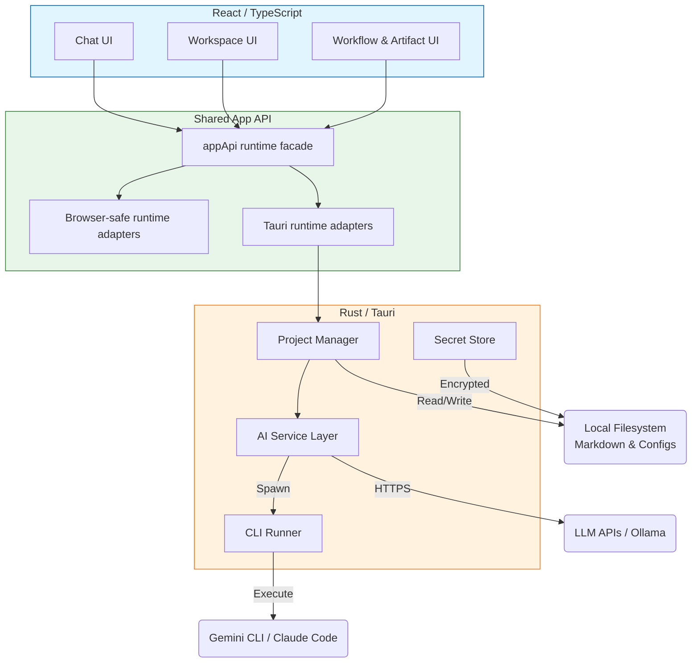

# 🚀 productOS: Research smarter. Own your data.


### Your AI-powered command center for product management.


**productOS** is an AI-powered research workspace built around a **Local-First Progressive Web App (PWA)**, seamlessly powered by a local **Rust Axum** backend. The result is a faster iteration loop for the core product surface without giving up local-first storage, native offline-capabilities, or secure key handling where they matter. *(Note: The legacy Tauri wrapper is being phased out.)*

You can leverage local AI models (Ollama), hosted AI services (Claude), local code agents (**Claude Code**), and specialized CLI tools (**Gemini CLI**) as first-class citizens. All of these can be enhanced with **MCP (Model Context Protocol)** tools to create autonomous agents that define your workflow.

---

## 📥 Downloads & Releases

Get the latest version of **productOS** for macOS, Windows, and Linux.

[**Download Latest Release**](https://github.com/AIResearchFactory/ai-researcher/releases)

---

## ⚡ Quick Start

### For normal use, not development

The recommended way to use **productOS** today is to install a packaged release.

1. Download the latest release for your platform from GitHub Releases.
2. Install it like a normal desktop app.
3. Launch **productOS**.
4. Complete the setup wizard, or skip setup and start in browser-safe mode.

### Getting started after first launch

On a fresh install, the workspace should open immediately even if no AI provider is configured yet.

- Open **Settings → Models** to pick your preferred provider.
- If the provider still needs setup, chat will now return an in-app guidance message instead of failing.
- Typical next steps:
  - **Gemini CLI** → run `gemini --auth` or add a Gemini API key
  - **Claude Code CLI** → run `claude login`
  - **OpenAI CLI** → log in to the CLI or add an OpenAI API key
  - **Ollama** → start Ollama locally and pull a model such as `llama3`

Once a provider is ready, retry your message from the chat composer.

### Start the app locally after cloning

If you already have the repo locally and want the easiest local app startup:

```bash
npm install
node bin/productos.mjs
```

That starts the local Rust server, starts the frontend, and opens the browser app on `http://localhost:5173`.

If the companion server binary is not available yet, productOS will try to build it from source on first run, so you should have Rust installed.

### Browser-first local run

If you want the shared browser-first app surface locally during development:

```bash
npm install
npm run dev
```

### Build the production assets locally

```bash
npm run build
npm start
```

- `npm run build` builds the frontend and the Rust server release binary
- `npm start` runs the local server against the built assets

### About `npx`

`npx` is **not** the recommended install path yet.

This repository currently ships as an application, not as a polished npm-distributed launcher package. Supporting a real `npx productos` flow would require a dedicated CLI/package entrypoint and a defined install/bootstrap experience.

Until that exists, use either:
- a packaged GitHub release for normal use, or
- local repo commands for development and testing

---

## ✨ Key Goals

The primary mission of **productOS** is to give you ownership and power over your research data:

*   🤖 **Intelligent Research:** Orchestrate custom AI agents (skills) to conduct complex research tasks.
*   📂 **Project Management:** Keep your context, artifacts, and history in one place. All data is stored as **human-readable Markdown files**, making it easy to audit and reuse.
*   🔒 **Total Ownership:** No external databases. You own your data.
*   ⚡ **Local-First Runtime:** Browser-first shared flows, with native capabilities available when running through Tauri.
*   🧩 **Automation:** A registry of reusable "skills" to automate repetitive workflows.

---

## 🌟 Main Capabilities

| Feature | Technology | Benefits |
| :--- | :--- | :--- |
| **Portability** | **Pure Markdown Files** | *No database required.* Your research is human-readable and move-ready. |
| **Cross-Platform** | **React + Shared Runtime + Tauri** | Browser-first UX with optional native runtime features on Windows, macOS, and Linux. |
| **Control** | **Shared App API** | Browser-safe flows where possible, honest gating for native-only capabilities. |
| **Extensibility** | **MCP Support** | Connect custom servers to expand agent capabilities. |
| **Smart Chat** | **Agent Reasoning** | Collapsible thinking process, `@file` referencing, and table support. |
| **Workflows** | **Canvas UI** | Drag-and-drop experience for orchestrating complex agent workflows. |
| **Research Log** | **Timeline UI** | Chronological audit trail of all AI actions, commands, and research steps. |

### 🚀 Recent Improvements
*   🧠 **Agent Thinking**: Collapsible "Thinking Process" accordion for better visibility into agent reasoning.
*   📎 **@File Referencing**: Mention any file in your project using `@` in the chat for instant context.
*   💾 **Auto-State Persistence**: Never lose your progress—scroll positions and chat states are preserved.
*   🛠️ **Skill Customization**: Define custom environment variables for your AI skills and agents.
*   📊 **Rich Markdown**: Enhanced support for tables and complex formatting in both chat and the viewer.
*   🍎 **macOS Native Integration**: Added native macOS system menu for a more seamless experience.
*   🆕 **New Chat**: Easily clear and start new conversations with a single click.
*   📜 **Project Log Timeline**: A full, searchable audit trail of AI research history with export capabilities.

### 🔌 Enhanced Workflows with MCP
**productOS** now includes **MCP (Model Context Protocol)** support. Connect any MCP server to give your agents real-time access to external data, tools, and integrations.

Check out the [MCP Marketplace](src/data/mcp_marketplace.ts) for supported integrations.

---

## 🛠️ Technical Architecture

This application now follows a **Local-First PWA architecture** served natively by an Axum backend.

### Architecture Overview

The React app talks to a shared application API. In browser mode, that API uses browser-safe fallbacks and local persistence where appropriate. In native mode, the same app can route into Tauri and Rust-backed capabilities.



### Technology Stack

| Component | Technology | Description |
| :--- | :--- | :--- |
| **Frontend** | **React + Tailwind** | Main product surface and browser-first UI. |
| **Runtime Layer** | **Shared `appApi` facade** | Routes features to browser-safe adapters or native Tauri-backed implementations. |
| **Native Shell** | **Tauri (v2)** | Optional native runtime for filesystem access, secure storage, updater flows, and native integrations. |
| **Backend** | **Rust** | Handles system operations, file I/O, encryption, and AI logic in native mode. |
| **Data Format** | **Markdown (.md)** | Portable, git-friendly, and human-readable project data. |
| **Encryption** | **Native secret storage / encrypted persistence** | Protects API keys and other sensitive settings in native mode. |
| **AI Client** | **HTTP + local CLI integrations** | Supports hosted APIs and local CLI execution (Gemini, Claude Code, Ollama, etc.). |

---

## 📂 Data Structure

In native mode, application data is stored within your system's standard `AppDataDirectory`. In browser-first mode, supported shared flows use browser-safe persistence and explicit fallbacks.

| File/Directory | Purpose |
| :--- | :--- |
| **`secrets.encrypted.json`** | **Encrypted global secrets** (e.g., AI API keys). Stored securely. |
| **`settings.json`** | Global application configuration settings. |
| **`skills/`** | Directory for **reusable agent skills**. |
| **`projects/`** | Main directory containing individual research projects. |
| **`projects/project-alpha/.metadata/project.json`** | Project metadata (id, name, goal, skills, etc.). |
| **`projects/project-alpha/.metadata/settings.json`** | Project-specific configuration settings. |
| **`projects/project-alpha/chat-001.md`** | AI conversation artifacts/history. |
| **`projects/project-alpha/*.md`** | All research notes, analyses, and project outputs. |
---

## ⚙️ Development & Testing

### Repo Structure

- `src/` — React application and shared runtime-facing UI
- `src/api/` — shared app/runtime API layer and native adapters
- `src-tauri/` — native Rust and Tauri shell
- `tests/` — Node test runner unit/integration coverage
- `e2e/` — Playwright browser-first end-to-end coverage
- `docs/` — architecture and migration status notes

### Prerequisites
1.  **Rust:** Required for the Rust backend.
```bash
`curl --proto '=https' --tlsv1.2 -sSf https://sh.rustup.rs | sh`
```
2.  **Node.js (v18+):** Required for the React frontend development. 
```bash
& `npm` / `pnpm`
```
3.  **Claude API Key:** (Optional, for hosted Claude AI features)

### Running Locally

1.  **Clone the repo:**
    ```bash
    git clone https://github.com/AIResearchFactory/ai-researcher.git
    cd ai-researcher
    ```

2.  **Install dependencies:**
    ```bash
    npm install
    ```

3.  **Run the browser-first dev app:**
    ```bash
    npm run dev
    ```

4.  **Run the native shell when needed:**
    ```bash
    npm run tauri dev
    ```

### Testing
- **Node unit/integration tests:**
    ```bash
    npm run test:unit:optimizer
    npm run test:integration:token-saver
    npm run test:guardrails
    npm run test:starter-pack
    npm run test:channels
    ```
- **Browser-first e2e with Playwright:**
    ```bash
    npm run test:e2e
    npm run test:e2e:ui
    npm run test:e2e:headed
    ```
- **Rust backend tests (native layer):**
    ```bash
    cargo test
    ```

---

## 🤝 Contributing

We welcome contributions! Whether it's adding a new feature, fixing a bug, or improving documentation, your help is appreciated.

1.  Fork & Clone.
2.  Create branch: `git checkout -b feature/cool-feature`
3.  **Make your changes.**
4.  Commit & Push.
5.  Open a Pull Request.

---

## ⚖️ License

This project is licensed under the **Apache License 2.0**. See [`LICENSE`](./LICENSE) for details.
