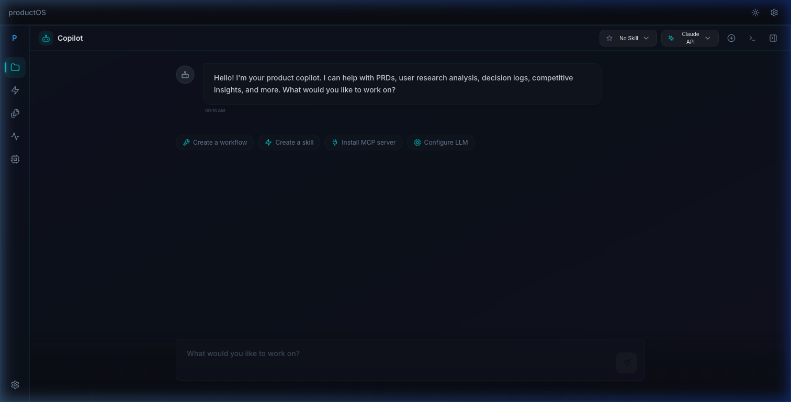

# productOS Documentation

Welcome to the productOS user documentation! This guide will help you get started and make the most of your AI-powered research workspace.

## 📚 Documentation Guide
### Getting Started
1. **[Why productOS?](01-why-productOS.md)** - Understand the problems productOS solves and how it can save you hours of work
2. **[Main Components](02-main-components.md)** - Overview of projects, skills, workflows, and other key features
3. **[Installation Guide](03-installation.md)** - Step-by-step instructions to install and configure productOS

### Core Features
4. **[Projects Guide](04-projects-guide.md)** - Create and manage research projects, organize files, and use AI Chat
5. **[Skills Guide](05-skills-guide.md)** - Create reusable AI agent templates with custom environment variables for specialized tasks
6. **[Workflows Guide](06-workflows-guide.md)** - Automate complex multi-step processes with visual workflow builder
7. **[Artifacts Guide](10-artifacts-guide.md)** - Understand persistent AI outputs and structured documentation

### Configuration & Advanced
7. **[Settings Guide](07-settings-guide.md)** - Configure AI providers, manage API keys, and customize your experience
8. **[Data Portability Guide](08-data-portability.md)** - Migrate data, share with your team, and understand file structure

### Real-World Examples
- **[Use Case 1: Simple Research](use-cases/Use-Case1-Simple_research.md)** - Save 2-3 hours on feature research and documentation
- **[Use Case 2: Automated Workflows](use-cases/Use-Case2-Using_Workflows.md)** - Save 5-7 hours on competitive research with automation
- **[Use Case 3: MCP Integration](use-cases/Use-Case3-Using_MCP.md)** - Save 2+ hours on cross-tool validation and updates

## 🚀 Quick Start

**New to productOS?** Follow this path:
1. Read [Why productOS?](01-why-productOS.md) (2 minutes)
2. Follow the [Installation Guide](03-installation.md) (10 minutes)
3. Create your first project with the [Projects Guide](04-projects-guide.md) (5 minutes)
4. Try the AI Chat feature and use the `@` symbol to reference files in your project

**Ready for more?** Explore Skills and Workflows to automate repetitive tasks and save even more time.

## 💡 Key Concepts

- **Projects**: Organized workspaces for your research topics
- **Skills**: Reusable AI agent templates for specific tasks
- **Workflows**: Automated multi-step processes that run in parallel
- **Artifacts**: Persistent, AI-generated documents (code, tables, reports)
- **MCP**: Connect to external tools like GitHub, Jira, and more
- **Smart Referencing**: Mention files with `@` in chat to give the AI context instantly
- **Data Ownership**: All your data stored as human-readable Markdown files

## 🔒 Security & Privacy

Your data is yours. productOS stores everything locally as Markdown files with:
- **Encrypted API keys** using AES-256-GCM encryption
- **No external databases** - you control where your data lives
- **Password protection** - your password unlocks encrypted secrets on each launch
- **Complete portability** - easily backup, migrate, or share your work

## 🆘 Need Help?

- Check the relevant guide section above
- Review the [use cases](use-cases/) for practical examples
- Visit the [GitHub repository](https://github.com/AIResearchFactory/ai-researcher) for issues and discussions

## 📝 About This Documentation

This documentation is designed for end users who want to leverage productOS for their research and automation needs. It focuses on practical usage rather than technical implementation details.

**Last Updated**: March 2026

---

**Ready to get started?** Begin with [Why productOS?](01-why-productOS.md) →
