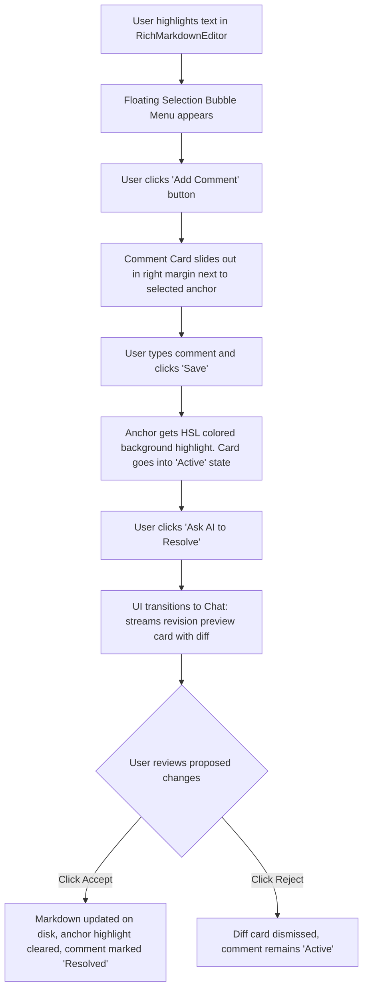

# UX Specification - AI Chat & Knowledge Workspace Alignment

**Feature Name:** Contextual Comments & Focused Chat UX  
**Status:** Under Review  
**Date:** May 28, 2026  
**Stage:** UX Design Phase (Stage 2 of the Feature Development Pipeline)

---

## 1. Primary & Alternate User Flows

### Flow 1: Contextual Inline Commenting & Resolution

### Flow 2: Bulk "Fix All Comments" Revision
1. **Trigger:** User opens a document containing multiple comments (e.g. 3 active feedback points).
2. **Affordance:** A primary outline button **"Fix All Comments (3)"** with a subtle purple glow is displayed next to the "Save" button in the editor toolbar.
3. **Execution:** Clicking "Fix All Comments" locks the editor, collapses the content area, opens the Chat Panel to full center, and triggers a prompt aggregating all 3 comments.
4. **Streaming:** The AI streams the combined revisions. Once complete, it displays a single structured revision card inside the chat containing a diff tab list: `[Slide 1]`, `[Slide 2]`, or sections.
5. **Decision:** The user clicks `Accept All` to patch the document and resolve all comments, or `Reject` to keep the file in its original state.

### Flow 3: Focused Chat & Context Peeking
1. **Trigger:** User toggles "Focused Chat" layout mode.
2. **UI Transition:** 
   - Central Chat Panel expands to a centered, high-fidelity card container.
   - Left Sidebar collapses into a vertical bar containing only circular, sleek icons (Product Explorer, Settings, Welcome). Hovering over an icon pops open a micro-tooltip.
3. **Peeking:** User types `@` in the chat input or right-clicks a file in the compact explorer and selects "Reference in Chat". 
4. **Trigger Slide-over:** Clicking the `@file` badge inside the text area or in the chat history slides open the **File Peek Panel** from the right margin.
5. **Peek Panel State:** The user reads, scrolls, or copies code inside the Slide-over. The active typing state inside the centered chat remains completely focused and active.

---

## 2. Screen States

### 1. Active Editor (With Comments)
- **Design System:** Inter Typography, 4px boundary margins.
- **Anchor Text:** Highlighted with HSL amber/yellow background (`background-color: hsla(var(--warning), 0.15); border-bottom: 2px dashed hsl(var(--warning))`).
- **Marginal Comments:** A vertical layout container on the right side of the editor. Cards are styled with `border: 1px solid hsl(var(--border)); backdrop-filter: blur(12px); background: hsla(var(--card), 0.7)`. 

### 2. Focused Chat Dashboard (Command Center)
- **Centered Workspace:** The chat viewport narrows to `max-w-4xl` (~800px) and centers with beautiful ambient backing (`shadow-[0_24px_64px_rgba(0,0,0,0.2)]`).
- **Prompt Input:** Glows with a subtle primary border when focused (`ring-2 ring-primary/20`). Contains a visual **HUD Context Shelf** showing active attached files as rounded tag pills.

### 3. Loading, Success & Error States (Diff Cards)
- **Loading:** Subtle shimmer gradient overlays the revision diff cards while the LLM streams the changes.
- **Success (Accepted):** A green success overlay flash over the text anchor in the editor, and the comment card fades to a light gray, checked border.
- **Error (Failed):** Card changes border to semantic red, displaying an "Edit failed to match document. Click to Retry." action link.

---

## 3. Accessibility Requirements (WCAG AA Compliance)

- **Keyboard Traversal (`keyboard-nav`):**
  - Pressing `Tab` cycles focus sequentially: Tiptap Editor -> Floating Add Comment button -> Comment inputs -> "Ask AI to Resolve" buttons.
  - Pressing `Esc` inside the Comment Card cancels active editing and returns focus to the editor cursor.
  - Pressing `Esc` inside the Slide-Over File Peek Panel closes the drawer and refocuses the active chat prompt.
- **ARIA Landmark Attributes:**
  - Slide-over panel uses `role="dialog" aria-modal="false" aria-label="Document Peek Panel"`.
  - Comment items use `role="complementary" aria-label="User feedback comment"`.
  - Focused chat inputs use `aria-autocomplete="list"` with file suggestions announced clearly.
- **Contrast Parity (`color-contrast`):**
  - Highlighted anchor text background is strictly bounded to `hsla(var(--warning), 0.15)` to guarantee underlying black/white text maintains >4.5:1 contrast against both dark and light backdrops.

---

## 4. Interaction & Motion Notes (150-300ms)

- **Layout Shifting Prevention:** Transitioning sidebar to compact mode uses Framer Motion on the flex column width container:
  - Entering Focused mode: Sidebar width animates from `240px` to `56px` (`duration: 0.2, ease: "easeInOut"`).
  - Exiting Focused mode: Sidebar expands back to `240px`.
- **Slide-Over Panel Animation:** 
  - File Peek Panel slides in from the right edge (`transform: translateX(100%)` to `translateX(0%)`, `duration: 0.25, ease: "easeOut"`).
- **Press Feedback:** All buttons (e.g. Accept, Reject, Resolve) use micro-scale feedback: `scale: 0.96` on tap, snapping back to `1.0` on release.

---

## 5. UI Copy Draft

- **Add Comment Placeholder:** `"Type feedback for the AI... (e.g. 'Make this roadmap more aggressive')"`
- **Ask AI Action Button:** `"Ask AI to Resolve"`
- **Fix All Button:** `"Fix All Comments"`
- **Diff Accept Prompt:** `"Review AI Revisions. Accept changes to patch this file."`
- **Right-Click Action:** `"Reference in Chat"`
- **Sidebar Compact Tooltips:** `"Workspace Explorer"`, `"Product Settings"`, `"AI Chat Hub"`.

---

## 6. Handoff Annotations for Frontend Agent

- Use `@tiptap/extension-highlight` to handle anchor spans. Store character offsets (`from`, `to`) and exact text matches in JSON metadata.
- When generating comment cards, calculate their vertical coordinates dynamically using `editor.view.coordsAtPos(anchorPos)` to align each card beside its text anchor line.
- The `FilePeekPanel` should use the existing `appApi.readMarkdownFile` API to render read-only contents, mapping internal `@file` mention clicks via a custom event channel.
