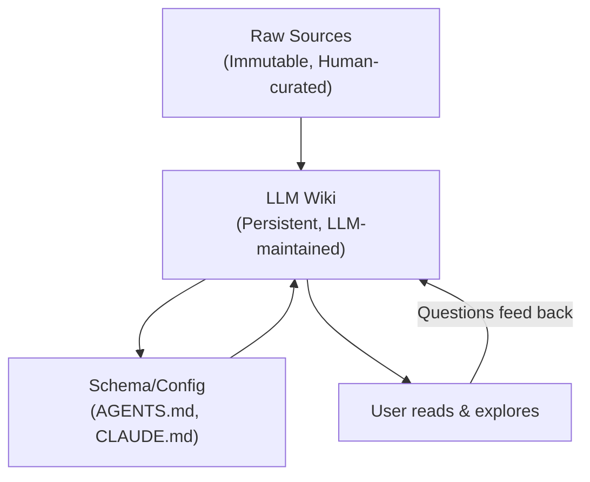
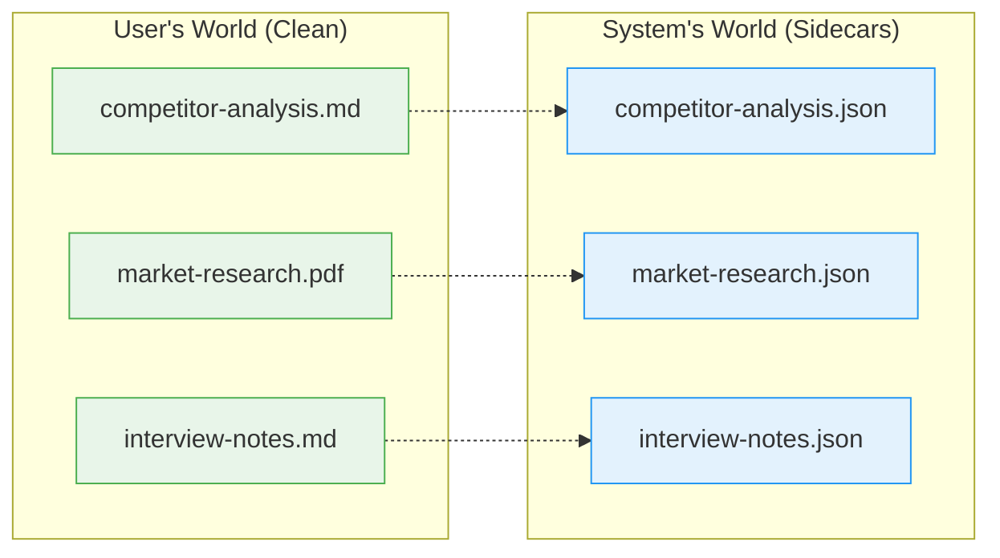
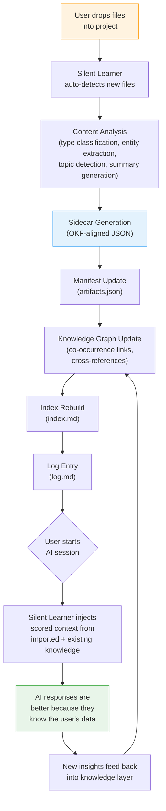
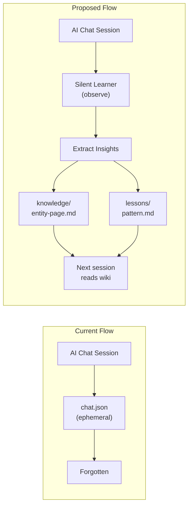
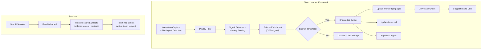
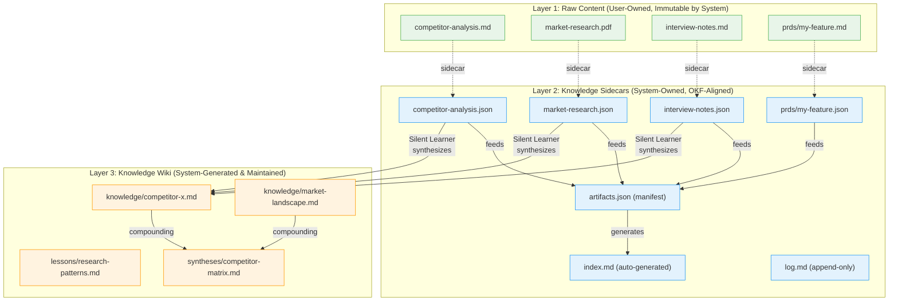

# Analysis: OKF, LLM-Wiki, and Silent Learner — What We Can Learn & Improve

## Executive Summary

After reviewing Karpathy's [LLM-wiki](https://gist.github.com/karpathy/442a6bf555914893e9891c11519de94f) pattern, Google Cloud's [Open Knowledge Format (OKF v0.1)](https://github.com/GoogleCloudPlatform/knowledge-catalog/tree/main/okf/SPEC.md), and our existing [Silent Learner architecture](file:///Users/assafmiron/Documents/Code/ai-researcher/docs/features/silent-learner/silent-learner-mode.md) and [artifact system](file:///Users/assafmiron/Documents/Code/ai-researcher/node-backend/lib/artifacts.mjs), there is a striking convergence of ideas — and several clear gaps where ProductOS can evolve.

**The core insight across all three:**
> Knowledge that compounds is more valuable than knowledge that is re-derived on every query.

All three systems share this principle, but approach it differently. The table below summarizes the landscape:

| Dimension | LLM-Wiki (Karpathy) | OKF (Google Cloud) | ProductOS (Silent Learner + Artifacts) |
|---|---|---|---|
| **Core format** | Markdown files in a directory | Markdown + YAML frontmatter | Markdown + JSON sidecars + manifest |
| **Knowledge producer** | LLM writes/maintains wiki | Enrichment agents + humans | AI agents produce artifacts; Silent Learner observes |
| **Accumulation** | Persistent, compounding wiki | Static knowledge bundles | Session-scoped memory packs (JSONL) |
| **Navigation** | `index.md` + `log.md` | `index.md` + `log.md` | `artifacts.json` manifest |
| **Health checks** | "Lint" operations | Not specified | Not implemented |
| **Cross-references** | Wikilinks maintained by LLM | Standard markdown links + `resource` URIs | `sourceRefs` array (mostly unused) |
| **Scoring/ranking** | Not specified | Not specified | Multi-signal relevance scoring ($S = wC + wU + wR + wA$) |
| **Privacy** | Not addressed | Not addressed | First-class: redaction, forget controls, encryption |

---

## The Three Systems In Depth

### 1. Karpathy's LLM-Wiki Pattern

The LLM-wiki proposes a **three-layer architecture**:



**Key operations:**
- **Ingest** — LLM reads a new source, writes a summary, updates index, updates related entity/concept pages (a single source can touch 10-15 wiki pages)
- **Query** — Questions against the wiki produce answers; good answers get filed _back_ into the wiki as new pages
- **Lint** — Periodic health checks for contradictions, stale claims, orphan pages, missing cross-references

> **Critical Insight**: "Good answers can be filed back into the wiki as new pages. A comparison you asked for, an analysis, a connection you discovered — these are valuable and shouldn't disappear into chat history. This way your explorations compound."

This is directly relevant to ProductOS — our chat transcripts and AI-generated analyses currently evaporate after the session.

> **Key architectural decision in LLM-wiki:** Raw sources are **immutable**. The LLM reads from them but never modifies them. This maps perfectly to our sidecar philosophy — the user's content files are the "raw sources" and ProductOS enriches them externally.

### 2. Google's Open Knowledge Format (OKF v0.1)

OKF formalizes the LLM-wiki idea into a **vendor-neutral specification**:

**Core structure:**
```yaml
---
type: <Type name>          # REQUIRED — e.g., "BigQuery Table", "Metric", "Playbook"
title: <Display name>
description: <One-line summary>
resource: <Canonical URI for the underlying asset>
tags: [tag, tag, …]
timestamp: <ISO 8601>
# … producer-defined key/value pairs
---

[Markdown body with free-form content]
```

**Terminology that maps to ProductOS:**

| OKF Term | ProductOS Equivalent | Alignment |
|---|---|---|
| **Knowledge Bundle** | A Project's artifacts directory | ✅ Close — but OKF bundles are self-contained |
| **Concept** | An artifact (PRD, Roadmap, etc.) | ⚠️ Partial — we have type constraints; OKF is extensible |
| **Concept ID** | `artifact.id` (relative path) | ✅ Same pattern (`tables/users.md` → `prds/my-prd.md`) |
| **Frontmatter** | JSON sidecar file | 🔄 See "Separation Principle" below |
| **Link** | `sourceRefs` array | ⚠️ Weaker — no bidirectional link tracking |
| **Citation** | Not implemented | ❌ Missing |
| **index.md** | `artifacts.json` manifest | ⚠️ Different format, similar purpose |
| **log.md** | Not implemented | ❌ Missing |

**Key OKF design principles:**
1. **Type is extensible** — no fixed taxonomy, consumers tolerate unknown types
2. **Directory structure is free** — organized however makes sense for the domain
3. **Frontmatter is minimal** — only `type` is required; everything else is optional
4. **Portable** — git-diffable, no SDKs, no central authority

### 3. ProductOS Silent Learner (Current State)

The Silent Learner's scoring engine is the most sophisticated element of our system, implementing what neither LLM-wiki nor OKF address:

$$S = (w_{\text{explicit}} \cdot C + w_{\text{usage}} \cdot U + w_{\text{recency}} \cdot R + w_{\text{alignment}} \cdot A) \times M_{\text{type}} \times M_{\text{active}}$$

**What we do well:**
- Multi-signal relevance scoring with recency decay
- Privacy-first design with redaction, forget controls, encryption
- Active state modifiers (git changes, error context boosts)
- Score thresholding for context optimization (active / RAG-only / cold storage)
- Workspace isolation

**What we're missing:**
- The "compounding knowledge" pattern — our memory packs are flat JSONL, not interlinked wiki pages
- No lint/health-check cycle for knowledge quality
- No mechanism for AI-generated insights to feed back into the knowledge base
- No `index.md` / `log.md` for human browsability

---

## The Separation of Content and Knowledge Principle

> [!IMPORTANT]
> This is the foundational design principle that differentiates ProductOS from both OKF and LLM-wiki, and is our key competitive advantage for the import-to-learn use case.

### The Problem with Frontmatter

OKF embeds metadata directly in files via YAML frontmatter. This works well when the _system_ creates the files. But it creates friction in a critical ProductOS use case:

**The "Bring Your Own Data" journey:**
1. User has a folder of research notes, competitor analyses, market data, interview transcripts
2. User imports them into a ProductOS project
3. User wants Silent Learner to start learning from them _immediately_
4. User should not need to add YAML headers, rename files, or restructure anything

If we required frontmatter, the user would face a "data preparation" barrier before they could benefit from the system. That's the opposite of zero-config personalization.

### The Sidecar Advantage

Our existing sidecar pattern already solves this elegantly. The key insight:

> **Content files are the user's property. Knowledge about those files is the system's responsibility.**



**This separation serves two audiences simultaneously:**

| Audience | They see | Benefit |
|---|---|---|
| **Humans** | Clean markdown/content files without metadata clutter | Can focus on reviewing, editing, and thinking about the _content_ |
| **LLMs in ProductOS** | Sidecar JSON with rich metadata, scores, classifications, and relationships | Can efficiently navigate the knowledge graph without parsing content first |

### How This Maps to OKF

Rather than rejecting OKF, we can be **OKF-aligned at the sidecar level**. The sidecar JSON can carry every field that OKF puts in frontmatter:

**Current sidecar:**
```json
{
  "id": "prds/my-feature.md",
  "artifactType": "prd",
  "title": "My Feature",
  "projectId": "project-123",
  "created": "2026-06-05T19:00:00Z",
  "updated": "2026-06-17T16:00:00Z"
}
```

**OKF-enriched sidecar:**
```json
{
  "id": "prds/my-feature.md",
  "artifactType": "prd",
  "title": "My Feature",
  "description": "One-line summary auto-extracted by Silent Learner",
  "tags": ["mvp", "mobile", "q3"],
  "resource": "prds/my-feature.md",
  "projectId": "project-123",
  "created": "2026-06-05T19:00:00Z",
  "updated": "2026-06-17T16:00:00Z",
  "sourceRefs": ["initiatives/mobile-first.md"],
  "citations": ["https://example.com/market-report-2026"],
  "silentLearner": {
    "confidence": 0.85,
    "usageConsistency": 0.72,
    "recencyScore": 0.91,
    "taskAlignment": 0.65,
    "compositeScore": 0.81,
    "lastObserved": "2026-06-17T15:00:00Z",
    "relatedConcepts": ["competitor-tool-x", "mobile-ux"],
    "contentHash": "sha256:abc123..."
  }
}
```

This gives us the best of both worlds:
- **OKF interop**: We can _export_ to OKF frontmatter format when needed (e.g., sharing a knowledge bundle externally)
- **Zero-friction import**: We can _import_ any file and the Silent Learner builds the sidecar automatically
- **Clean content**: Users never see metadata in their documents
- **Rich machine context**: LLMs get structured metadata without parsing markdown

---

## The Import-to-Learn User Journey

> [!TIP]
> This is the core use case that drives the design. Every proposal below should make this journey smoother.



**The key stages in detail:**

### Stage 1: Zero-Friction Import
- User drops files in any format (`.md`, `.txt`, `.pdf`, etc.)
- No renaming, no metadata, no restructuring required
- Files stay exactly as the user provided them

### Stage 2: Silent Learner Auto-Enrichment
The Silent Learner processes each imported file and generates an OKF-aligned sidecar:

| Auto-extracted field | How it's derived |
|---|---|
| `type` | Content classification heuristic (is this a spec? research? notes? data?) |
| `title` | First H1, or filename stem |
| `description` | LLM-generated one-line summary |
| `tags` | Topic extraction from content |
| `sourceRefs` | Cross-file entity and concept matching |
| `silentLearner.confidence` | Initial content quality signal |
| `silentLearner.contentHash` | SHA-256 for change detection |

### Stage 3: Compounding Knowledge
As the user works with the data — asking questions, generating analyses, making connections — the Silent Learner:
- Updates sidecar scores (usage consistency rises)
- Identifies cross-references between files
- Builds co-occurrence graphs
- Creates "knowledge pages" that synthesize findings across multiple source files

### Stage 4: Self-Improving Context
Next time the user starts a session, the system already knows:
- Which files are most relevant to their current task
- What connections exist between documents
- What insights were previously derived
- What knowledge gaps remain

---

## Five Improvement Proposals (Revised)

### Proposal 1: OKF-Aligned Sidecar Enrichment

> [!IMPORTANT]
> Evolve our existing sidecar pattern to carry OKF-level metadata, rather than migrating to frontmatter. This preserves our zero-friction import advantage while gaining structured knowledge representation.

**What changes:**

| Current Sidecar | Enhanced Sidecar |
|---|---|
| Basic manifest metadata (id, type, title, dates) | **+ OKF fields**: `description`, `tags`, `resource`, `citations` |
| No content-derived fields | **+ Auto-extracted**: summary, topics, entity references |
| No Silent Learner signals | **+ Scoring signals**: confidence, usage, recency, task alignment, composite score |
| No relationships | **+ Knowledge graph**: `sourceRefs`, `relatedConcepts`, `contradicts`, `supersedes` |
| Static once created | **+ Living metadata**: updated by Silent Learner on every observation |

**Auto-enrichment pipeline for imported files:**

```
File imported
  → Content hash + type classification (fast, regex-based)
  → Title extraction (H1 or filename)
  → Summary generation (local LLM or heuristic)
  → Tag extraction (topic modeling)
  → Entity extraction (named entities, product names, concepts)
  → Cross-reference scan (match entities against existing sidecars)
  → Sidecar JSON written alongside file
  → Manifest updated
```

**OKF export capability:** When a user wants to share a knowledge bundle externally, ProductOS can _generate_ OKF frontmatter files from sidecars:

```
Export to OKF bundle:
  for each artifact:
    read sidecar.json
    inject YAML frontmatter into copy of .md file
    write to export directory
```

This gives us OKF interop as a _feature_ without making it the internal format.

### Proposal 2: Introduce Compounding Knowledge Artifacts

> [!TIP]
> The LLM-wiki's most powerful idea: knowledge that _accumulates_ rather than being re-derived per session.

**New artifact types to add to `TYPE_DIRS`:**

| Type | Folder | Description |
|---|---|---|
| `knowledge_page` | `knowledge/` | LLM-maintained entity/concept pages synthesized from research and chats |
| `synthesis` | `syntheses/` | Cross-artifact summaries that connect multiple sources |
| `lesson_learned` | `lessons/` | Distilled patterns from Silent Learner observations |

**How it works in practice:**



**Concrete example:**

After 5 sessions discussing competitive research on tool X, instead of re-reading 5 chat transcripts, the system would maintain:

```
knowledge/
  competitor-tool-x.md          # Entity page with strengths, weaknesses, pricing
  competitor-tool-y.md          # Entity page
  market-landscape.md           # Synthesis page connecting all competitor pages
lessons/
  competitive-research-patterns.md   # Distilled patterns from how the user does competitive research
```

Each new chat session that touches competitive research would:
1. **Read** existing wiki pages for context (reducing token overhead — our 60% target)
2. **Update** pages with new information
3. **Log** the update in `log.md`

**Important distinction**: These knowledge pages are _system-generated_ content (like LLM-wiki), and they DO get sidecars. But unlike user-imported files, the system owns both the content and the metadata. The user reads them; the system maintains them.

### Proposal 3: Add Knowledge Lint/Health-Check Operations

Inspired directly by LLM-wiki's "Lint" operation:

**Lint checks to implement:**

| Check | Description | Implementation |
|---|---|---|
| **Orphan detection** | Artifacts with no inbound `sourceRefs` links | Graph traversal on sidecars |
| **Stale content** | Artifacts not updated in 30+ days with high prior engagement | Silent Learner recency scores |
| **Contradiction detection** | Conflicting claims across artifacts (e.g., two PRDs with different target dates) | Semantic similarity + LLM pass |
| **Missing coverage** | Important concepts mentioned in chats but lacking their own artifact/knowledge page | Chat scan → entity extraction |
| **Deduplication** | Artifacts with >0.85 cosine similarity | Embedding comparison (already planned in scoring) |
| **Stale sidecar** | Content hash changed but sidecar not re-analyzed | Compare `silentLearner.contentHash` with actual file hash |

**UX integration:**
- A "Knowledge Health" panel in Project Settings
- Lint results as actionable suggestions: "Create a page for [Entity X]", "Update [Artifact Y] — last modified 45 days ago", "Re-analyze [File Z] — content changed since last scan"
- Can run automatically when Silent Learner's "Optimize Memory" is triggered

### Proposal 4: Implement `index.md` + `log.md` Pattern

Both LLM-wiki and OKF prescribe these two special files. They serve different purposes:

**`index.md`** — Content-oriented. A human- and LLM-readable catalog:
```markdown
# Project Knowledge Index

## PRDs
- [Mobile App Redesign](prds/mobile-app-redesign.md) — Core mobile UX overhaul (3 sources, updated Jun 15)
- [Silent Learner Mode](prds/silent-learner-mode.md) — Privacy-first learning system (8 sources, updated Jun 17)

## Insights
- [Market Gap Analysis](insights/market-gap.md) — Competitive positioning gaps (2 sources)

## Knowledge (Auto-maintained by Silent Learner)
- [Competitor Tool X](knowledge/competitor-tool-x.md) — Feature comparison and pricing
- [Market Landscape](knowledge/market-landscape.md) — Cross-competitor synthesis
```

**`log.md`** — Chronological. Append-only record:
```markdown
## [2026-06-17] import | 12 files added
Auto-classified: 4 research documents, 3 competitive analyses, 5 meeting notes.
Generated sidecars with initial scores. Updated index.

## [2026-06-17] learn | Silent Learner observation
Created knowledge/competitor-tool-x.md from 3 sources. Cross-referenced with insights/market-gap.md.

## [2026-06-16] query | Competitive landscape
Generated comparison table. Filed as syntheses/competitor-matrix.md.

## [2026-06-15] lint | Project health check
Found 2 orphan artifacts, 1 stale PRD. Created suggestions.
```

**Benefits:**
- LLMs can read `index.md` to find relevant artifacts without scanning all files (cheaper, faster)
- `log.md` gives temporal context — what changed recently, what the project's trajectory looks like
- Human users get a dashboard-like overview without needing the UI
- Both are grep-friendly and git-diffable
- `index.md` is auto-generated from sidecars + manifest — not hand-maintained

### Proposal 5: Silent Learner as Knowledge Maintainer (Connecting the Dots)

This is the synthesis proposal — using the Silent Learner's existing scoring engine to power a LLM-wiki-style knowledge maintenance loop:



**What changes in the scoring engine:**

Currently, the scoring formula produces a number that determines whether a file goes into active context, RAG, or cold storage. The enhancement adds sidecar enrichment and a knowledge-building output path:

| Score Range | Current Behavior | Proposed Enhancement |
|---|---|---|
| $S \ge 0.7$ | Load into prompt context | **+ Auto-maintain knowledge pages** for high-signal entities |
| $0.4 \le S < 0.7$ | RAG-only retrieval | **+ Suggest** creating a knowledge page if entity appears 3+ times |
| $S < 0.4$ | Cold storage | **+ Flag for lint** if the artifact was previously high-scoring (decay detection) |

**The closed loop for imported data:**

When a user imports files and starts a session:

1. **Import** → Sidecars generated (auto-classification, entity extraction, cross-referencing)
2. **Session 1** → Silent Learner observes which files the user asks about, what connections they care about
3. **Between sessions** → Sidecar scores updated, knowledge pages created for frequently-discussed entities
4. **Session 2** → Context is already richer. The AI "knows" the user's data better. Token overhead drops.
5. **Session N** → The knowledge layer has compounded. New imports are automatically cross-referenced against existing knowledge.

---

## Architectural Summary: Three Layers in ProductOS

Drawing from both LLM-wiki and OKF but keeping our sidecar principle:



| Layer | Owner | Mutability | Example Files |
|---|---|---|---|
| **Layer 1: Raw Content** | User | System never modifies | `competitor-analysis.md`, `market-research.pdf` |
| **Layer 2: Knowledge Sidecars** | System | Auto-generated and continuously updated | `.json` sidecars, `artifacts.json`, `index.md`, `log.md` |
| **Layer 3: Knowledge Wiki** | System | LLM-maintained compounding knowledge | `knowledge/*.md`, `lessons/*.md`, `syntheses/*.md` |

> [!NOTE]
> **Layer 1 vs Layer 3 distinction**: The user creates and owns Layer 1 files. The system creates and maintains Layer 3 files. Both are content (markdown), but the contract is different. Layer 1 is immutable by the system (like LLM-wiki's "raw sources"). Layer 3 is the system's synthesis layer (like LLM-wiki's "wiki").

---

## Impact Assessment: How This Maps to Current KPIs

| KPI from PRD | Current Approach | With Proposals | Expected Impact |
|---|---|---|---|
| **≥60% token reduction** | Memory packs + scoring | Sidecar scores enable surgical retrieval; knowledge pages replace raw source scanning | 🟢 Stronger — pre-synthesized knowledge is denser than raw sources |
| **≥20% latency improvement** | Scoring-based context pruning | LLM reads `index.md` first (fast) → drills into scored pages (targeted) | 🟢 Better — two-phase retrieval is faster than scanning everything |
| **<1% CPU, <20MB RAM** | Debounced SQLite writes | Sidecar-based scoring avoids runtime content parsing; `index.md` replaces some DB queries | 🟡 Neutral to slightly better |
| **<5s cold-start** | Regex-based historical scan | `index.md` + pre-computed sidecars can bootstrap context instantly | 🟢 Significantly better — near-zero cold start for returning users |
| **Zero-friction import** | Not a formal KPI | Auto-enrichment pipeline makes any file immediately learnable | 🟢 New capability — competitive differentiator |

---

## Prioritized Improvement Matrix

| # | Proposal | Effort | Risk | Value | Recommendation |
|---|---|---|---|---|---|
| 1 | OKF-aligned sidecar enrichment | Medium | Low | Very High | **Start here** — extends existing pattern, enables import-to-learn |
| 4 | `index.md` + `log.md` pattern | Low | Very Low | High | **Quick win** — auto-generated from sidecars, immediately useful |
| 2 | Compounding knowledge artifacts | High | Medium | Very High | **Design next** — the system's own wiki layer |
| 3 | Knowledge lint operations | Medium | Low | Medium | **Add after** knowledge artifacts exist |
| 5 | Silent Learner as knowledge maintainer | High | Medium | Very High | **Long-term** — the closed-loop that makes everything compound |

---

## Resolved Design Decisions

> [!NOTE]
> All open questions have been resolved through product review (2026-06-18).

1. **Auto-enrichment depth at import time?** → **(b) Progressive auto-enrichment**
   - Hash + type classification immediately at import
   - Deeper analysis (summary, entity extraction, cross-referencing) on first access or via background worker
   - Rationale: Balances instant responsiveness with resource efficiency

2. **Who maintains the wiki (Layer 3)?** → **(a) Fully AI-generated from Silent Learner observations**
   - This is a major differentiating advantage of Silent Learner
   - Knowledge pages, lessons, and syntheses are all system-generated as the learner observes
   - Users continue creating PM artifacts (PRDs, roadmaps, etc.) through the existing UI

3. **OKF export format?** → **Backlogged**
   - OKF bundle export is a valid future feature but not for current implementation
   - The sidecar format should be designed with OKF field compatibility in mind for eventual export

4. **Scope of "knowledge" types?** → **Support at concept/sidecar level only**
   - OKF-style extensible types are supported in sidecars (any `type` value allowed)
   - `TYPE_DIRS` stays as-is — these represent the PM artifact outputs that define the core UX and mental model
   - Future consideration: allow users to create "custom" artifact types when ready

5. **How visible should compounding be?** → **Silent, with passive visibility**
   - Compounding happens silently, true to "Silent Learner" identity
   - The existing project settings "score" panel shows file scores — compounding is visible there
   - No active notifications for wiki updates

6. **Sidecar storage location?** → **Keep next to files (co-located)**
   - The system already handles sidecar cleanup and management
   - Moving to `.metadata/` would require unnecessary code changes
   - Co-location is simpler to reason about and maintain
