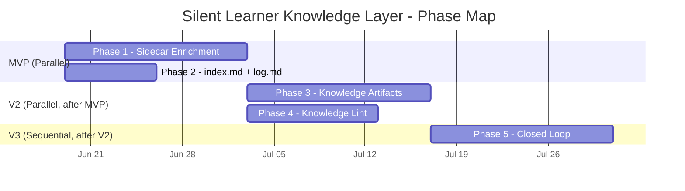

# Implementation Plan: Silent Learner Knowledge Layer (OKF-Inspired)

## Goal

Evolve ProductOS's Silent Learner from a session-scoped memory pack system into a **compounding knowledge layer** inspired by Karpathy's LLM-wiki pattern and Google Cloud's Open Knowledge Format (OKF). The system will progressively enrich imported files via OKF-aligned sidecars, auto-generate navigational files, build LLM-maintained knowledge pages, and run health checks — all silently, without requiring user action.

> [!IMPORTANT]
> **Core design principle:** Content files remain pristine (user-owned). Knowledge about those files lives in co-located JSON sidecars (system-owned). This enables zero-friction data import — users drop files and start working.

---

## Resolved Design Decisions

| Question | Decision | Rationale |
|---|---|---|
| Auto-enrichment timing | **Progressive** — hash+type immediately, deeper analysis in background | Balances responsiveness with resource efficiency |
| Who maintains wiki? | **Fully AI-generated** from Silent Learner observations | Major differentiator — the system learns autonomously |
| OKF export | **Backlogged** — design sidecars for OKF compat but no export now | Focus on internal value first |
| Knowledge type system | **Sidecar-level only** — TYPE_DIRS stays fixed for PM artifacts | Preserve core UX; future custom types later |
| Compounding visibility | **Silent** — scores visible in project settings panel | True to "Silent Learner" identity |
| Sidecar location | **Co-located** next to content files | Existing code handles cleanup; moving adds unnecessary complexity |

---

## Phase Map



---

## Phase 1: OKF-Aligned Sidecar Enrichment

**Parallel with:** Phase 2
**Estimated effort:** 2 weeks

### Deliverables

| # | Deliverable | Path |
|---|---|---|
| 1 | Extended sidecar schema (OKF-aligned) | Schema in [backend-plan.md](file:///Users/assafmiron/Documents/Code/ai-researcher/docs/features/silent-learner-knowledge-layer/backend-plan.md) |
| 2 | `enrichment.mjs` — 3-stage enrichment pipeline | `node-backend/lib/silent-learner/enrichment.mjs` |
| 3 | `content-classifier.mjs` — heuristic type classifier | `node-backend/lib/silent-learner/content-classifier.mjs` |
| 4 | `entity-extractor.mjs` — entity extraction (heuristic + AI) | `node-backend/lib/silent-learner/entity-extractor.mjs` |
| 5 | Modified `artifacts.mjs` — extended sidecar writes | `node-backend/lib/artifacts.mjs` |
| 6 | `POST /api/projects/:id/enrich` endpoint | `node-backend/server.mjs` |
| 7 | Background enrichment queue | `node-backend/lib/silent-learner/enrichment.mjs` |

### Tests

```bash
# Phase 1 unit tests
node --test node-backend/tests/silent-learner/enrichment-immediate.test.mjs
node --test node-backend/tests/silent-learner/content-classifier.test.mjs
node --test node-backend/tests/silent-learner/entity-extractor.test.mjs
node --test node-backend/tests/silent-learner/enrichment-deep.test.mjs

# Phase 1 integration tests
node --test node-backend/tests/silent-learner/enrichment-integration.test.mjs
```

### Acceptance Criteria
- [ ] Importing a `.md` file generates a sidecar with `enrichmentLevel: "minimal"` within 1 second
- [ ] Background worker enriches to `enrichmentLevel: "full"` within 60 seconds
- [ ] Existing sidecars without new fields load without errors (backward compat)
- [ ] `POST /api/projects/:id/enrich` processes all files and returns status
- [ ] 100-file batch enrichment completes within 60 seconds

---

## Phase 2: `index.md` + `log.md` Auto-Generation

**Parallel with:** Phase 1
**Estimated effort:** 1 week

### Deliverables

| # | Deliverable | Path |
|---|---|---|
| 1 | `index-generator.mjs` — auto-generates index.md from sidecars | `node-backend/lib/silent-learner/index-generator.mjs` |
| 2 | `log-writer.mjs` — append-only knowledge event log | `node-backend/lib/silent-learner/log-writer.mjs` |
| 3 | `GET /api/projects/:id/index` endpoint | `node-backend/server.mjs` |
| 4 | `GET /api/projects/:id/log` endpoint | `node-backend/server.mjs` |
| 5 | Artifact CRUD hooks for index regeneration + log appending | `node-backend/lib/artifacts.mjs` |

### Tests

```bash
# Phase 2 unit tests
node --test node-backend/tests/silent-learner/index-generator.test.mjs
node --test node-backend/tests/silent-learner/log-writer.test.mjs

# Phase 2 integration tests
node --test node-backend/tests/silent-learner/navigation-integration.test.mjs
```

### Acceptance Criteria
- [ ] `index.md` auto-generated with grouped artifacts, links, and descriptions
- [ ] `index.md` regenerated (debounced, 30s) after artifact CRUD operations
- [ ] `log.md` appends entries for import, enrich, learn, lint events
- [ ] Both files are valid markdown and grep-friendly
- [ ] API endpoints return correct content with pagination for log

---

## Phase 3: Compounding Knowledge Artifacts

**Parallel with:** Phase 4
**Depends on:** Phase 1
**Estimated effort:** 2 weeks

### Deliverables

| # | Deliverable | Path |
|---|---|---|
| 1 | Extended `TYPE_DIRS` with knowledge, syntheses, lessons | `node-backend/lib/artifacts.mjs` |
| 2 | `knowledge-builder.mjs` — creates/updates knowledge pages | `node-backend/lib/silent-learner/knowledge-builder.mjs` |
| 3 | Capture hook integration for threshold-based creation | `node-backend/lib/silent-learner/capture-hook.mjs` |

### Tests

```bash
# Phase 3 unit tests
node --test node-backend/tests/silent-learner/knowledge-builder.test.mjs

# Phase 3 integration tests
node --test node-backend/tests/silent-learner/knowledge-integration.test.mjs
```

### Acceptance Criteria
- [ ] Entity appearing in 3+ interactions triggers auto-creation of `knowledge/*.md` page
- [ ] Knowledge pages have proper sidecars with `sourceRefs` linking back to source files
- [ ] Knowledge pages are updated (not recreated) when new information arrives
- [ ] Lessons learned are distilled from repeated patterns
- [ ] Knowledge pages appear in artifacts panel and index.md
- [ ] All compounding happens silently — no user notifications

---

## Phase 4: Knowledge Lint/Health-Check Operations

**Parallel with:** Phase 3
**Depends on:** Phase 1
**Estimated effort:** 1.5 weeks

### Deliverables

| # | Deliverable | Path |
|---|---|---|
| 1 | `knowledge-lint.mjs` — lint checks module | `node-backend/lib/silent-learner/knowledge-lint.mjs` |
| 2 | `GET /api/projects/:id/knowledge-health` endpoint | `node-backend/server.mjs` |
| 3 | Lint integration with "Optimize Memory" trigger | `node-backend/lib/silent-learner/index.mjs` |

### Tests

```bash
# Phase 4 unit tests
node --test node-backend/tests/silent-learner/knowledge-lint.test.mjs

# Phase 4 integration tests
node --test node-backend/tests/silent-learner/lint-integration.test.mjs
```

### Acceptance Criteria
- [ ] Orphan detection identifies artifacts with no inbound `sourceRefs`
- [ ] Stale content detection flags high-engagement artifacts not updated in 30+ days
- [ ] Stale sidecar detection catches content hash mismatches
- [ ] Duplicate detection finds >0.85 similarity artifacts
- [ ] Missing coverage detects entities needing knowledge pages
- [ ] `GET /api/projects/:id/knowledge-health` returns structured findings
- [ ] Lint run completes in <5s for 100-artifact project

---

## Phase 5: Silent Learner as Knowledge Maintainer (Closed Loop)

**Sequential** — depends on Phases 1-4
**Estimated effort:** 2 weeks

### Deliverables

| # | Deliverable | Path |
|---|---|---|
| 1 | Extended state machine in Silent Learner index | `node-backend/lib/silent-learner/index.mjs` |
| 2 | Score-based knowledge maintenance paths in scoring | `node-backend/lib/silent-learner/scoring.mjs` |
| 3 | Knowledge-aware context retrieval | `node-backend/lib/silent-learner/retrieval.mjs` |

### Tests

```bash
# Phase 5 unit tests
node --test node-backend/tests/silent-learner/closed-loop.test.mjs

# Phase 5 integration/E2E test
node --test node-backend/tests/silent-learner/e2e-compounding.test.mjs
```

### Acceptance Criteria
- [ ] Score ≥ 0.7 entities auto-trigger knowledge page maintenance
- [ ] Score 0.4–0.7 entities with 3+ mentions generate suggestions
- [ ] Decayed entities (S < 0.4 after being high) flagged for lint
- [ ] Context retrieval prioritizes knowledge pages over raw sources
- [ ] Context retrieval uses index.md for fast artifact discovery
- [ ] Full closed loop: import → interact → knowledge created → next session benefits

---

## Verification Plan

### Automated Tests

```bash
# Run all Silent Learner Knowledge Layer tests
npm test -- --test-path-pattern='silent-learner'

# Run regression tests
npm test -- --test-path-pattern='artifacts'
npm test -- --test-path-pattern='files'
npm test -- --test-path-pattern='projects'
```

### Manual Verification

1. **Import flow:** Drop 10 research files into a test project → verify sidecars created → verify index.md generated
2. **Progressive enrichment:** Import file → check sidecar is "minimal" → wait 60s → check sidecar is "full"
3. **Knowledge compounding:** Chat about same entity 3 times → verify knowledge page auto-created
4. **Score visibility:** Open project settings → verify file scores reflect enrichment
5. **Lint:** Modify a file externally → run knowledge health → verify stale sidecar detected

---

## Feature Documents

| Document | Path | Status |
|---|---|---|
| Analysis | [analysis_results.md](file:///Users/assafmiron/.gemini/antigravity-ide/brain/b02e65f3-1218-4d18-9443-bef56863da84/analysis_results.md) | ✅ Complete |
| PRD | [prd.md](file:///Users/assafmiron/Documents/Code/ai-researcher/docs/features/silent-learner-knowledge-layer/prd.md) | ✅ Complete |
| UX Spec | [ux-spec.md](file:///Users/assafmiron/Documents/Code/ai-researcher/docs/features/silent-learner-knowledge-layer/ux-spec.md) | ✅ Complete |
| Backend Plan | [backend-plan.md](file:///Users/assafmiron/Documents/Code/ai-researcher/docs/features/silent-learner-knowledge-layer/backend-plan.md) | ✅ Complete |
| QA Plan | [qa-plan.md](file:///Users/assafmiron/Documents/Code/ai-researcher/docs/features/silent-learner-knowledge-layer/qa-plan.md) | ✅ Complete |
