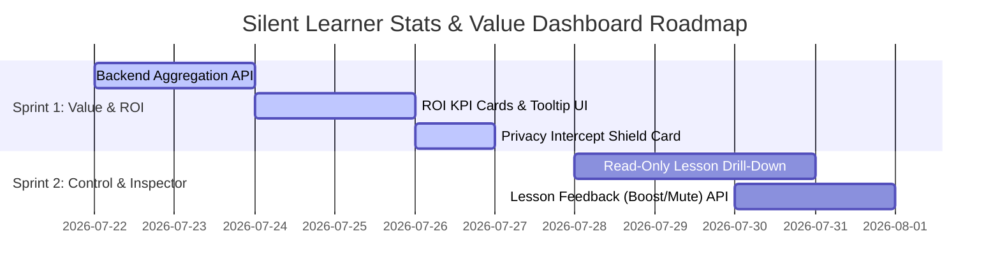

# Product Requirements Document (PRD): Silent Learner Stats & Value Dashboard

**Feature Name:** Silent Learner Stats & Value Dashboard  
**Path:** `docs/features/silent-learner-stats-dashboard/prd.md`  
**Status:** Approved for Design & Planning  
**Target Release:** Sprint 1 (ROI & Value Metrics) & Sprint 2 (Lesson Inspector & Privacy Audit)

---

## 1. Problem Statement

While the Silent Learner passively captures user coding patterns, style preferences, and project recipes to optimize AI responses, the current settings UI (`SilentLearnerSettings.tsx`) only presents raw operational counts (*Sessions Observed*, *Qualifying Events*, *Memory Packs*).

Users currently lack visibility into:
1. **Concrete ROI & Impact:** How many tokens have been saved, cost reductions, or latency improvements.
2. **Value Proof:** Concrete proof that Silent Learner is actively improving prompt context relevancy.
3. **Memory Control & Transparency:** Detailed insight into what specific rules have been distilled into memory packs, without risk of memory pack corruption.

The **Silent Learner Stats & Value Dashboard** transforms the settings panel into a high-visibility **Value & Control Dashboard** that demonstrates quantifiable ROI, builds trust in background learning, and provides read-only inspection and feedback controls over learned lessons.

---

## 2. User Stories

### Story 1: Visualizing ROI & Cost Savings (Priority: P0 - Sprint 1)
> *As a project developer*, I want to see how many tokens and estimated API costs Silent Learner has saved me so that I understand the financial and performance value of background context distillation.

### Story 2: Benchmarking & Transparency Tooltip (Priority: P0 - Sprint 1)
> *As a user*, I want to inspect how token savings are calculated via an explicit tooltip so that I can trust the ROI metrics presented on my dashboard.

### Story 3: Privacy & Security Intercept Counter (Priority: P1 - Sprint 1)
> *As a security-conscious developer*, I want to see a counter of redacted sensitive strings so that I have complete confidence that private credentials remain 100% local and safe.

### Story 4: Inspecting Distilled Lessons (Priority: P1 - Sprint 2)
> *As a user*, I want to open a memory pack to view all distilled rules (e.g., "Prefers Tailwind HSL color tokens") without being able to edit raw text directly (preventing memory corruption), so that I know exactly what Silent Learner has remembered about my workflow.

### Story 5: Rule Signal Feedback & Muting (Priority: P1 - Sprint 2)
> *As a user*, I want to thumb-up/down or mute specific distilled rules so that I can tune AI behavior without risking manual text syntax corruption.

---

## 3. Scope Boundaries

### In Scope
- **Sprint 1 (ROI & Value Metrics - Immediate Focus):**
  - KPI summary cards for Estimated Tokens Saved, Estimated Cost Impact, Latency Reduction %, and Solution Acceptance Rate.
  - Interactive tooltip explaining the fixed benchmark calculation methodology.
  - Privacy & Redaction Shield Intercept Counter (e.g., "14 sensitive tokens redacted on-device").
  - Backend API endpoint `/api/projects/:id/silent-learner/metrics` returning calculated ROI aggregations.
- **Sprint 2 (Lesson Inspector & Memory Control):**
  - Read-only drill-down modal/drawer for individual memory packs.
  - Signal feedback controls (Boost 👍 / Degrade 👎 / Mute 👁️) per lesson.
  - Dynamic relevance score updating based on user feedback.

### Out of Scope
- **Direct Text Editing of Lessons:** Direct user editing of distilled lesson text is explicitly forbidden to prevent memory pack schema corruption or invalid rule state.
- **Custom Dynamic Token Cost Calculators per LLM Model:** Sprint 1 will use a unified fixed benchmark methodology ($0.003 / 1,000 tokens saved).
- **Multi-Tenant Team Cloud Syncing:** Syncing packs across teams is reserved for Phase 5 of the master Silent Learner roadmap.

---

## 4. Acceptance Criteria (Testable)

### AC-1: ROI Summary Card Render
- [ ] Displays **Estimated Tokens Saved** formatted dynamically (e.g., `145.2K tokens`).
- [ ] Displays **Estimated Financial Savings** based on fixed benchmark (e.g., `~$0.43 saved`).
- [ ] Displays **Prompt Latency Improvement** percentage (e.g., `-38% latency`).
- [ ] Displays **Solution Acceptance Rate** (percentage of accepted AI edits vs total events).

### AC-2: Benchmark Tooltip Explainer
- [ ] Hovering or clicking the info icon next to Token Savings reveals a tooltip explaining:
  *“Estimated using a fixed benchmark of ~2,600 tokens saved per distilled context injection turn at an average cost of $0.003 / 1,000 tokens.”*

### AC-3: Privacy & Security Intercept Counter
- [ ] Shield card displays total count of redacted secrets/tokens from SQLite `redaction_logs`.
- [ ] Reaffirms 100% on-device local storage under `.metadata/memory.db`.

### AC-4: Read-Only Lesson Inspector (Sprint 2)
- [ ] Clicking a Memory Pack row opens a drill-down slide-over or modal.
- [ ] Displays list of distilled lessons with their source session and confidence score.
- [ ] Direct text editing input is **disabled / prohibited**.
- [ ] User can click 👍 (Boost), 👎 (Degrade), or Mute on any lesson.

---

## 5. Edge Cases & Handling

1. **New Project with Zero Sessions Observed:**
   - Display clean empty state for ROI cards: *"0 Tokens Saved (Start chatting to accumulate savings)"*.
   - Tooltip remains accessible explaining how savings will be calculated once active.
2. **Disabled / Off State:**
   - If Silent Learner mode toggle is switched OFF, ROI metrics remain visible (historical totals), but a banner indicates *"Monitoring paused — historical savings preserved"*.
3. **Database Reset / Clear All Data:**
   - Executing "Clear All Data" resets ROI metrics, redaction logs, and memory packs back to 0.

---

## 6. Dependencies

- **Frontend:** React, Lucide Icons (`Brain`, `Sparkles`, `ShieldCheck`, `TrendingUp`, `Coins`, `Clock`), Tailwind CSS, Radix UI Tooltip/Dialog components.
- **Backend:** `node-backend/lib/silent-learner/learning-store.mjs` (SQLite tables: `learning_events`, `redaction_logs`, `memory_packs`, `file_scores`).

---

## 7. Prioritized Implementation Slices



---

## 8. API & Contract Assumptions

### `GET /api/projects/:id/silent-learner/metrics`
**Response:**
```json
{
  "workspaceId": "proj_123",
  "sessionsObserved": 35,
  "qualifyingEvents": 33,
  "acceptedEvents": 29,
  "acceptanceRate": 0.878,
  "estimatedTokensSaved": 145200,
  "estimatedCostSavedUsd": 0.4356,
  "estimatedLatencyReductionPct": 38,
  "redactionCount": 14,
  "benchmark": {
    "tokensSavedPerTurn": 2600,
    "costPerKTokensUsd": 0.003
  }
}
```

### `GET /api/projects/:id/silent-learner/memory-packs/:packId/lessons`
**Response:**
```json
{
  "packId": "workspace-style",
  "packName": "Workspace Style",
  "lessons": [
    {
      "id": "les_01",
      "text": "Prefers Tailwind HSL variables for color tokens",
      "sourceSessionId": "sess_882",
      "confidence": 0.92,
      "status": "active"
    }
  ]
}
```
