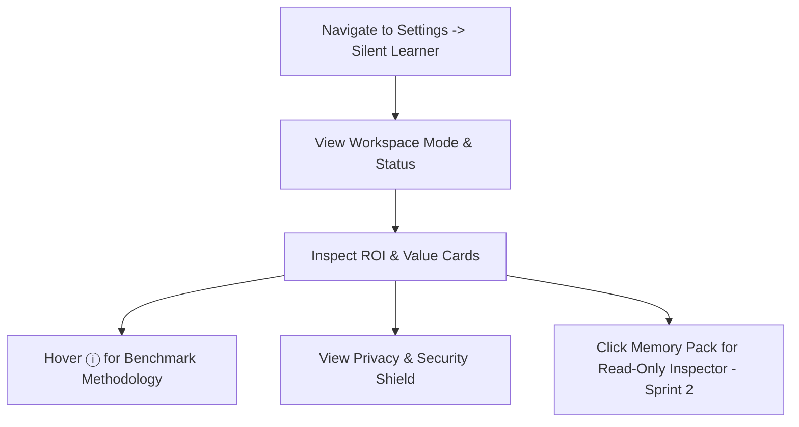

# UX Specification: Silent Learner Stats & Value Dashboard

**Feature Name:** Silent Learner Stats & Value Dashboard  
**Path:** `docs/features/silent-learner-stats-dashboard/ux-spec.md`  
**Status:** Approved for Implementation  
**Target Screen:** `src/components/settings/SilentLearnerSettings.tsx`

---

## 1. User Flows

### Primary Flow: Reviewing ROI & Savings (Sprint 1)
1. User navigates to **Project Settings** → **Silent Learner**.
2. Page displays top **Workspace Mode & Status** header with toggle and status badge (`Memory Ready ✓`).
3. User immediately sees **ROI & Impact Summary Cards**:
   - **Tokens Saved** (e.g. `145.2K`)
   - **Cost Saved** (e.g. `~$0.43`)
   - **Latency Speedup** (e.g. `-38%`)
   - **Acceptance Rate** (e.g. `87.8%`)
4. User hovers over or taps the **Info Icon (ⓘ)** next to "Tokens Saved".
5. Tooltip pops up explaining the fixed benchmark methodology.
6. User scrolls down to inspect the **Privacy & Security Intercept Shield** card displaying local redactions.



### Alternate Flow: Inspecting Lessons & Providing Feedback (Sprint 2)
1. User clicks on a Memory Pack row (e.g., `Workspace Style`).
2. A side-over drawer slides in displaying extracted lessons in read-only format (text editing disabled).
3. User clicks 👍 to boost lesson confidence or 👁️ to mute a rule.
4. UI updates badge to `Muted` or `Boosted` with instant feedback toast.

---

## 2. Screen States

### A. Empty State (New Workspace / No Sessions)
- **Visual:** Metric cards show `0 Tokens Saved`, `0ms Saved`, `0 Redactions`.
- **Copy:** *"Silent Learner is listening. As you interact with AI tools in this project, your ROI metrics will populate here."*
- **Action:** Primary button `[ Optimize Memory (Cold-Start Scan) ]` prominent to bootstrap context.

### B. Loading State
- **Visual:** Skeleton loaders for KPI cards and shimmer state on memory insight rows while backend aggregates metrics.

### C. Populated / Active State (Sprint 1 Target)
- **Visual:** Vibrant HSL badges, subtle dark mode borders, clean numerical formatting (`145.2K` instead of `145200`).
- **Interactive Tooltip:** Radix UI accessible tooltip rendered on hover/focus.

### D. Paused / Disabled State
- **Visual:** Header banner muted gray/amber. Cards show muted text with badge `Monitoring Paused`. Historical savings remain preserved.

---

## 3. UI Layout & Visual Design Token Map

```
┌────────────────────────────────────────────────────────────────────────────────────────┐
│ Silent Learner Mode                              [ Memory Ready ✓ ]  (●) Toggle        │
├────────────────────────────────────────────────────────────────────────────────────────┤
│ ┌──────────────────────┐ ┌──────────────────────┐ ┌──────────────────────┐ ┌─────────┐ │
│ │ ⚡ TOKENS SAVED ⓘ    │ │ ⏱️ LATENCY BOOST     │ │ 🎯 ACCEPTANCE RATE   │ │ PRIVACY │ │
│ │ 145.2K (~$0.43)      │ │ -38% Faster          │ │ 87.8% (29/33)        │ │ 14 Safe │ │
│ └──────────────────────┘ └──────────────────────┘ └──────────────────────┘ └─────────┘ │
```

### Color Palette (Tailwind HSL Tokens)
- **Primary / Emerald Accent:** `bg-emerald-500/10 text-emerald-600 dark:text-emerald-400` (Success & Savings)
- **Blue Accent:** `bg-blue-500/10 text-blue-600 dark:text-blue-400` (Tokens & Performance)
- **Purple Accent:** `bg-purple-500/10 text-purple-600 dark:text-purple-400` (Memory & Knowledge)
- **Shield Accent:** `bg-emerald-950/20 text-emerald-400 border-emerald-500/20` (On-Device Privacy)

---

## 4. UI Copy Drafts & Tooltips

| Component | UI Copy |
| :--- | :--- |
| **Tokens Saved Label** | `ESTIMATED TOKENS SAVED` |
| **Cost Saved Subtext** | `~$0.43 API cost reduction` |
| **Benchmark Tooltip** | *"Savings are calculated using a fixed benchmark of ~2,600 tokens saved per context injection at an average estimated cost of $0.003 / 1,000 tokens."* |
| **Latency Speedup Label** | `PROMPT LATENCY REDUCTION` |
| **Acceptance Rate Label** | `SOLUTION ACCEPTANCE` |
| **Acceptance Subtext** | `29 of 33 AI solutions accepted without edits` |
| **Privacy Shield Label** | `100% ON-DEVICE PRIVACY GUARANTEE` |
| **Privacy Shield Subtext** | `14 sensitive tokens/secrets intercepted and prevented from reaching remote LLMs.` |

---

## 5. Accessibility Requirements (A11y)

- **Keyboard Navigation:** 
  - All summary cards and info icons (`ⓘ`) must be focusable via `Tab`.
  - Tooltips open on `Focus` or `Hover` and close on `Escape`.
- **Screen Readers:**
  - `aria-label="Estimated tokens saved: 145.2 thousand"`
  - `aria-describedby="token-savings-benchmark-tooltip"`
- **Contrast & Hierarchy:**
  - Text contrast ratio ≥ 4.5:1 for normal text and ≥ 3:1 for large stats numbers.

---

## 6. Handoff Annotations for Frontend Agent

1. **Tooltip Component:** Use standard shadcn UI `@/components/ui/tooltip` component.
2. **Icons:** Import `Coins`, `Clock`, `Sparkles`, `ShieldCheck`, `TrendingUp`, `Info` from `lucide-react`.
3. **Data Formatting:** Use helper `formatNumber(145200) => "145.2K"`.
4. **Sprint 1 Scope:** Focus exclusively on adding the 4 top KPI cards + benchmark tooltip + Privacy Intercept card. The read-only lesson drawer is deferred to Sprint 2.
