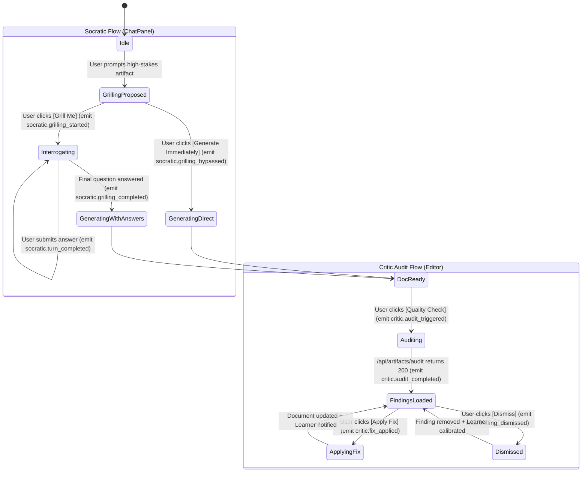

# Frontend Implementation Plan: Socratic PM Intelligence (M1)

> **Feature**: `socratic-pm-harness`  
> **Milestone**: M1 (P0: Socratic Grilling Engine + On-Demand Critic Board)  
> **Pipeline Stage**: Frontend Agent $\rightarrow$ Ready for Implementation & Review  
> **Reference Specs**: [prd.md](./prd.md) &bull; [ux-spec.md](./ux-spec.md) &bull; [TELEMETRY.md](../../../TELEMETRY.md)

---

## 1. Executive Summary & Scope Focus

This plan outlines the frontend implementation for **Milestone 1 (P0)** of Socratic PM Intelligence.
It delivers three primary UX and instrumentation systems:
1. **The Socratic "Grill-Me" Clarification Card** inside `ChatPanel.tsx` with hybrid triggering, quick-select answer chips, multi-turn Socratic step handling, and telemetry tracking.
2. **The Adversarial Critic Review Drawer** (`CriticReviewDrawer.tsx`) replacing the basic section quality banner in `MarkdownEditor.tsx`, with 1-click text fixes, severity categorization, Silent Learner feedback hooks, and telemetry tracking.
3. **Telemetry & Product Analytics Instrumentation** via `src/lib/telemetry.ts` to measure feature discovery, grilling completion rates, critic finding engagement, and fix adoption.

---

## 2. Component Architecture & File Inventory

```
src/
├── components/
│   └── workspace/
│       ├── SocraticGrillCard.tsx       [NEW] Socratic clarification card & multi-step chips
│       ├── CriticReviewDrawer.tsx      [NEW] Slide-over adversarial audit panel
│       ├── ChatPanel.tsx               [MODIFY] Mount SocraticGrillCard, intent detector, telemetry hooks
│       ├── MarkdownEditor.tsx          [MODIFY] Connect Quality Check button to Critic Drawer & telemetry
│       └── RichMarkdownEditor.tsx      [MODIFY] Support target section replacement via Critic fix
├── api/
│   └── server.ts                       [MODIFY] Add auditArtifact & sendLearningFeedback client methods
├── lib/
│   └── telemetry.ts                    [MODIFY] Telemetry event helpers for Socratic & Critic events
└── types/
    └── socratic.ts                     [NEW] TypeScript interfaces for Socratic turns & Critic findings
```

---

## 3. Detailed Component Specifications

### 3.1 `SocraticGrillCard.tsx` [NEW]
- **Location**: `src/components/workspace/SocraticGrillCard.tsx`
- **Purpose**: Render the Socratic invitation block, question turns, quick-select chips, and bypass buttons.
- **Props Interface**:
  ```typescript
  interface SocraticGrillCardProps {
    artifactType: 'prd' | 'roadmap' | 'user_story' | 'presentation';
    step: number;
    totalSteps: number;
    currentQuestion?: {
      id: string;
      question: string;
      quickOptions: string[];
      category: 'edge_case' | 'telemetry' | 'scope' | 'dependency';
    };
    onAnswer: (questionId: string, answer: string, mode: 'chip' | 'custom_text') => void;
    onSkipTurn: () => void;
    onBypassImmediately: () => void;
    isLoading: boolean;
  }
  ```
- **Key Interactions**:
  - Clicking a quick-option chip immediately sends that value as the answer and tracks `socratic.turn_completed` with `answeredMode: 'chip'`.
  - Custom text input allows freeform answer submission via `Enter` and tracks `answeredMode: 'custom_text'`.
  - `[⚡ Generate Immediately]` bypass immediately transitions the agent into generation with context-derived default assumptions and tracks `socratic.grilling_bypassed`.

---

### 3.2 `CriticReviewDrawer.tsx` [NEW]
- **Location**: `src/components/workspace/CriticReviewDrawer.tsx`
- **Purpose**: A slide-over sheet displaying the multi-agent adversarial audit findings with 1-click fix applications.
- **Props Interface**:
  ```typescript
  interface CriticFinding {
    id: string;
    critic: 'devils_pm' | 'telemetry_guardian' | 'tone_inspector';
    severity: 'critical' | 'suggestion' | 'compliant';
    title: string;
    description: string;
    quote?: string;
    suggestedFix: string;
    targetSection?: string;
  }

  interface CriticReviewDrawerProps {
    isOpen: boolean;
    onClose: () => void;
    isLoading: boolean;
    overallScore: number;
    findings: CriticFinding[];
    onApplyFix: (finding: CriticFinding) => Promise<void>;
    onDismissFinding: (findingId: string, finding: CriticFinding) => void;
  }
  ```
- **Visual Design**:
  - Slide-over panel from right edge (`w-96` to `w-[450px]` on desktop, full width on mobile).
  - Severity tabs (`All (3)`, `Critical (1)`, `Suggestions (2)`).
  - Critic badges with dedicated icons:
    - 👿 **The Devil's PM** (Scope & Edge Cases)
    - 📊 **The Telemetry Guardian** (Metrics & Events)
    - ✍️ **The Tone & Brand Inspector** (Style & Keywords)
  - `[✨ Apply Fix]` with optimistic loading spinner $\rightarrow$ checkmark animation, tracking `critic.fix_applied`.
  - `[✕ Dismiss]` collapsing the card and tracking `critic.finding_dismissed`.

---

### 3.3 Integration with `MarkdownEditor.tsx` & `ChatPanel.tsx` [MODIFY]

#### `MarkdownEditor.tsx`:
- Update `handleQualityCheck()` to trigger `api.server.auditArtifact({ projectId, artifactPath, content })`.
- Fire telemetry event `critic.audit_triggered` with `{ artifactType, source: 'toolbar_button' | 'shortcut' | 'approval_card', criticsCount: 3 }`.
- Maintain `isCriticDrawerOpen: boolean` and `criticFindings: CriticFinding[]` state.
- Bind `Cmd+Shift+Q` / `Ctrl+Shift+Q` keyboard shortcut to open the Critic Drawer and run the audit.
- When `onApplyFix` is called:
  1. Locates the `targetSection` or `quote` in the markdown text.
  2. Drop-in replaces with `suggestedFix`.
  3. Dispatches `api.server.sendLearningFeedback({ projectId, findingId, action: 'applied' })`.
  4. Dispatches `trackEvent('critic.fix_applied', { critic: finding.critic, severity: finding.severity })`.
  5. Triggers `toast({ title: 'Fix Applied', description: 'Updated document & saved rule to project memory.' })`.

#### `ChatPanel.tsx`:
- Parse incoming assistant message streams for Socratic interrogation triggers (`socratic_proposal` / `socratic_question` events or structured SSE blocks).
- Fire `trackEvent('socratic.grilling_started', { artifactType, trigger: 'suggestion_accepted' })` when user opts into grilling.
- Display `SocraticGrillCard` when a proposal or question turn is active.
- Forward user chip selections or typed answers to the assistant session.

---

## 4. Telemetry & Product Analytics Specification

To measure adoption, drop-off rates, and utility of Socratic PM Intelligence and the Critic Board, all user actions emit privacy-preserving telemetry events via `trackEvent()` in `src/lib/telemetry.ts`.

### 4.1 Event Catalog for Milestone 1

| Event Name | Trigger Point | Payload Parameters | Purpose |
| :--- | :--- | :--- | :--- |
| `socratic.grilling_started` | User clicks `[Grill Me First]` on Socratic card | `artifactType` (string), `trigger` (`suggestion_accepted` / `slash_command`) | Measure feature opt-in rate vs. direct generation |
| `socratic.turn_completed` | User submits answer to a Socratic question | `artifactType` (string), `step` (number), `totalSteps` (number), `answeredMode` (`chip` / `custom_text` / `default`) | Track question completion progression and input mode preference |
| `socratic.grilling_bypassed` | User clicks `[⚡ Generate Immediately]` or skips turn | `artifactType` (string), `reason` (`generate_immediately` / `skipped`) | Measure user bypass rate and identify potential friction points |
| `socratic.grilling_completed` | All Socratic questions answered and generation begins | `artifactType` (string), `questionsAnswered` (number), `durationMs` (number) | Track end-to-end interview completion and time spent |
| `critic.audit_triggered` | User triggers Quality Check / Audit | `artifactType` (string), `source` (`toolbar_button` / `shortcut` / `approval_card`), `criticsCount` (number) | Measure frequency of on-demand quality inspections |
| `critic.audit_completed` | `/api/artifacts/audit` successfully returns findings | `artifactType` (string), `overallScore` (number), `findingsCount` (number), `criticalCount` (number), `durationMs` (number) | Benchmark quality scores and backend performance |
| `critic.fix_applied` | User clicks `[✨ Apply Fix]` on a finding card | `critic` (`devils_pm` / `telemetry_guardian` / `tone_inspector`), `severity` (`critical` / `suggestion`) | Measure fix acceptance rate and value per critic type |
| `critic.finding_dismissed`| User clicks `[✕ Dismiss]` on a finding card | `critic` (`devils_pm` / `telemetry_guardian` / `tone_inspector`), `severity` (`critical` / `suggestion`) | Measure false-positive rate and tune critic prompts |

> [!NOTE]
> All new telemetry events above are documented in the central [TELEMETRY.md](../../../TELEMETRY.md) allowlist file.

---

## 5. State & Event Model



---

## 6. API Client Methods (`src/api/server.ts`)

```typescript
export const auditArtifact = async (params: {
  projectId: string;
  artifactPath: string;
  content: string;
  critics?: Array<'devils_pm' | 'telemetry_guardian' | 'tone_inspector'>;
}): Promise<{
  summary: string;
  overallScore: number;
  findings: CriticFinding[];
}> => {
  return serverFetch('/api/artifacts/audit', {
    method: 'POST',
    body: JSON.stringify(params),
  });
};

export const sendLearningFeedback = async (params: {
  projectId: string;
  feedbackType: 'critic_resolution' | 'socratic_decision';
  data: Record<string, any>;
}): Promise<{ success: boolean }> => {
  return serverFetch('/api/learning/feedback', {
    method: 'POST',
    body: JSON.stringify(params),
  });
};
```

---

## 7. Responsive Behavior & Accessibility (a11y)

- **Mobile & Tablet**: Critic Review Drawer renders as a full-screen bottom sheet with a fixed top drag handle and dismiss button.
- **Desktop**: Slide-over panel that docks cleanly alongside the `MarkdownEditor` without obscuring text.
- **Keyboard Shortcuts**:
  - `Cmd+Shift+Q` (Mac) / `Ctrl+Shift+Q` (Windows): Trigger Quality Check Audit (emits `critic.audit_triggered` with `source: 'shortcut'`).
  - `Escape`: Close Critic Review Drawer and restore focus to the editor.
- **Screen Reader Announcements**:
  - `aria-live="polite"` on Quality Score update and Fix Applied confirmations.

---

## 8. PR-Ready Checklist & Stage Gate Handoff

- [ ] `SocraticGrillCard.tsx` created with quick-select chips and custom input
- [ ] `CriticReviewDrawer.tsx` created with WCAG AA compliant severity badges
- [ ] `MarkdownEditor.tsx` integrated with `auditArtifact` and `Cmd+Shift+Q` shortcut
- [ ] `ChatPanel.tsx` integrated with Socratic streaming protocol
- [ ] Telemetry events instrumented for all 8 Socratic & Critic actions
- [ ] `TELEMETRY.md` updated with all 8 new events
- [ ] Optimistic update and error toasts verified
- [ ] Zero TypeScript errors under `strict: true`

### Stage Gate Handoff Contract (FE $\rightarrow$ Backend & QA)
- **Summary**: Frontend plan for Milestone 1 (P0) updated with complete Telemetry specification and component bindings.
- **Artifacts Produced**: `docs/features/socratic-pm-harness/frontend-plan.md` &bull; `TELEMETRY.md`
- **Handoff to Next Agent**: **QA Strategy Agent** (for `qa-plan.md`)
- **Blockers**: None.
