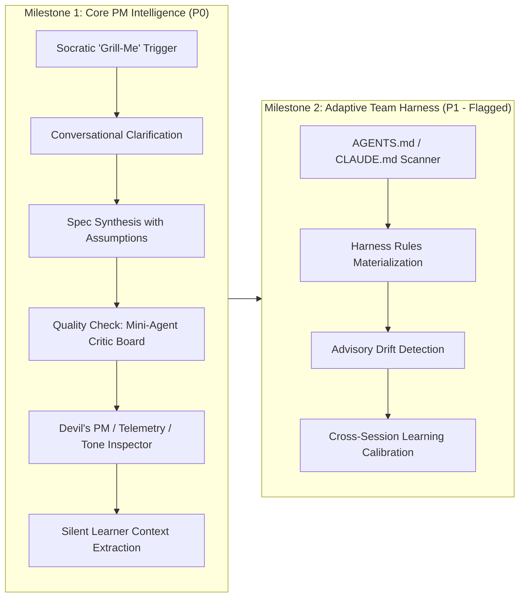

# PRD: Socratic PM Intelligence & Adaptive Team Harness

> **Feature**: `socratic-pm-harness`  
> **Status**: Approved by Product Lead  
> **Pipeline Stage**: Product/Design Agent $\rightarrow$ Ready for UX Agent  
> **Milestones**: M1 (P0: Socratic Grilling + Critic Board) &bull; M2 (P1: Team Harness & Silent Learning Loop)

---

## 1. Executive Summary & Problem Statement

### 1.1 The Problem
When non-technical product managers, founders, and team leads prompt general-purpose AI agents with high-level feature requests (e.g., *"Create a PRD for Slack notifications"*), the outputs suffer from three systemic flaws:
1. **The "Happy Path" Hallucination Trap**: AI jumps straight into generating boilerplate without asking critical, non-obvious questions regarding edge cases, rate limits, enterprise security, or failure modes.
2. **Self-Grading Worker Bias**: The same model generating the specification evaluates its own completeness, resulting in missed telemetry requirements, vague acceptance criteria, and hidden technical contradictions.
3. **Organizational Context & Harness Disconnect**: Teams maintain coding standards, architecture decisions (ADRs), design tokens, and style guidelines across `AGENTS.md`, `CLAUDE.md`, and internal documentation. Current tools cannot automatically ingest or enforce these organizational constraints for product artifacts, resulting in specification drift.

### 1.2 The Solution
ProductOS introduces **Socratic PM Intelligence & Adaptive Team Harness**:
- **Socratic "Grill-Me" Engine (M1 - P0)**: An intelligent conversational interrogation layer that proactively identifies ambiguous requirements and interviews the user on high-impact trade-offs *before* generating specifications.
- **On-Demand Mini-Agent Critic Board (M1 - P0)**: An adversarial review panel (*The Devil's PM*, *The Telemetry & Metrics Guardian*, *The Tone & Brand Inspector*) integrated directly into the artifact Quality Check workflow to stress-test drafts against project context and OKF metadata.
- **Adaptive Team Harness Ingestion (M2 - P1)**: Automatic parsing of repository `AGENTS.md` and `CLAUDE.md` to establish project boundaries, detect architectural drift, and feed the Silent Learner with real user decisions.

---

## 2. Target Personas & Core Value Proposition

| Persona | Primary Goal | Pain Point Solved |
| :--- | :--- | :--- |
| **Product Manager** | Create export-ready, watertight PRDs and User Stories. | Eliminates vague specs and missing telemetry; replaces tedious manual prompt crafting with guided Socratic clarification. |
| **Tech Lead / Engineering Manager** | Ensure product specifications respect system constraints and team standards. | Pre-screens PRDs for unstated technical assumptions and architectural violations using the Critic Board. |
| **Founder / Product Lead** | Maintain consistent brand voice and quality standards across all projects. | Automatically enforces tone, avoided keywords, and standard KPI metrics through ambient project context. |

---

## 3. Milestones & Scope Boundaries



### In-Scope vs. Out-of-Scope

| Category | In-Scope (Milestone 1 - P0) | In-Scope (Milestone 2 - P1) | Out-of-Scope (Future) |
| :--- | :--- | :--- | :--- |
| **Socratic Engine** | • Hybrid trigger (Suggest Grilling with Skip/Generate option)<br>• Conversational inline chat interview<br>• Context-aware questions (no redundant queries)<br>• Default fallback to Silent Learner / OKF assumptions | • Cross-initiative question calibration based on past interviews | • Video/Audio voice-driven interview |
| **Critic Board** | • Integrated into existing artifact **Quality Check** action<br>• 3 Specialized Mini-Agents:<br>&nbsp;&nbsp;1. *Devil's PM* (Scope & Edge Cases)<br>&nbsp;&nbsp;2. *Telemetry & Metrics Guardian* (KPIs & Events)<br>&nbsp;&nbsp;3. *Tone & Brand Inspector* (Style & Keywords)<br>• Actionable recommendations with "Apply Fix" | • Critic consensus scoring<br>• Team-customizable critic prompts | • External automated LLM red-teaming against production APIs |
| **Team Harness** | • N/A | • Env switch (`ENABLE_TEAM_HARNESS=true`)<br>• Auto-ingestion of `AGENTS.md` and `CLAUDE.md`<br>• Advisory drift badges on PRD/story editor | • Bi-directional Git commit hooks for PRD changes |
| **Learning Loop** | • Auto-persist answered questions into `.metadata/_context/`<br>• Adjust critic tolerance based on accept/reject feedback | • Team-wide shared preference consolidation | • Public fine-tuning datasets |

---

## 4. User Stories & Acceptance Criteria

### Milestone 1 (P0): Core PM Intelligence

#### US-1: Socratic "Grill-Me" Pre-Generation Clarification
**As a** Product Manager,  
**I want** the AI assistant to detect when I am requesting a major product artifact and offer a quick Socratic clarification session,  
**So that** we uncover critical edge cases, non-goals, and dependencies before writing the draft.

**Acceptance Criteria**:
- [ ] **Trigger Detection**: When requesting a PRD, Roadmap, User Story slice, or Presentation, the assistant responds with an actionable prompt offering:
  - *"I'm ready to craft this PRD. We can jump straight in, or I can grill you on 3–4 high-impact trade-offs first to make the spec watertight."*
  - Action buttons: `[Grill Me First]` and `[Generate Immediately]`.
- [ ] **Context Awareness**: The generated questions MUST NOT repeat facts already present in Project Settings, OKF context, or the Silent Learner.
- [ ] **Conversational Flow**: Grilling occurs naturally inside the existing `ChatPanel` with progressive disclosure (1–2 questions per turn).
- [ ] **Graceful Fallback**: If the user responds *"I don't know"*, *"Decide for me"*, or *"Skip"*, the assistant applies industry best practices informed by the project context and flags these explicitly under an `## Assumptions & Defaults` section in the generated document.
- [ ] **Context Ingestion**: Key decisions extracted during the grilling session are automatically saved to the project's `.metadata/_context/` and Silent Learner memory.

#### US-2: On-Demand Mini-Agent Critic Board
**As a** Product Manager or Tech Lead,  
**I want** to run an adversarial Quality Check on my draft artifact using specialized mini-agents,  
**So that** I identify missing error states, uninstrumented metrics, and tone violations before sharing the document.

**Acceptance Criteria**:
- [ ] **Trigger Location**: Triggered on-demand via the existing **Quality Check** / **Audit** button in the artifact header and `ApprovalCard`.
- [ ] **Parallel Mini-Agent Evaluation**: The backend executes three targeted evaluator passes in parallel:
  1. **The Devil's PM**: Scans for vague requirements (*"fast"*, *"intuitive"*), unhandled edge cases, negative flows, and unconstrained scope.
  2. **The Telemetry & Metrics Guardian**: Verifies presence of Primary KPIs, Guardrail Metrics, PostHog/Segment tracking events, and Rollback criteria.
  3. **The Tone & Brand Inspector**: Audits compliance against `references/keywords.md`, `references/avoided-terms.md`, and project writing persona.
- [ ] **Structured Review Output**: Results are rendered in a clean, categorized Review Panel featuring:
  - Severity level (`Critical Blocker`, `Improvement`, `Compliant`).
  - Specific file location / quote.
  - Actionable recommendation with a 1-click `[Apply AI Fix]` or `[Dismiss]` button.
- [ ] **Learning Feedback**: Clicking `[Dismiss]` or `[Apply AI Fix]` updates the Silent Learner profile to calibrate future criticism sensitivity.

---

### Milestone 2 (P1): Adaptive Team Harness (Behind Feature Flag)

#### US-3: Repository Harness Ingestion (`AGENTS.md` / `CLAUDE.md`)
**As a** Team Lead,  
**I want** ProductOS to automatically read our team's `AGENTS.md` and `CLAUDE.md` files when the harness feature flag is active,  
**So that** all generated product artifacts inherit our organization's architecture guidelines, testing norms, and conventions.

**Acceptance Criteria**:
- [ ] **Feature Flag Gate**: Only active when environment variable `ENABLE_TEAM_HARNESS=true` is set.
- [ ] **File Ingestion**: Scans the project directory or linked codebase for `AGENTS.md`, `CLAUDE.md`, or `.agents/rules/`.
- [ ] **Context Normalization**: Ingested rules are mapped into `.metadata/_context/team-harness.md` under standardized headers (`Architecture Constraints`, `Testing Standards`, `Naming Conventions`).
- [ ] **System Prompt Injection**: Relevant harness rules are automatically injected into the generation pipeline for all artifacts.

#### US-4: Advisory Architectural Drift Detection
**As a** PM writing an initiative,  
**I want** ProductOS to provide non-blocking advisory warnings when my spec conflicts with established team standards,  
**So that** I catch architectural mismatches before development without halting my writing flow.

**Acceptance Criteria**:
- [ ] **Non-Blocking Warnings**: Renders subtle advisory badges in the Markdown Editor / Review drawer (e.g., *"Advisory: Proposes custom auth table, but team harness mandates OAuth via WorkOS"*).
- [ ] **No Hard Blockers**: The PM can acknowledge or ignore the advisory warning without blocking save, export, or approval workflows.

---

## 5. Technical Architecture & Data Contracts

### 5.1 System Architecture

```
┌─────────────────────────────────────────────────────────────────────────────┐
│                            ProductOS Frontend                               │
│                                                                             │
│   ┌───────────────────────────┐           ┌─────────────────────────────┐   │
│   │    ChatPanel & Bubble     │           │     RichMarkdownEditor      │   │
│   │  (Socratic Grilling UX)   │           │   (Critic Review Drawer)    │   │
│   └─────────────┬─────────────┘           └──────────────▲──────────────┘   │
└─────────────────┼────────────────────────────────────────┼──────────────────┘
                  │ POST /api/chat (stream)                │ POST /api/audit  │
                  ▼                                        │                  │
┌──────────────────────────────────────────────────────────┴──────────────────┐
│                         ProductOS Node Backend                              │
│                                                                             │
│   ┌───────────────────────────┐           ┌─────────────────────────────┐   │
│   │   Socratic Interrogator   │           │      Mini-Agent Board       │   │
│   │  (Context Gap Analyzer)   │           │  (Devil's PM / Telemetry)   │   │
│   └─────────────┬─────────────┘           └──────────────▲──────────────┘   │
│                 │                                        │                  │
│                 ▼                                        │                  │
│   ┌──────────────────────────────────────────────────────┴──────────────┐   │
│   │                 OKF Context Layer & Silent Learner                  │   │
│   │    (.metadata/_context/, references/keywords.md, Harness Cache)     │   │
│   └─────────────────────────────────────────────────────────────────────┘   │
└─────────────────────────────────────────────────────────────────────────────┘
```

### 5.2 API Contracts

#### Endpoint 1: Quality Check & Adversarial Audit
`POST /api/artifacts/audit`
- **Request Payload**:
  ```json
  {
    "projectId": "proj-analytics-platform",
    "artifactPath": "initiatives/slack-notifications/prd.md",
    "content": "# PRD: Slack Notifications...",
    "critics": ["devils_pm", "telemetry_guardian", "tone_inspector"]
  }
  ```
- **Response Payload**:
  ```json
  {
    "summary": "Audited with 3 critics. 1 critical gap, 2 suggestions.",
    "overallScore": 84,
    "findings": [
      {
        "id": "crit-001",
        "critic": "telemetry_guardian",
        "severity": "critical",
        "title": "Missing Webhook Failure Alert Metric",
        "description": "The PRD specifies Slack webhook delivery but does not define failure rate alerts or retry dead-letter queues.",
        "suggestedFix": "Add Section 4.3: 'Alerting: PostHog event `slack_delivery_failed` triggered when retry count > 3.'",
        "targetSection": "4. Telemetry & Analytics"
      },
      {
        "id": "crit-002",
        "critic": "tone_inspector",
        "severity": "suggestion",
        "title": "Avoided Term Detected",
        "description": "Found phrase 'seamlessly connects' which violates project writing rule against marketing hyperbole.",
        "suggestedFix": "Replace 'seamlessly connects' with 'integrates directly via OAuth 2.0'",
        "targetSection": "1. Problem Statement"
      }
    ]
  }
  ```

#### Endpoint 2: Silent Learner Feedback Ingestion
`POST /api/learning/feedback`
- **Request Payload**:
  ```json
  {
    "projectId": "proj-analytics-platform",
    "feedbackType": "critic_resolution",
    "data": {
      "findingId": "crit-002",
      "action": "applied",
      "originalText": "seamlessly connects",
      "appliedText": "integrates directly via OAuth 2.0",
      "learnedRule": "Enforce technical precision over marketing adjectives in PRD problem statements"
    }
  }
  ```

---

## 6. Edge Cases & Risk Mitigation

| Risk / Edge Case | Impact | Mitigation Strategy |
| :--- | :--- | :--- |
| **Grilling Fatigue** | User feels interrogated and abandons the workflow. | Cap grilling at **3–4 questions max** per session; always provide the `[Generate Immediately with Defaults]` escape hatch. |
| **Over-Aggressive Critics** | Critic mini-agents flag harmless formatting details, frustrating the PM. | Provide strict critic guidelines that prioritize business blockers and edge cases over stylistic nitpicks; user feedback auto-calibrates sensitivity. |
| **Model Latency on Audit** | Running 3 separate critic prompts sequentially could take 15–20 seconds. | Execute all three mini-agent evaluations concurrently via `Promise.all()` with cached project context. |
| **Conflicting Team Harness Rules** | `AGENTS.md` and `CLAUDE.md` contain contradictory guidelines. | Deterministic precedence hierarchy: `Project Settings > AGENTS.md > CLAUDE.md > Global Defaults`. |

---

## 7. Stage Gate Handoff Contract

### Summary
Product requirements defined for Socratic PM Intelligence and Adaptive Team Harness across Milestone 1 (P0: Grilling Engine + Critic Board) and Milestone 2 (P1: Team Harness Ingestion under feature flag `ENABLE_TEAM_HARNESS=true`).

### Decisions Made
1. **Grilling Trigger**: Hybrid model (Offer grilling proactively in Chat with immediate bypass option).
2. **Grilling UX**: Natural conversational flow inside `ChatPanel`.
3. **Critic Execution**: On-demand execution triggered via the artifact **Quality Check** action.
4. **Initial Critics**: *The Devil's PM*, *The Telemetry & Metrics Guardian*, *The Tone & Brand Inspector*.
5. **Team Harness Ingestion**: Read `AGENTS.md` / `CLAUDE.md` as advisory constraints behind an environment feature flag.
6. **Learning Loop**: Ingest resolved grilling answers and critic resolutions into `.metadata/_context/` and Silent Learner memory.

### Open Risks
- Latency during parallel critic execution on lower-tier API providers (mitigated via streaming / parallel calls).
- User question fatigue if grilling questions are too long (mitigated via 3-question cap).

### Artifacts Produced
- `docs/features/socratic-pm-harness/prd.md`

### Handoff to Next Agent
- **Target Agent**: `UX Agent`
- **Immediate Task**: Produce user flow diagrams, screen states (Empty, Grilling Turn, Critic Drawer, Advisory Badges), and interaction notes in `docs/features/socratic-pm-harness/ux-spec.md`.

### Blockers
- None. Ready for UX Specification.
