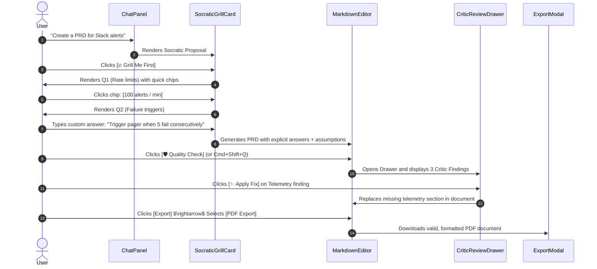

# QA Test Strategy: Socratic PM Intelligence (M1)

> **Feature**: `socratic-pm-harness`  
> **Milestone**: M1 (P0: Socratic Grilling Engine + On-Demand Critic Board)  
> **Pipeline Stage**: QA Strategy Agent $\rightarrow$ Ready for Unit & E2E Test Execution  
> **Reference Specs**: [prd.md](./prd.md) &bull; [ux-spec.md](./ux-spec.md) &bull; [frontend-plan.md](./frontend-plan.md) &bull; [backend-plan.md](./backend-plan.md) &bull; [TELEMETRY.md](../../../TELEMETRY.md)

---

## 1. Executive Summary & Quality Goals

This QA Strategy defines the comprehensive verification framework for **Milestone 1 (P0)** of Socratic PM Intelligence.
The goal is to ensure end-to-end reliability, high accessibility compliance (WCAG 2.1 AA), robust telemetry verification, and zero regression across the complete authoring-to-export lifecycle.

### Core Journey Under Test:
$$\text{Prompt Intent} \xrightarrow{\text{Socratic Grilling}} \text{Artifact Generation} \xrightarrow{\text{Adversarial Critic Audit}} \text{Review / 1-Click Fix} \xrightarrow{\text{PDF / DOCX Export}}$$

---

## 2. Risk-Based Test Matrix

| Priority | Risk Category | Potential Failure Mode | Test Strategy |
| :--- | :--- | :--- | :--- |
| **P0 (Critical)** | **End-to-End Workflow Integrity** | Grilling hangs, artifact generation fails, or doc corrupts after applying critic fix. | Full automated Playwright E2E test covering the complete lifecycle from prompt to PDF/DOCX export. |
| **P0 (Critical)** | **Critic Execution & Text Replacement** | Critic service times out or target section replacement replaces wrong document paragraph. | Integration & unit tests for `node-backend/lib/critics/` and diff replacement logic in `RichMarkdownEditor`. |
| **P0 (Critical)** | **Socratic State Machine** | Grilling loop gets stuck in infinite question cycle or ignores `[Generate Immediately]` bypass. | State transition unit tests for `SocraticGrillCard` and `ChatPanel`. |
| **P1 (High)** | **Accessibility & Keyboard Flow** | Screen reader fails to announce critic findings; focus lost when opening/closing drawer. | Automated axe-core audits + manual keyboard navigation validation (`Tab`, `Escape`, `Cmd+Shift+Q`). |
| **P1 (High)** | **Telemetry Completeness** | User actions fail to trigger allowlisted telemetry events in `TELEMETRY.md`. | Telemetry mock assertion tests checking payload shapes for all 8 Socratic & Critic events. |
| **P2 (Medium)** | **Export Format Fidelity** | Applied critic fixes break Markdown table formatting or header hierarchy in PDF/DOCX export. | Snapshot and visual regression tests on exported PDF/DOCX files. |

---

## 3. Comprehensive End-to-End (E2E) Test Scenarios

### 3.1 E2E Journey 1: Happy Path (Prompt $\rightarrow$ Grilling $\rightarrow$ Generation $\rightarrow$ Audit $\rightarrow$ Fix $\rightarrow$ PDF Export)


**Verification Steps**:
1. User enters PRD prompt in chat $\rightarrow$ `SocraticGrillCard` appears with `[Grill Me First]` and `[Generate Immediately]`.
2. Telemetry event `socratic.grilling_started` is fired.
3. User completes 2 turns using combination of quick chip and custom text input $\rightarrow$ `socratic.turn_completed` fired on each turn.
4. Generated PRD appears in `MarkdownEditor` with explicit answers incorporated and defaults flagged in `## Assumptions & Defaults`.
5. User clicks `Quality Check` $\rightarrow$ `critic.audit_triggered` fired $\rightarrow$ Critic Drawer opens with score and findings from Devil's PM, Telemetry Guardian, and Tone Inspector.
6. User clicks `Apply Fix` $\rightarrow$ Target section updates cleanly without corrupting other markdown content $\rightarrow$ `critic.fix_applied` fired.
7. User exports document as **PDF** $\rightarrow$ File downloads successfully with status 200, valid magic bytes (`%PDF-`), and intact headers/tables.

---

### 3.2 E2E Journey 2: Immediate Bypass $\rightarrow$ Quality Audit $\rightarrow$ DOCX Export
**Verification Steps**:
1. User requests a Roadmap artifact.
2. User clicks `[⚡ Generate Immediately]` bypass on `SocraticGrillCard`.
3. Telemetry event `socratic.grilling_bypassed` is fired with `reason: 'generate_immediately'`.
4. Artifact generates instantly using project context best-practice assumptions.
5. User presses `Cmd+Shift+Q` (Mac) / `Ctrl+Shift+Q` (Windows) to trigger Quality Check.
6. Critic Drawer renders findings $\rightarrow$ User clicks `[✕ Dismiss]` on a suggestion $\rightarrow$ Finding collapses and `critic.finding_dismissed` is fired.
7. User clicks `Export` $\rightarrow$ Selects **DOCX Export** $\rightarrow$ `.docx` binary downloads and parses cleanly without XML schema errors.

---

## 4. Accessibility (a11y) Test Scenarios

| Test Case ID | Accessibility Area | Description | Expected Behavior |
| :--- | :--- | :--- | :--- |
| **A11Y-01** | **Keyboard Navigation** | Navigate Socratic proposal and question chips using keyboard only. | `Tab` cycles between quick-option chips; `Enter` selects active chip; `Arrow` keys move focus predictably. |
| **A11Y-02** | **Critic Drawer Focus Trap** | Open Critic Review Drawer via `Cmd+Shift+Q`. | Focus moves to the first critical finding card inside the drawer; background editor text is aria-hidden / inert while drawer is open. |
| **A11Y-03** | **Escape Key Dismissal** | Press `Escape` while Critic Drawer is active. | Drawer slides closed smoothly; focus returns exactly to the editor cursor position. |
| **A11Y-04** | **Screen Reader Alerts** | Apply a Critic Fix or dismiss a finding. | `aria-live="polite"` region announces: *"Fix applied from The Telemetry Guardian. Document updated."* |
| **A11Y-05** | **Color Contrast (WCAG AA)** | Verify text contrast on Critical (Red), Suggestion (Amber), and Compliant (Green) badges. | Contrast ratio $\ge 4.5:1$ against dark/light theme backgrounds; each badge contains an icon (`🚨`, `⚠️`, `✅`) + text label for color-blind support. |

---

## 5. Negative, Edge & Pathological Test Scenarios

| Test Case ID | Scenario | Injected Condition | Expected System Behavior |
| :--- | :--- | :--- | :--- |
| **NEG-01** | **Audit Backend Timeout** | API provider takes $>8\text{ s}$ during one critic check. | `Promise.allSettled()` collects remaining available critics; drawer displays partial findings with non-fatal warning: *"The Devil's PM timed out; showing results from 2 critics"*. |
| **NEG-02** | **Malformed LLM Output** | Critic returns unstructured text instead of JSON schema. | Regex fallback parser in `devils-pm.mjs` extracts title and suggestion; overall audit returns 200 without throwing 500. |
| **NEG-03** | **Rapid Repeated Clicks** | User spams `[Quality Check]` or `[Apply Fix]` button rapidly. | UI debounces button; subsequent clicks are ignored while request is pending. |
| **NEG-04** | **Network Disconnect on Fix** | Network drops while dispatching Silent Learner feedback. | Local document text updates optimistically; telemetry/feedback queues in offline storage without breaking UI. |
| **NEG-05** | **Special Characters in Fix** | Suggested fix contains backticks, quotes, regex characters, or HTML tags. | Markdown replacement cleanly escapes entities and inserts text verbatim without breaking TipTap editor DOM. |

---

## 6. Telemetry & Analytics Verification Plan

Validate that all 8 new events documented in `TELEMETRY.md` fire with accurate, allowlisted payloads:

```typescript
// Telemetry Test Suite Assertions (e2e / unit)
expect(telemetryQueue).toContainEqual({
  eventName: 'socratic.grilling_started',
  payload: { artifactType: 'prd', trigger: 'suggestion_accepted' }
});

expect(telemetryQueue).toContainEqual({
  eventName: 'socratic.turn_completed',
  payload: { artifactType: 'prd', step: 1, totalSteps: 2, answeredMode: 'chip' }
});

expect(telemetryQueue).toContainEqual({
  eventName: 'critic.audit_triggered',
  payload: { artifactType: 'prd', source: 'toolbar_button', criticsCount: 3 }
});

expect(telemetryQueue).toContainEqual({
  eventName: 'critic.fix_applied',
  payload: { critic: 'telemetry_guardian', severity: 'critical' }
});
```

---

## 7. Regression Scope & Verification Targets

Ensure zero regressions across existing ProductOS capabilities:
1. **Existing Artifact Workflows**: Standard PRD, Roadmap, and Presentation templates continue generating without regression.
2. **Silent Learner Capture**: Regular chat conversations and settings updates continue capturing project facts normally.
3. **Presentation & Deck Engine**: Slide layout editor, Remotion rendering, and PPTX export remain 100% operational.
4. **Secret Encryption & Settings**: Keychain security and provider switching remain unaffected.

---

## 8. Release Exit Criteria

- [ ] **E2E Pass Rate**: 100% pass on automated Playwright E2E test suite (including Happy Path, Bypass, and PDF/DOCX export).
- [ ] **Unit Test Coverage**: $\ge 90\%$ branch coverage across `node-backend/lib/critics/` and `src/components/workspace/CriticReviewDrawer`.
- [ ] **Accessibility Audit**: Zero WCAG 2.1 AA violations on automated axe-core scans.
- [ ] **Telemetry Compliance**: All 8 events emit properly and match `TELEMETRY.md` allowlist.
- [ ] **Performance SLA**: End-to-end parallel audit completes in $\le 3.5\text{ s}$ under normal network conditions.
- [ ] **Zero Regressions**: Existing test suite (`npm test` and `npm run test:e2e`) runs green.

---

## 9. Stage Gate Handoff Contract (QA $\rightarrow$ Unit & E2E Test Agents)

### Summary
Complete QA Strategy delivered covering risk analysis, end-to-end user journeys (Prompt $\rightarrow$ Grill $\rightarrow$ Generate $\rightarrow$ Critic Audit $\rightarrow$ Fix $\rightarrow$ PDF/DOCX Export), accessibility compliance, negative scenarios, telemetry validation, and release exit criteria.

### Decisions Made
1. E2E tests will validate both export formats (**PDF** and **DOCX**) following critic fixes.
2. Accessibility tests enforce keyboard navigation (`Cmd+Shift+Q`, `Escape`, `Tab`) and WCAG AA contrast.
3. Negative tests verify 8-second circuit breakers and regex fallback parsers for malformed LLM responses.

### Artifacts Produced
- `docs/features/socratic-pm-harness/qa-plan.md`

### Handoff to Next Agents
- **Unit Test Agent**: Ready to author unit test specifications in `docs/features/socratic-pm-harness/unit-test-plan.md`.
- **E2E Test Agent**: Ready to author Playwright test specifications in `docs/features/socratic-pm-harness/e2e-plan.md`.

### Blockers
- None. Ready for Unit & E2E Test Plans.
