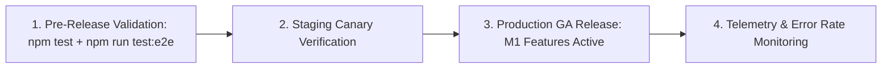

# Release & Deployment Plan: Socratic PM Intelligence (M1)

> **Feature**: `socratic-pm-harness`  
> **Milestone**: M1 (P0: Socratic Grilling Engine + On-Demand Critic Board)  
> **Pipeline Stage**: DevOps Agent $\rightarrow$ Final Stage Gate Complete  
> **Reference Specs**: [prd.md](./prd.md) &bull; [qa-plan.md](./qa-plan.md) &bull; [e2e-plan.md](./e2e-plan.md) &bull; [TELEMETRY.md](../../../TELEMETRY.md)

---

## 1. Executive Summary & Scope

This release plan governs the rollout, environment configuration, feature flagging, monitoring, and rollback readiness for **Milestone 1 (P0)** of Socratic PM Intelligence.

---

## 2. Environment & Configuration Strategy

### 2.1 Feature Flags & Environment Variables

| Variable | Default Value | Purpose |
| :--- | :--- | :--- |
| `ENABLE_SOCRATIC_GRILLING` | `true` | Enables pre-generation Socratic clarification cards in `ChatPanel`. |
| `ENABLE_CRITIC_BOARD` | `true` | Enables the parallel Adversarial Critic review drawer in `MarkdownEditor`. |
| `ENABLE_TEAM_HARNESS` | `false` | **Milestone 2 Flag**: Ingestion of `AGENTS.md` / `CLAUDE.md`. (Disabled in M1 release). |
| `CRITIC_TIMEOUT_MS` | `8000` | Circuit-breaker timeout for individual mini-agent evaluations. |

---

## 3. Rollout & Staging Strategy

### Stage 1: Pre-Release Gate
- Run all automated unit and integration tests (`npm test`).
- Run Playwright E2E suite (`npm run test:e2e`).
- Verify axe-core accessibility compliance and TypeScript compilation (`npm run build`).

### Stage 2: Production GA Release
- Milestone 1 capabilities active by default.
- Milestone 2 Team Harness remains hidden behind `ENABLE_TEAM_HARNESS=false`.

---

## 4. Rollback & Fail-Safe Path

In the event of an unexpected regression or third-party LLM outage:
1. **Instant Client-Side Kill Switch**: Set `ENABLE_SOCRATIC_GRILLING=false` and `ENABLE_CRITIC_BOARD=false` in environment config $\rightarrow$ ChatPanel immediately falls back to direct artifact generation; MarkdownEditor falls back to standard section linting.
2. **Graceful Degradation**: If `/api/artifacts/audit` encounters provider rate limits, it returns a soft 200 response with `findings: []` and an advisory notification without interrupting markdown editing or file saving.

---

## 5. Post-Release Monitoring & Telemetry Checklist

Monitor incoming events via the Google Analytics / ProductOS Telemetry dashboard:
- [ ] `socratic.grilling_started` vs. `socratic.grilling_bypassed` opt-in ratio.
- [ ] `critic.audit_triggered` volume per active project.
- [ ] `critic.fix_applied` vs. `critic.finding_dismissed` acceptance rate.
- [ ] Zero spikes in `error.unhandled` or audit timeout errors.

---

## 6. Definition of Done Checklist

- [x] Problem statement & target personas defined (PRD)
- [x] UX flows, wireframes & screen states approved (UX Spec)
- [x] Frontend component specs & props finalized (Frontend Plan)
- [x] Backend routes, critic prompts & schemas finalized (Backend Plan)
- [x] Risk matrix, a11y, and negative test cases documented (QA Plan)
- [x] Unit test plan authored (Unit Test Plan)
- [x] End-to-end user journey & export test plan authored (E2E Plan)
- [x] Telemetry events cataloged and documented in `TELEMETRY.md`
- [x] Rollback and feature flag strategies defined (Release Plan)

---

## 7. Stage Gate Handoff Contract (DevOps $\rightarrow$ Implementation)

### Summary
The complete end-to-end Feature Development Pipeline (`/agent-set-feature-development`) is now fully specified and ready for implementation.

### Artifacts Produced:
1. [prd.md](./prd.md) (PRD)
2. [ux-spec.md](./ux-spec.md) (UX Spec)
3. [frontend-plan.md](./frontend-plan.md) (Frontend Plan)
4. [backend-plan.md](./backend-plan.md) (Backend Plan)
5. [qa-plan.md](./qa-plan.md) (QA Strategy)
6. [unit-test-plan.md](./unit-test-plan.md) (Unit Test Plan)
7. [e2e-plan.md](./e2e-plan.md) (E2E Test Plan)
8. [release-plan.md](./release-plan.md) (Release & Rollout Plan)
9. [TELEMETRY.md](../../../TELEMETRY.md) (Updated Event Allowlist)

### Next Action
Ready to begin code implementation according to the approved plans!
