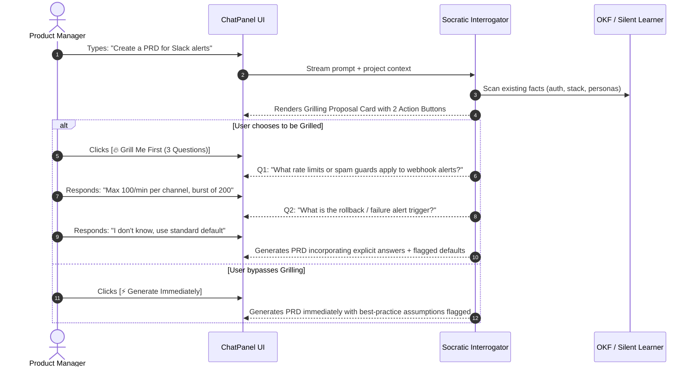
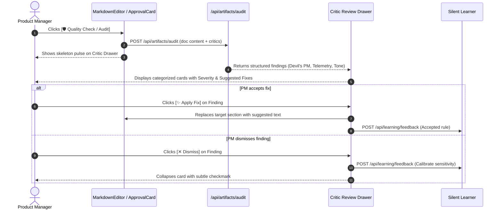
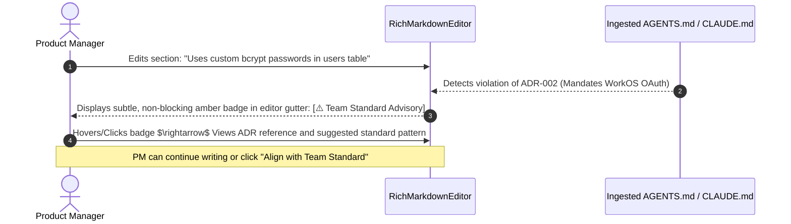

# UX Specification: Socratic PM Intelligence & Adaptive Team Harness

> **Feature**: `socratic-pm-harness`  
> **Status**: Completed  
> **Pipeline Stage**: UX Agent $\rightarrow$ Ready for Frontend & Backend Agents  
> **Reference PRD**: [prd.md](./prd.md)

---

## 1. Executive Summary & Design Goals

This specification defines the user experience, interaction architecture, component states, and accessibility standards for **Socratic PM Intelligence & Adaptive Team Harness**.

### Primary UX Objectives:
1. **Reduce Mental Overhead**: Replace daunting blank-prompt interfaces with structured, conversational Socratic questions that guide non-technical product leads.
2. **Empower with 1-Click Escape Hatches**: Never trap or force a user into prolonged interrogation. Always provide an immediate `[Generate with Best Practices]` bypass.
3. **Elevate the Quality Check Experience**: Transform the existing static section linter into an engaging, adversarial **Critic Review Drawer** with clear severity indicators and 1-click AI remediation.
4. **Subtle & Non-Intrusive Governance**: Deliver Milestone 2 Team Harness checks as ambient, advisory notices that inform without interrupting writing flow.

---

## 2. User Flows & Journey Maps

### 2.1 Flow 1: Socratic "Grill-Me" Pre-Generation Clarification (M1 - P0)



---

### 2.2 Flow 2: On-Demand Mini-Agent Critic Board (M1 - P0)



---

### 2.3 Flow 3: Advisory Team Harness Drift Warning (M2 - P1)



---

## 3. UI Component Architecture & Wireframes

### 3.1 Socratic Grilling Card (in `ChatPanel.tsx`)

When the AI detects a high-stakes request (PRD, Roadmap, User Story, Presentation), it renders an interactive action block above the chat message:

```
┌──────────────────────────────────────────────────────────────────────────┐
│  🧠 Socratic Clarification Suggested                                     │
│  I have project context for Authentication and Tech Stack, but 3 critical│
│  trade-offs are undefined for this feature:                              │
│  • Webhook failure retries & rate limits                                 │
│  • Free vs. Enterprise tier feature gating                               │
│  • Telemetry tracking events                                             │
│                                                                          │
│  ┌──────────────────────────────┐     ┌──────────────────────────────┐   │
│  │ 🔥 Grill Me First (3 Qs)    │     │ ⚡ Generate Immediately      │   │
│  └──────────────────────────────┘     └──────────────────────────────┘   │
└──────────────────────────────────────────────────────────────────────────┘
```

#### Grilling Question Bubble:
```
┌──────────────────────────────────────────────────────────────────────────┐
│  🤖 Socratic Interrogator                                   [Step 1 of 3]│
│                                                                          │
│  "What rate limits or spam protection should apply when a service fires  │
│   bulk alerts to a single Slack channel?"                                │
│                                                                          │
│  💡 Quick Options:                                                       │
│  [100 alerts / min per channel]   [Standard 60/min]   [Decide for me]    │
│                                                                          │
│  Type your answer below or select a quick option...                      │
└──────────────────────────────────────────────────────────────────────────┘
```

---

### 3.2 Critic Review Drawer (`CriticReviewDrawer.tsx`)

Replaces the simple banner in `MarkdownEditor.tsx` with a slide-over panel on the right side of the editor:

```
┌──────────────────────────────────────────────────────────────────────────┐
│  🛡️ Artifact Quality Audit                                     [✕ Close] │
│  Overall Quality Score: 84 / 100                                         │
├──────────────────────────────────────────────────────────────────────────┤
│                                                                          │
│  🚨 CRITICAL (1)                                                         │
│  ┌────────────────────────────────────────────────────────────────────┐  │
│  │ 👿 The Devil's PM                                                 │  │
│  │ Missing Dead-Letter Queue & Retry Policy                           │  │
│  │ "The spec does not define behavior when Slack API returns HTTP 429 │  │
│  │  or rate limits are exceeded."                                     │  │
│  │                                                                    │  │
│  │ 💡 Suggested Fix:                                                  │  │
│  │ Add Section 3.4: 'Retry with exponential backoff up to 3 times;    │  │
│  │ route undeliverable payloads to dead-letter queue.'                │  │
│  │                                                                    │  │
│  │ [✨ Apply Fix]                      [✕ Dismiss]                     │  │
│  └────────────────────────────────────────────────────────────────────┘  │
│                                                                          │
│  ⚠️ SUGGESTIONS (2)                                                      │
│  ┌────────────────────────────────────────────────────────────────────┐  │
│  │ 📊 The Telemetry Guardian                                          │  │
│  │ Missing Rollback Alert Metric                                      │  │
│  │ [✨ Apply Fix]                      [✕ Dismiss]                     │  │
│  └────────────────────────────────────────────────────────────────────┘  │
│  ┌────────────────────────────────────────────────────────────────────┐  │
│  │ ✍️ The Tone & Brand Inspector                                      │  │
│  │ Avoided term 'seamless' used in Overview                           │  │
│  │ [✨ Apply Fix]                      [✕ Dismiss]                     │  │
│  └────────────────────────────────────────────────────────────────────┘  │
└──────────────────────────────────────────────────────────────────────────┘
```

---

### 3.3 Advisory Team Harness Badge (Milestone 2 - P1)

Rendered in the status bar / toolbar of `RichMarkdownEditor.tsx`:

```
┌──────────────────────────────────────────────────────────────────────────┐
│ [← Back]  PRD: Slack Notifications  [💾 Saved]  [🏛️ Team Harness: Active]│
└──────────────────────────────────────────────────────────────────────────┘
```

When an advisory conflict is detected in text:
- An inline amber highlight (`border-b-2 border-amber-400 bg-amber-500/10`) appears under the relevant sentence.
- Hovering displays a popover tooltip:
  > **🏛️ Team Standard Advisory (ADR-004)**:  
  > *Your team mandates OAuth 2.0 via WorkOS rather than custom password tables.*  
  > `[Align with Standard]` &bull; `[Ignore Advisory]`

---

## 4. Screen States & Edge Cases

| Screen / Component | State | Visual Representation & Behavior |
| :--- | :--- | :--- |
| **Socratic Card** | `Prompt Detected` | Animated gradient border around suggestion box; focus lands on `[Grill Me First]`. |
| | `In-Progress Turn` | Step counter pill (`[Step 1 of 3]`); quick-select chips; input field active. |
| | `Skipped / Default` | Collapses into a minimal summary chip: *"Generated with 2 standard assumptions"*. |
| **Critic Drawer** | `Idle` | Drawer closed; Quality Check button in toolbar has badge counter if unchecked. |
| | `Auditing (Loading)` | Shimmer pulse effect across 3 critic cards with status: *"The Devil's PM is reviewing edge cases..."* |
| | `Clean (100% Pass)` | Full-width celebratory card: *"🛡️ All Critics Passed: Watertight PRD ready for development."* |
| | `Error / Timeout` | Inline retry button: *"Audit timed out. Check provider connection and [Retry]".* |
| **Team Harness** | `Flag Disabled` | Component unmounted; zero UI footprint when `ENABLE_TEAM_HARNESS` is false. |
| | `Flag Active & Synced`| Subtle shield icon in header with tooltip: *"Enforcing rules from AGENTS.md"*. |

---

## 5. UI Copy & Tone Guidelines

### 5.1 System Copy Reference
- **Grilling Prompt**:  
  *"I'm ready to write this [Artifact Type]. We can jump straight in, or I can grill you on [N] critical trade-offs first to make the specification watertight."*
- **Unknown Answer Fallback**:  
  *"No problem! I'll apply industry best practices based on your project context and clearly highlight these as assumptions in the document."*
- **Critic Header**:  
  *"Adversarial Quality Audit — 3 Mini-Agents reviewing against project context, telemetry rules, and brand guidelines."*
- **Fix Applied Toast**:  
  *"✨ Applied fix from [Critic Name]. Learned preference saved to project memory."*
- **Harness Advisory Banner**:  
  *"🏛️ Team Harness Notice: This section differs from your team's documented standard in [File Name]."*

---

## 6. Accessibility (a11y) & Interaction Requirements

1. **Keyboard Navigation**:
   - `Escape` closes the Critic Review Drawer and returns focus to the editor cursor position.
   - Arrow keys (`Left`/`Right` or `Tab`) navigate quick-select option chips in the Socratic Grilling card.
   - `Cmd+Shift+Q` (Mac) / `Ctrl+Shift+Q` (Win) triggers the **Quality Check / Critic Audit** shortcut.
2. **Focus Management**:
   - Opening the Critic Review Drawer automatically focuses the first critical finding.
   - Applying a fix announces via `aria-live="polite"`: *"Fix applied to document"*.
3. **Contrast & Color Semantics**:
   - Critic severity colors comply with WCAG AA (4.5:1 minimum contrast):
     - `Critical`: High-contrast Red/Coral (`hsl(0, 84%, 60%)`).
     - `Suggestion`: Amber/Gold (`hsl(38, 92%, 50%)`).
     - `Compliant`: Emerald (`hsl(142, 71%, 45%)`).
   - Every badge includes both an icon (`🚨`, `⚠️`, `✅`) and descriptive text to support color-blind users.

---

## 7. Stage Gate Handoff Contract (UX $\rightarrow$ FE & BE)

### Summary
Complete UX Specification, user flow diagrams, component wireframes, screen states, accessibility requirements, and UI copy delivered for Socratic PM Intelligence and Adaptive Team Harness.

### Decisions Made
1. **Grilling UI**: Inline Socratic card inside `ChatPanel` with progressive disclosure (1–2 questions per step) and quick-select option chips.
2. **Critic Drawer**: Slide-over panel on the right side of `MarkdownEditor` with categorized severity tabs and 1-click `[Apply Fix]` buttons.
3. **Advisory Harness Gutter**: Non-blocking amber underline with popover details for Milestone 2.
4. **Keyboard Shortcuts**: `Cmd+Shift+Q` mapped to trigger Quality Check.

### Open Risks
- Ensuring smooth transition when applying multi-line text replacements from the Critic drawer into the TipTap/RichMarkdown editor (addressed via target section IDs).

### Artifacts Produced
- `docs/features/socratic-pm-harness/ux-spec.md`

### Handoff to Next Agents
- **Frontend Agent**: Ready to implement `SocraticGrillCard.tsx`, `CriticReviewDrawer.tsx`, and update `MarkdownEditor.tsx` / `ChatPanel.tsx` in `docs/features/socratic-pm-harness/frontend-plan.md`.
- **Backend Agent**: Ready to implement `/api/artifacts/audit` endpoint, mini-agent prompts, and Silent Learner feedback loop in `docs/features/socratic-pm-harness/backend-plan.md`.

### Blockers
- None. Ready for Frontend & Backend architectural planning.
