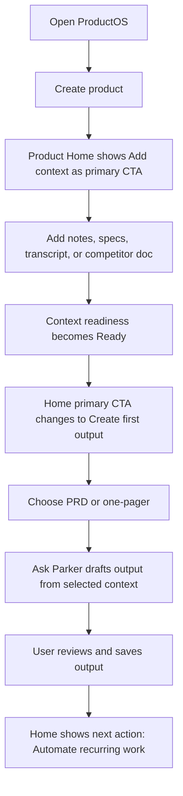
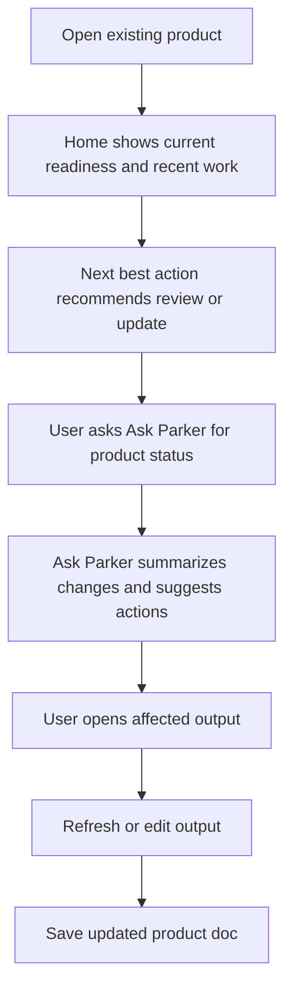
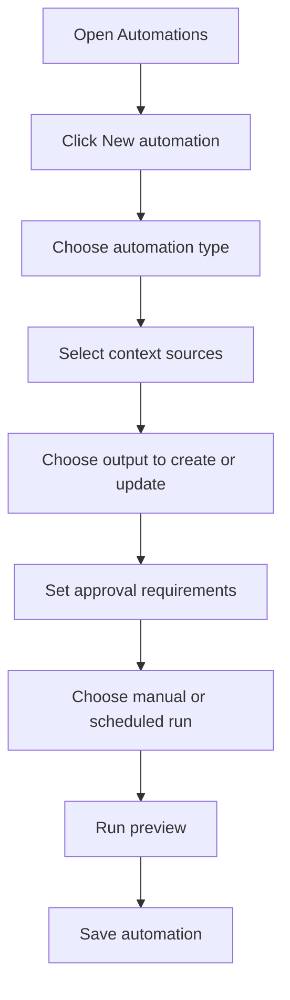
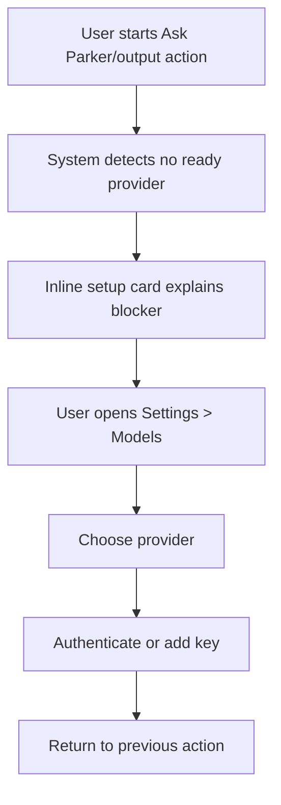
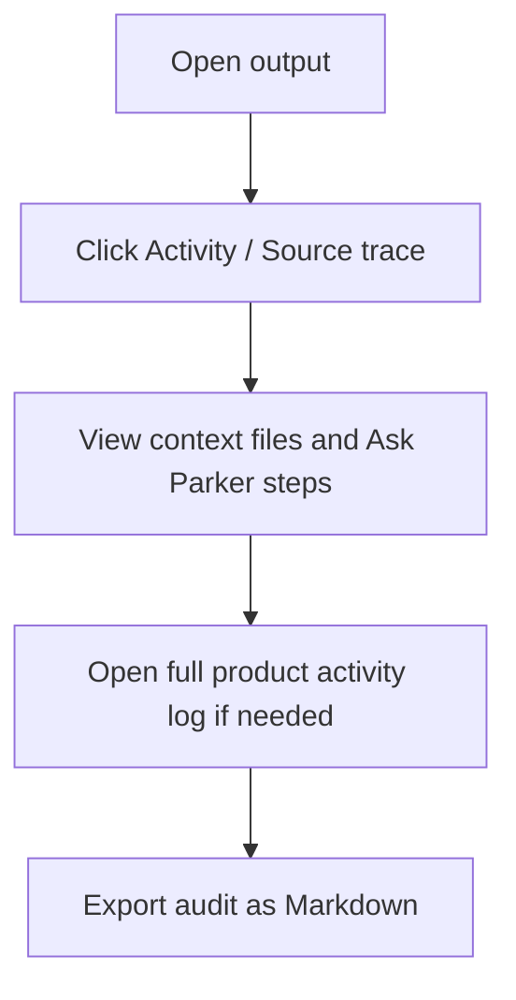

# ProductOS Simplified User Journeys

These journeys define how the simplified IA should feel for real product-management work. They should guide implementation decisions after the mockups are approved.

## Journey 1: First product setup

### Persona

A PM has a new product idea or feature area and wants a useful workspace quickly.

### User goal

Create a product, add initial context, and generate the first useful output without learning every ProductOS concept.

### Happy path

### Screen-by-screen expectations

1. **Home empty state**
   - Primary CTA: `Add context`
   - Secondary: `Start from template`, `Ask Parker`
   - No exposed Skills/Models/Workflow jargon

2. **Context**
   - User can add a file, paste notes, or import a folder
   - Context list shows file names, type, freshness, and whether AI can use it

3. **Outputs**
   - Create output flow suggests common PM docs
   - The first output should not require choosing an agent/skill

4. **Ask Parker review**
   - Shows what context was used
   - Clearly separates draft content from save/overwrite action

### Success criteria

- First useful output can be created in under five minutes.
- User sees no more than one primary CTA per screen.
- User does not need to understand Skills or Workflows to get value.

### Edge states

- If upload/import fails: show retry + paste notes fallback.
- If no AI provider is configured: explain the blocker and link to Settings.
- If context is too large: ask the user to choose which files to include.

## Journey 2: Mature product daily review

### Persona

A PM already has context, docs, and workflows in ProductOS and wants to know what needs attention today.

### User goal

Open ProductOS, understand product state, and act on the highest-leverage update.

### Happy path

### Home requirements

Home should answer:

- What changed recently?
- What is stale or missing?
- What should I do next?
- Which product docs/workflows are healthy?

### Recommended widgets

- Next best action
- Readiness summary: Context / Outputs / Automations
- Recent work
- Stale outputs or failed automations
- Ask Parker suggestions based on current state

### Success criteria

- User understands product health within 30 seconds.
- User can update a stale output without navigating through implementation concepts.
- Recent activity is visible but does not dominate the page.

### Edge states

- If an automation failed: show failure reason and `Review run`.
- If an output is stale: show `Refresh from latest context`.
- If context changed but outputs did not: suggest updating the relevant docs.

## Journey 3: Create recurring automation

### Persona

A PM repeats a weekly task: competitor scan, PRD review, launch status update, or research summary.

### User goal

Turn a repeated PM chore into an automation with approval controls.

### Happy path

### Wizard steps

1. **What should repeat?**
   - Research scan
   - Output refresh
   - Review checklist
   - Custom workflow

2. **What context should it use?**
   - Files
   - Outputs
   - Web/integration sources where available

3. **What should it produce?**
   - New output
   - Update existing output
   - Summary only
   - Draft PR/comment/task

4. **What requires approval?**
   - Before writing files
   - Before sending external messages
   - Before creating PRs/issues
   - Always ask / trusted automation

5. **When should it run?**
   - Manual
   - Daily/weekly/monthly
   - On context change

### Success criteria

- User can create a useful automation without touching the old workflow-builder canvas first.
- Advanced workflow editing remains available after creation.
- Approval moments are explicit and understandable.

### Edge states

- If no context exists: suggest adding context first.
- If no output exists: offer to create a new output target.
- If schedule permissions are unavailable: save as manual automation.

## Journey 4: Configure AI provider only when needed

### Persona

A new user tries to Ask Parker or generate an output before configuring a model.

### User goal

Understand the missing setup step and fix it quickly.

### Happy path

### UX rule

Models are not a top-level daily workspace item. They appear when relevant:

- Inline blocker card
- Settings
- Initial setup
- Provider status detail

### Setup card copy

> Ask Parker needs an AI provider before it can generate outputs. Connect Ollama, Gemini CLI, Claude Code, OpenAI, or another provider. Your product context stays local unless you choose a hosted provider.

Primary CTA: `Configure AI provider`
Secondary CTA: `Use local Ollama guide`

### Success criteria

- User knows why generation is blocked.
- User understands local vs hosted provider implications.
- Returning to the previous action is automatic after setup.

## Journey 5: Audit what happened

### Persona

A PM or team lead wants to understand how a decision/output was produced.

### User goal

Trace source context, prompts, automation runs, and saved outputs.

### Happy path

### UX rule

The research log should be contextual first, global second.

Recommended placement:

- Output detail: `Source trace`
- Automation detail: `Run history`
- Product Home: `Recent work`
- Settings/overflow: `Full activity log`

### Success criteria

- Auditability remains strong without making Research Log primary navigation.
- User can answer: what context was used, what action ran, what output changed, and when.

## Cross-journey interaction rules

### Primary CTA rules

Each screen should have one primary CTA:

- Home: readiness-based next action
- Context: add/import/paste context
- Outputs: create output
- Automations: create automation
- Settings: save/test selected configuration

### Ask Parker rules

- Ask Parker suggestions should be surface-aware.
- Ask Parker should show selected context before acting.
- Write/external actions need explicit approval.
- Ask Parker should not permanently occupy screen space unless the user pins it.

### Empty/loading/error rules

- Empty states teach the next step.
- Loading states name what is being loaded.
- Error states include recovery actions.
- Readiness indicators use text labels and icons, not color alone.

## Implementation sequencing recommendation

1. Add renamed navigation labels and simplified shell.
2. Update Product Home to one next-best-action card.
3. Split current product/project list into Context and Outputs surfaces.
4. Merge Skills and Workflows into Automations IA while preserving underlying components.
5. Move Models into Settings and add inline provider-blocker cards.
6. Convert always-visible Ask Parker panel into drawer/command composer with pin option.
