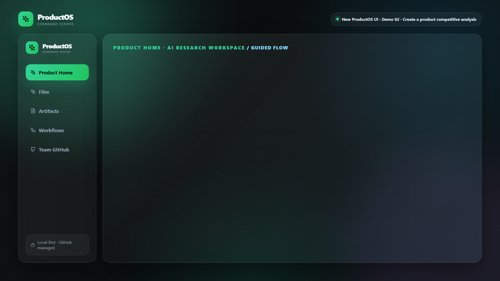

# ProductOS GitHub Context Marketing Demos

This branch adds a Remotion marketing demo suite based on the team context sharing flow from PR #162.

## Story arc

1. **Connect ProductOS to GitHub** — ProductOS indexes a centralized GitHub workspace as the durable team source of truth.
2. **Create competitive analysis** — A product workspace pulls shared context, compares competitors, and generates a polished artifact.
3. **Connect analysis to workflows** — The artifact becomes a reusable competitive-intelligence workflow that opens reviewable GitHub PRs.

## Compositions

- `ConnectProductToGitHub` — 11s focused setup clip
- `CompetitiveAnalysisArtifact` — 11s product + artifact generation clip
- `WorkflowFromCompetitiveIntel` — 11s workflow automation clip
- `ProductOSMarketingSuite` — 33s combined hero reel

## Preview



Rendered recording: [ProductOS marketing suite MP4](assets/productos-marketing-suite.mp4)

## Commands

Open Remotion Studio:

```bash
npm run demo:remotion
```

Render the full marketing reel:

```bash
npm run demo:render:marketing-suite
```

Render individual clips:

```bash
npm run demo:render:connect
npm run demo:render:competitive
npm run demo:render:workflow
```

Generate a preview still:

```bash
npx remotion still src/remotion/index.ts ProductOSMarketingSuite docs/assets/productos-marketing-suite-preview.png --frame=420
```

## Marketing positioning

The reel is designed to communicate:

- **Centralized GitHub management**: product docs, skills, and workflows live in one reviewed repo.
- **Local-first trust**: ProductOS works locally while syncing durable team context through Git.
- **Product workflow clarity**: create product → add GitHub context → generate competitive artifact → automate recurring workflow.
- **Human review loop**: workflow outputs are captured as artifacts and GitHub PRs before publication.
