# ProductOS UX Change Map

Date: 2026-05-09  
Branch: `ux-accomplish-inspired-ui`  
Baseline: `docs/ux-flow-map.md`  
Purpose: turn the flow audit into a practical menu of UI/UX changes: what could change, why, how, where, and in what order.

## Change Strategy

The product should move toward a clearer mental model:

> **ProductOS is a product command center. Each product contains files, structured artifacts, workflows, research history, and a Copilot that can act with approval.**

Design principles for the changes:

1. **One primary noun:** use **Product** in the UI. Keep `project` only as an internal implementation detail.
2. **One visible context:** users should always know active Product, active mode, active item, and active AI/provider state.
3. **Actions over empty space:** empty states should offer next actions, not just say nothing exists.
4. **Privileged actions must look privileged:** Copilot approvals, deletes, provider changes, and workflow runs need stronger trust boundaries.
5. **Progressive disclosure:** simple entry points first; advanced settings and context menus second.

## Priority Legend

| Priority | Meaning                                                                   |
| -------- | ------------------------------------------------------------------------- |
| P0       | Safety / trust / scope clarity. Should be addressed before broad release. |
| P1       | High-impact onboarding and daily-use clarity.                             |
| P2       | Important polish or discoverability.                                      |
| P3       | Nice-to-have or deeper redesign.                                          |

## 1. First-Run / Install / Welcome Flow

### Current problem

The app has overlapping first-run concepts: installation wizard, onboarding, welcome page, provider setup, and first product creation. Users can skip setup or enter the workspace without a stable model of what ProductOS does.

### Proposed future flow

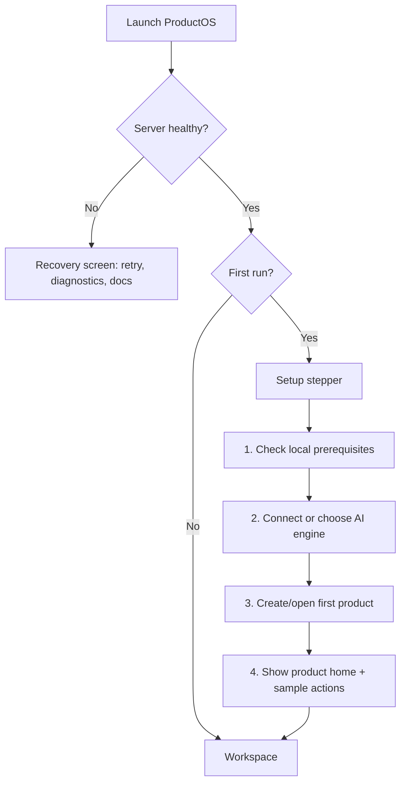

### Change map

| Priority | Change                                     | How                                                                                                       | Main surfaces                                                      | Notes                                                      |
| -------- | ------------------------------------------ | --------------------------------------------------------------------------------------------------------- | ------------------------------------------------------------------ | ---------------------------------------------------------- |
| P1       | Consolidate first-run into a stepper       | Combine install checks, provider selection, product creation, and welcome education into one guided path. | `src/App.tsx`, `src/pages/Onboarding.tsx`, `src/pages/Welcome.tsx` | Avoid three competing CTAs: “continue”, “explore”, “skip”. |
| P1       | Make provider setup outcome-based          | Replace technical provider copy with “Choose an AI engine so Copilot and workflows can run.”              | `Onboarding.tsx`, `ProviderSettings.tsx`                           | Show “configure later” consequence clearly.                |
| P1       | Turn Welcome into product-positioning page | Keep Accomplish-inspired hero, capability chips, and “Make it happen” Copilot card.                       | `Welcome.tsx`                                                      | Already started in PR #158.                                |
| P2       | Add sample first actions                   | “Draft a PRD”, “Map competitors”, “Create roadmap”, “Set recurring scan”.                                 | `Welcome.tsx`, future product home                                 | Helps users understand value before learning nav.          |
| P2       | Recovery screen for server offline         | Add retry, diagnostic output, local docs link, and exact command/help hints.                              | `ServerOfflineOverlay`                                             | High support value.                                        |

## 2. Product Home / Workspace Entry Flow

### Current problem

Selecting a product can auto-open a first chat or first file. This hides context and makes products feel like folders rather than command centers.

### Proposed future flow

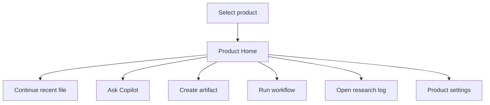

### Change map

| Priority | Change                         | How                                                                                                             | Main surfaces                                           | Notes                                        |
| -------- | ------------------------------ | --------------------------------------------------------------------------------------------------------------- | ------------------------------------------------------- | -------------------------------------------- |
| P1       | Add Product Home page          | Instead of auto-opening first doc, show overview cards: Files, Artifacts, Workflows, Copilot, Research Log.     | `Workspace.tsx`, new `ProductHome.tsx`, `MainPanel.tsx` | This is the highest-value structural change. |
| P1       | Add “Next best action” card    | Suggest based on current state: no docs → create PRD; no workflows → schedule scan; no provider → configure AI. | `ProductHome.tsx`                                       | Makes product state legible.                 |
| P2       | Recent activity / recent files | Show last opened docs, recent generated artifacts, recent workflow runs.                                        | `ProductHome.tsx`, state/API helpers                    | Can start static/simple.                     |
| P2       | Product health/status chips    | “AI ready”, “3 artifacts”, “2 workflows”, “research log active”.                                                | `ProductHome.tsx`, `TopBar.tsx`                         | Reinforces mental model.                     |

## 3. Navigation / Information Architecture Flow

### Current problem

Rail, flyout, top bar, tab strip, and chat panel all express different modes. Models and Settings overlap. App settings and product settings both use gear icons.

### Proposed IA

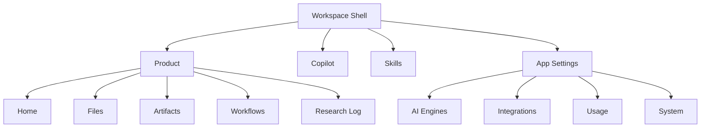

### Change map

| Priority | Change                                       | How                                                             | Main surfaces                       | Notes                                                     |
| -------- | -------------------------------------------- | --------------------------------------------------------------- | ----------------------------------- | --------------------------------------------------------- |
| P0       | Distinguish App Settings vs Product Settings | Use labels/tooltips and optionally different icons.             | `Sidebar.tsx`, `TopBar.tsx`         | Started in PR #158.                                       |
| P1       | Add global context breadcrumb/status         | Display Product → Mode → Item → Provider somewhere persistent.  | `TopBar.tsx`, `MainPanel.tsx`       | Reduces “where am I?” confusion.                          |
| P1       | Reconsider Models nav                        | Either rename to “Usage” dashboard or move into App Settings.   | `Sidebar.tsx`, `GlobalSettings.tsx` | Current “Models” is neither full settings nor full usage. |
| P2       | Make rail tooltips always clear              | Every rail icon should have a precise tooltip and active state. | `Sidebar.tsx`                       | Low risk polish.                                          |
| P2       | Add command palette / quick switcher         | Search products, files, workflows, settings, actions.           | New command palette component       | Solves many hidden action issues.                         |

## 4. Product Creation / Product Management Flow

### Current problem

User-facing copy mixes Product and Project. Product deletion scope is not explicit enough. Add/import actions are hidden in menus.

### Proposed flow

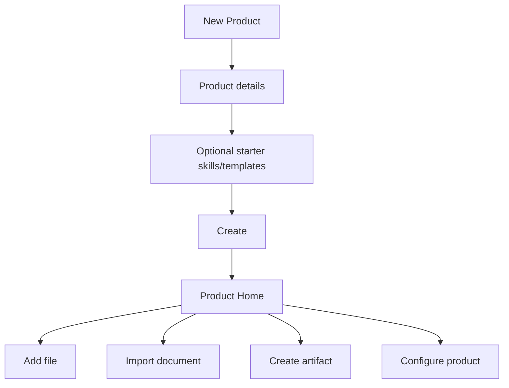

### Change map

| Priority | Change                             | How                                                                                    | Main surfaces                                                        | Notes                                 |
| -------- | ---------------------------------- | -------------------------------------------------------------------------------------- | -------------------------------------------------------------------- | ------------------------------------- |
| P1       | Normalize “Product” language       | Rename visible “Project” labels to “Product”.                                          | `ProjectFormDialog.tsx`, `Sidebar.tsx`, `TopBar.tsx`, settings pages | Started in PR #158; needs full sweep. |
| P1       | Product creation templates         | Add starter options: “Blank”, “PRD-ready”, “Competitor research”, “Launch planning”.   | `ProjectFormDialog.tsx`                                              | Strong onboarding improvement.        |
| P0       | Strong delete-product confirmation | Enumerate files/artifacts/workflows deleted; require typing product name.              | `Sidebar.tsx`, `ConfirmationDialog`                                  | Data safety.                          |
| P2       | Visible Add/Import buttons         | Put Add file / Import document on Product Home and Files panel, not only context menu. | `ProductHome.tsx`, `Sidebar.tsx`                                     | Discoverability.                      |

## 5. Files / Documents / Tabs Flow

### Current problem

Files, special pages, settings, skills, artifacts, workflow canvases, and welcome pages all compete in the main panel/tab metaphor. Cross-product tabs can remain but become unavailable.

### Proposed flow

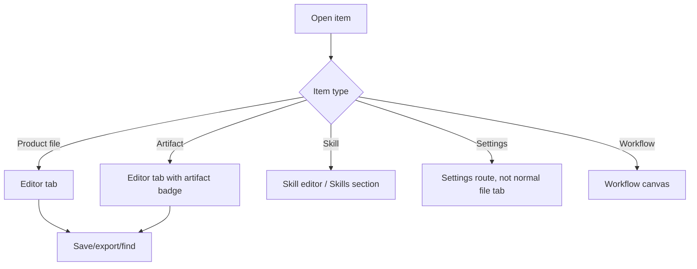

### Change map

| Priority | Change                                 | How                                                                                                 | Main surfaces                       | Notes                                  |
| -------- | -------------------------------------- | --------------------------------------------------------------------------------------------------- | ----------------------------------- | -------------------------------------- |
| P1       | Separate system tabs from content tabs | Settings/welcome/skill editors should visually differ from product files or live outside file tabs. | `MainPanel.tsx`, routing/doc model  | Prevents “settings as file” confusion. |
| P1       | Cross-product tab handling             | Group tabs by product or show “Switch back to product” CTA instead of just unavailable state.       | `MainPanel.tsx`, `Workspace.tsx`    | Important when switching products.     |
| P2       | Action-oriented empty tabs state       | Tell users to open file/create artifact/ask Copilot.                                                | `MainPanel.tsx`                     | Started in PR #158.                    |
| P2       | Simplify tab context menu              | Keep close/current/close all; hide advanced close-right/close-others unless needed.                 | `MainPanel.tsx`                     | Reduces complexity.                    |
| P2       | Editor toolbar                         | Add visible export/find/import/save status.                                                         | Editor components / `MainPanel.tsx` | Makes menu-only actions discoverable.  |

## 6. Copilot / Chat / Approval Flow

### Current problem

Copilot is both chat and command surface. It can create files, run workflows, install/configure tools, and request approvals, but the input and approval UI do not make trust boundaries clear enough.

### Proposed flow

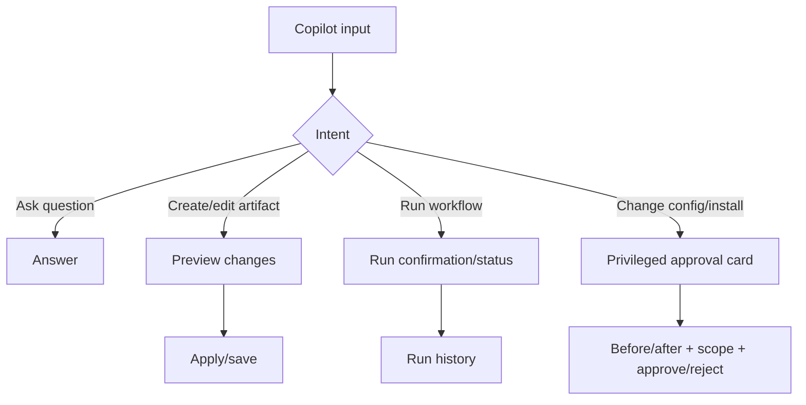

### Change map

| Priority | Change                                  | How                                                                                          | Main surfaces                                 | Notes                                    |
| -------- | --------------------------------------- | -------------------------------------------------------------------------------------------- | --------------------------------------------- | ---------------------------------------- |
| P0       | Strong privileged approval UI           | Approval cards show action type, affected files/settings, before/after, risk, rollback note. | `ApprovalCard.tsx`, `ChatPanel.tsx`           | Trust boundary.                          |
| P1       | Copilot input helpers                   | Add helper chips: `@file`, `/workflow`, “create artifact”, “run workflow”.                   | `ChatPanel.tsx`                               | Makes command powers discoverable.       |
| P1       | Copilot layout control                  | Explicit Open / Split / Hidden state.                                                        | `MainPanel.tsx`, `ChatPanel.tsx`              | Prevents “where did Copilot go?” issues. |
| P1       | Shared provider display metadata        | One source of truth for provider names/statuses across chat/settings/onboarding.             | `ChatPanel.tsx`, settings provider components | Reduces setup confusion.                 |
| P2       | Hide trace/dev details by default       | Use “Details” disclosure for trace logs/thinking.                                            | `TraceLogs`, `ThinkingBlock`, `ChatPanel.tsx` | More product-like default UX.            |
| P2       | Copilot examples tied to active product | Empty chat suggests actions based on product artifacts/workflows.                            | `ChatPanel.tsx`                               | Useful next-action guidance.             |

## 7. Artifacts Flow

### Current problem

Artifacts are both structured objects and files. They appear in Products and Artifacts sections with inconsistent labels and delete/export language.

### Proposed flow

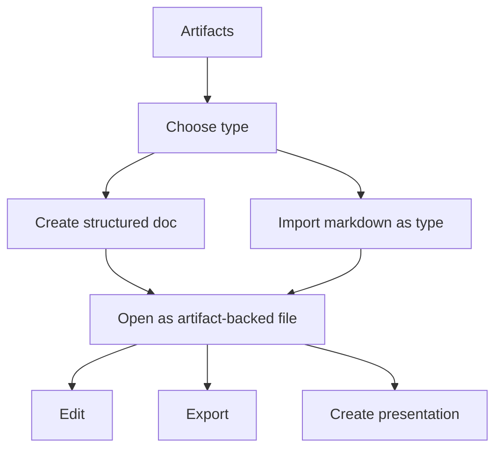

### Change map

| Priority | Change                            | How                                                                            | Main surfaces                            | Notes                                     |
| -------- | --------------------------------- | ------------------------------------------------------------------------------ | ---------------------------------------- | ----------------------------------------- |
| P1       | Define artifact in UI             | Add subtitle: “Structured product docs saved as files.”                        | `ArtifactList.tsx`, product home         | Clarifies duality.                        |
| P1       | Normalize artifact type labels    | Same names everywhere: Roadmap, PRD, One-pager, Research, etc.                 | `ArtifactList.tsx`, `Sidebar.tsx`        | Avoid “Vision” vs “Product Vision”.       |
| P1       | Type picker for create/import     | If no filter selected, ask which artifact type. Import dialog also shows type. | `ArtifactList.tsx`                       | Prevent default-roadmap surprise.         |
| P0       | Delete artifact copy              | Say “Delete artifact” and show file/path affected.                             | `ArtifactList.tsx`, `ConfirmationDialog` | Safety and terminology.                   |
| P2       | Artifact badges in file tree/tabs | Show artifact type pill wherever artifact appears as a file.                   | `Sidebar.tsx`, `MainPanel.tsx`           | Makes dual representation understandable. |

## 8. Skills Flow

### Current problem

Skills are variously presented as skills/playbooks/templates. Their relationship to Copilot and workflows is not obvious during creation/import.

### Proposed flow

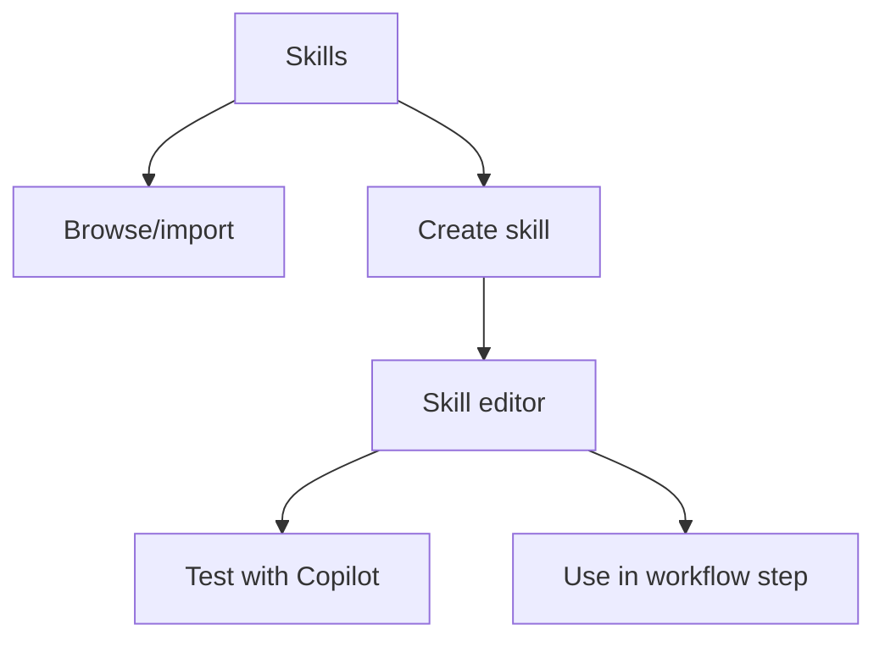

### Change map

| Priority | Change                      | How                                                                 | Main surfaces                                           | Notes                             |
| -------- | --------------------------- | ------------------------------------------------------------------- | ------------------------------------------------------- | --------------------------------- |
| P1       | Standardize language        | Use “Skills” as primary, subtitle “Reusable AI playbooks.”          | `Sidebar.tsx`, `Welcome.tsx`, `CreateSkillDialog`, docs | Keeps term but explains it.       |
| P2       | Skill empty/editor guidance | Explain: “Skills can be used in Copilot and workflow steps.”        | Skill editor components                                 | Reduces orphaned concept feeling. |
| P2       | Better import dialog        | Support registry/search/file/URL first; command import as advanced. | `Sidebar.tsx`, skill dialogs                            | Less technical default path.      |
| P3       | Skill test runner           | Let user test a skill against active product before saving.         | Skill editor + Chat integration                         | Higher effort.                    |

## 9. Workflows Flow

### Current problem

Workflow creation captures metadata first, while actual step building happens later. Schedule/notification setup is split. Delete uses native confirmation.

### Proposed flow

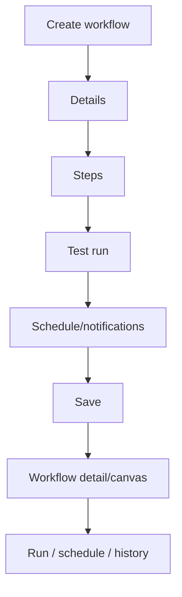

### Change map

| Priority | Change                                  | How                                                                 | Main surfaces                                   | Notes                         |
| -------- | --------------------------------------- | ------------------------------------------------------------------- | ----------------------------------------------- | ----------------------------- |
| P1       | Rename CTA to “Create and open builder” | Set expectation that steps come next.                               | `WorkflowBuilderDialog.tsx`                     | Low risk.                     |
| P1       | Workflow creation stepper               | Details → Steps → Test → Schedule.                                  | `WorkflowBuilderDialog.tsx`, `WorkflowCanvas`   | Higher effort but clearer.    |
| P1       | Unified workflow settings panel         | Centralize schedule, notifications, provider, and run options.      | `WorkflowBuilderDialog.tsx`, `WorkflowList.tsx` | Reduces split setup.          |
| P0       | Custom delete confirmation              | Replace native confirm with shared confirmation component.          | `WorkflowList.tsx`                              | Safety consistency.           |
| P2       | Workflow templates                      | “Weekly competitor scan”, “PRD refresh”, “User feedback synthesis”. | `WorkflowList.tsx`, creation dialog             | Strong first-use improvement. |
| P2       | Run history/status row                  | Show active/recent runs, cancel, result summary.                    | `WorkflowList.tsx`, `WorkflowProgressOverlay`   | Daily-use clarity.            |

## 10. Settings / Providers / Integrations Flow

### Current problem

Settings combines global app config, provider setup, models, integrations, artifacts, usage, and system. Provider states are conflated: installed, authenticated, configured, selected, enabled.

### Proposed flow

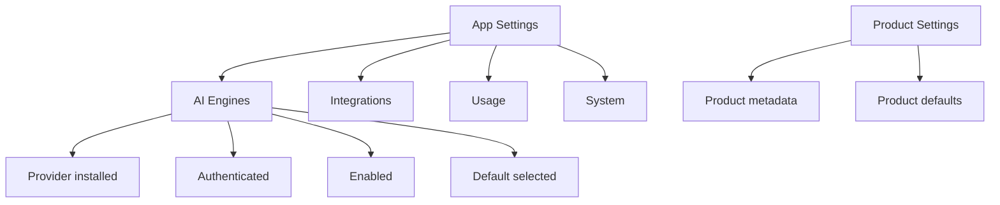

### Change map

| Priority | Change                                      | How                                                                                   | Main surfaces                                            | Notes                             |
| -------- | ------------------------------------------- | ------------------------------------------------------------------------------------- | -------------------------------------------------------- | --------------------------------- |
| P0       | Scope labeling and breadcrumbs              | Every settings page says App Settings or Product Settings.                            | `GlobalSettings.tsx`, `SettingsLayout.tsx`, `TopBar.tsx` | Prevent wrong-scope edits.        |
| P1       | Four-state provider status model            | Installed / Authenticated / Enabled / Default.                                        | `ProviderSettings.tsx`, provider metadata                | Fixes “Active” ambiguity.         |
| P1       | Settings search scope                       | Either global search works across sections or placeholder says “Search this section.” | `SettingsLayout.tsx` and child sections                  | Avoid broken expectation.         |
| P1       | Integrations tied to workflow notifications | Workflow notification setup links to exact integration section and shows readiness.   | `WorkflowBuilderDialog.tsx`, Integration settings        | Makes notifications discoverable. |
| P2       | Usage dashboard                             | Merge Models sidebar into Usage/AI dashboard or make it a true dashboard.             | `Sidebar.tsx`, `GlobalSettings.tsx`                      | IA cleanup.                       |

## 11. Import / Export / File Operations Flow

### Current problem

Import/export/find actions are scattered across menus, context menus, artifact menus, and keyboard shortcuts. Export dependency state is hidden.

### Proposed flow

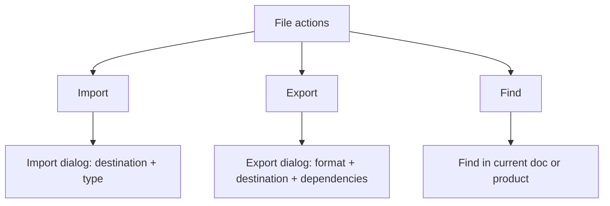

### Change map

| Priority | Change                           | How                                                                        | Main surfaces                                                         | Notes                                 |
| -------- | -------------------------------- | -------------------------------------------------------------------------- | --------------------------------------------------------------------- | ------------------------------------- |
| P1       | Unified import dialog            | Choose source, destination product/folder, file/artifact type.             | `Workspace.tsx`, `Sidebar.tsx`, `ArtifactList.tsx`                    | Reduces scattered behavior.           |
| P1       | Explicit export dialog           | Format, filename, destination, dependency status.                          | Export handlers in `Workspace.tsx`, `Sidebar.tsx`, `ArtifactList.tsx` | Avoid inferred `.pdf/.docx` behavior. |
| P2       | Pandoc preflight                 | Show export dependency readiness in export dialog and App Settings/System. | Export dialog, settings/about                                         | Prevents late failures.               |
| P2       | Command palette for file actions | One place for import/export/find/replace.                                  | New command palette                                                   | Big discoverability win.              |

## 12. Destructive Actions / Safety Flow

### Current problem

Delete product/file/artifact/workflow use mixed patterns and sometimes vague scope.

### Proposed flow

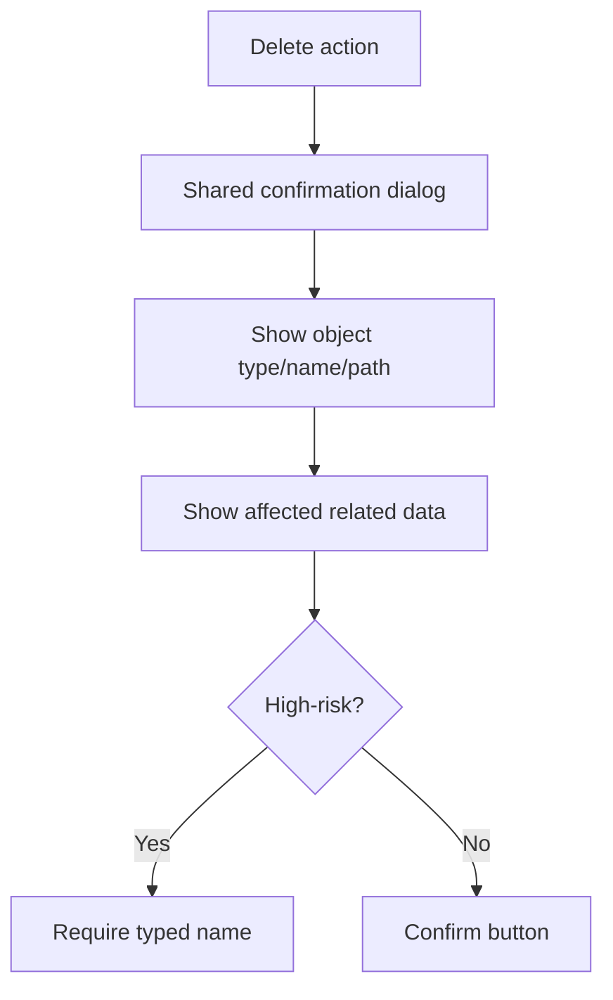

### Change map

| Priority | Change                                       | How                                                                     | Main surfaces                                                               | Notes                               |
| -------- | -------------------------------------------- | ----------------------------------------------------------------------- | --------------------------------------------------------------------------- | ----------------------------------- |
| P0       | Shared destructive confirmation              | One component and copy model for delete product/file/artifact/workflow. | `ConfirmationDialog`, `Sidebar.tsx`, `ArtifactList.tsx`, `WorkflowList.tsx` | Trust/safety.                       |
| P0       | Deletion scope summary                       | “This deletes X files, Y artifacts, Z workflows.”                       | Product deletion handlers                                                   | Needs data counts.                  |
| P0       | Type-to-confirm for product/workflow deletes | Require typing name for high-impact deletes.                            | Confirmation component                                                      | Prevent accidental loss.            |
| P2       | Undo/toast where possible                    | For reversible client-state deletes, show undo.                         | Toast system                                                                | Only if backend supports safe undo. |

## 13. Cross-Cutting Visual System Changes

### Current problem

The app is functional, but visual hierarchy can feel equal-weight. Accomplish.ai inspiration suggests stronger hero messaging, darker premium shell, pill copy, action cards, and obvious CTAs.

### Change map

| Priority | Change                    | How                                                                                 | Main surfaces                                         | Notes                                              |
| -------- | ------------------------- | ----------------------------------------------------------------------------------- | ----------------------------------------------------- | -------------------------------------------------- |
| P1       | Dark premium shell polish | Use restrained dark cards, subtle borders, radial gradients, green/teal accent.     | Welcome, product home, empty states                   | Started in PR #158.                                |
| P1       | CTA hierarchy             | Primary action should be unmistakable; secondary actions subdued.                   | Welcome, dialogs, empty states                        | Product creation and Copilot actions benefit most. |
| P2       | Consistent status pills   | Use pills for provider readiness, approval needed, workflow running, artifact type. | TopBar, cards, tabs, settings                         | Makes state scannable.                             |
| P2       | Empty-state cards         | Replace bare text with short explanation + 1–3 actions.                             | Sidebar panels, MainPanel, WorkflowList, ArtifactList | Good staged PR.                                    |
| P3       | Motion and transitions    | Small enter/hover transitions; avoid noisy animation.                               | Cards/dialogs/panels                                  | Polish after IA fixes.                             |

## Suggested Implementation Sequence

### PR A — Language + scope clarity

- Finish Product vs Project UI terminology sweep.
- App Settings vs Product Settings labels/breadcrumbs.
- Action-oriented empty tab state.
- Models copy cleanup.

Risk: low.  
Value: high.

### PR B — Product Home

- Add Product Home page.
- Route product selection to Product Home by default.
- Add next-action cards and recent items.
- Visible Add file / Import / Create artifact buttons.

Risk: medium.  
Value: very high.

### PR C — Safety and trust boundaries

- Shared destructive confirmation.
- Product/workflow type-to-confirm.
- Strong Copilot approval cards.

Risk: medium.  
Value: high and necessary.

### PR D — Copilot command UX

- Input helper chips.
- Copilot layout control.
- Hide trace/dev detail behind disclosures.
- Shared provider display metadata.

Risk: medium.  
Value: high.

### PR E — Artifacts/workflows cleanup

- Artifact type picker and label normalization.
- Workflow creation copy/stepper.
- Workflow templates and run status/history.

Risk: medium/high depending on stepper scope.  
Value: high.

### PR F — First-run consolidation

- Merge InstallationWizard/Onboarding/Welcome responsibilities into one flow.
- Provider setup consequence copy.
- First product creation and product home handoff.

Risk: high.  
Value: high; best after Product Home exists.

## Quick Wins Already Covered in PR #158

- Accomplish-inspired Welcome visual direction.
- Primary CTA changed to “Start a new product”.
- Product/App settings labels in key nav surfaces.
- “New Product” sidebar copy.
- More action-oriented empty tab copy.
- Product creation dialog copy updated from project-oriented to product-oriented.
- Mockups added under `docs/mockups/`.

## Open Design Questions

1. Should **Models** remain a primary nav item, or should it move fully under App Settings / Usage?
2. Should product selection always open Product Home, or only when no recent doc exists?
3. Should Skills be first-class primary nav, or should they become part of Copilot/workflow creation?
4. How much AI/provider setup should block first-run versus be optional?
5. Should artifacts be shown as a separate section, or as a structured filter within Files?
