# ProductOS UX Flow Map and Ambiguity Audit

Date: 2026-05-09  
Scope: source-based audit of the current React UI flows in `src/App.tsx`, `src/pages/Workspace.tsx`, workspace components, settings, onboarding, artifact, chat, and workflow components.

This document maps the current user experience before redesign work. It intentionally separates **what exists** from **what is unclear**, so future UI/UX fixes can be prioritized without guessing.

## Color / Severity Legend

| Color | Meaning | UX interpretation |
| --- | --- | --- |
| 🔴 Red | Critical ambiguity / high-risk broken mental model | User can lose context, fail setup, or take a destructive action without enough clarity. |
| 🟠 Orange | Major clarity issue | Flow works, but labels, state, or routing are confusing enough to cause mistakes. |
| 🟡 Yellow | Friction / discoverability issue | Flow is usable after learning, but not self-explanatory. |
| 🔵 Blue | Information architecture issue | Concepts overlap, navigation hierarchy is unclear, or naming is inconsistent. |
| 🟢 Green | Clear enough | Flow is understandable; keep or polish later. |

## Top-Level Mental Model

ProductOS currently presents itself as a **local-first AI research workspace**, but the UI exposes several competing concepts at the same level:

- **Products / Projects**: the primary workspace container.
- **Files / Documents**: regular markdown-like editable project files.
- **Artifacts**: structured product documents stored separately but also displayed as files.
- **Skills**: reusable AI prompt/playbook templates.
- **Workflows**: visual automations that can run, schedule, and notify.
- **Models / Providers**: AI provider configuration and usage.
- **Chat / Copilot**: persistent assistant panel that can create workflows, run workflows, create files, install tools, and answer questions.
- **Settings**: global settings plus model, integration, artifact, usage, and system settings.

Core ambiguity: the app has a strong feature set, but users are not consistently told **where to start**, **which concept owns which object**, or **what the current mode is**.

## Global Application Flow

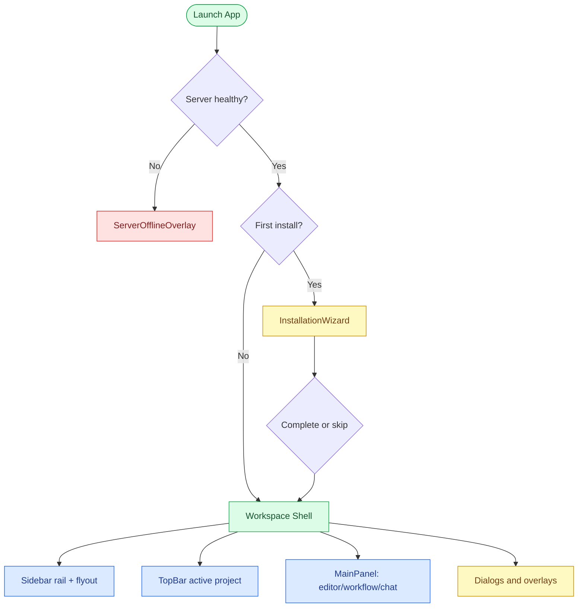

### App boot states

| Flow | Current behavior | Clarity |
| --- | --- | --- |
| Boot splash | Shows ProductOS logo and “Initializing productOS…” while server/install status is checked. | 🟢 Clear enough. |
| Server offline | Blocks workspace with `ServerOfflineOverlay`. | 🔴 The blocked state is correct, but the user needs plain recovery instructions and “retry / diagnostics” affordances. |
| First install | Shows `InstallationWizard`. | 🟡 Useful, but overlaps conceptually with `Onboarding`, `Welcome`, and Settings AI provider setup. |
| Returning user | Opens workspace. Workspace initialization decides active project/doc. | 🟠 User may land in chat, welcome, last project, or empty file state depending on stored data. Needs visible explanation. |

## Onboarding / First-Run Flow

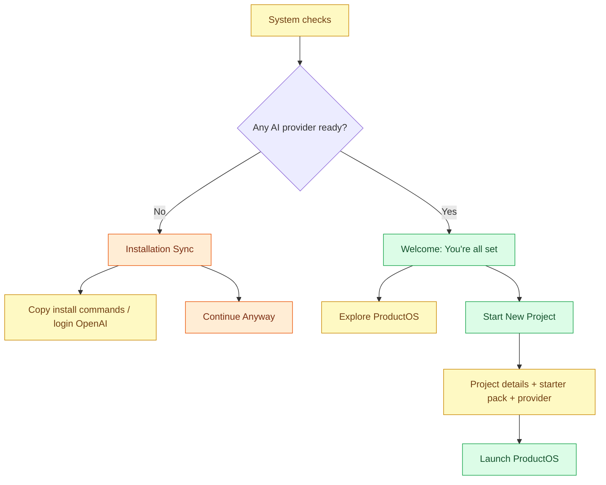

### Ambiguities

| Severity | Finding | Evidence / location | Suggested direction |
| --- | --- | --- | --- |
| 🟠 | There are multiple first-run surfaces: `InstallationWizard`, `Onboarding`, and `Welcome`. Their responsibilities are not distinct. | `App.tsx` chooses `InstallationWizard`; `Workspace.tsx` can show `Onboarding`; `Welcome.tsx` is also a start page. | Define a single first-run journey: **Install prerequisites → choose provider → create/open product → learn core actions**. |
| 🟠 | “Proceed to Workspace”, “Explore ProductOS”, “Skip to App”, and “Continue Anyway” all sound similar but have different consequences. | `Onboarding.tsx` buttons. | Use consequence-based copy: “Skip setup and open empty workspace”, “Create first product”, “Retry provider checks”. |
| 🟡 | Provider readiness is technical. Users see CLI names before knowing why they matter. | `Onboarding.tsx` system checks. | Add one-line framing: “Choose at least one AI engine so Copilot and workflows can run.” |
| 🟡 | Preferred provider is optional after the flow says AI provider is required. | `selectedProvider` may remain blank. | Either require provider when available or label it as “Optional; can choose later in Settings”. |

## Workspace Shell / Navigation Flow

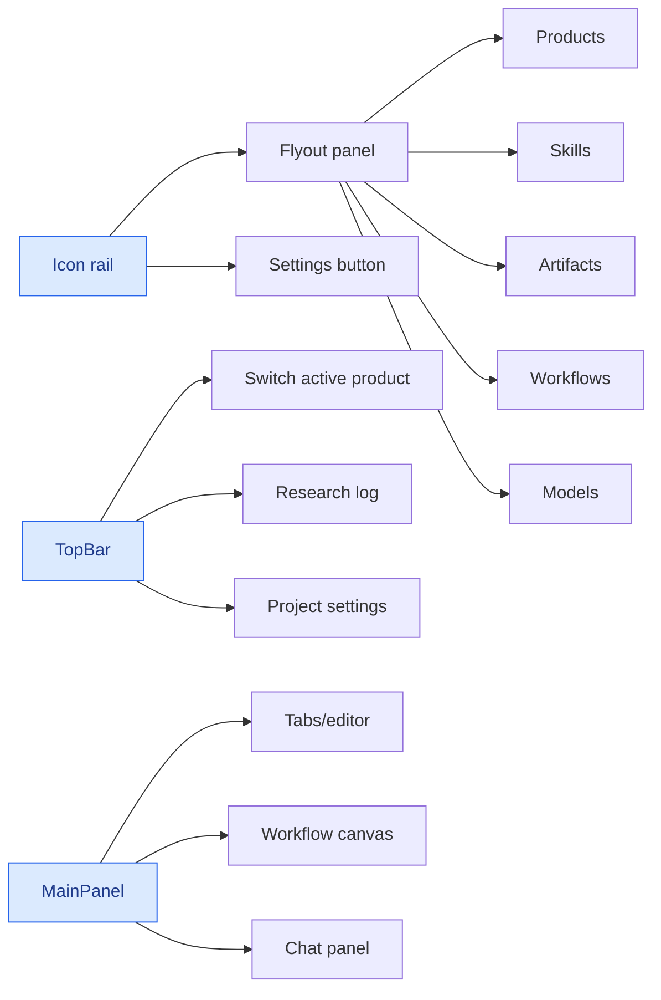

### Ambiguities

| Severity | Finding | Evidence / location | Suggested direction |
| --- | --- | --- | --- |
| 🔵 | “Products” in the UI maps to project data structures. The code and docs often say project; UI says product. | `WorkspaceProject`, `TopBar`, `Sidebar`. | Pick one user-facing term. Recommendation: use **Product** in UI, **project** internally only. |
| 🟠 | Sidebar rail expansion changes navigation width and meaning. The label “Control” adds little and competes with active section names. | `Sidebar.tsx` rail header. | Make rail persistent and predictable: icons + tooltip always, flyout title describes current section. |
| 🟠 | TopBar Settings icon opens project settings, while Sidebar Settings opens global settings. Both use the same gear metaphor. | `TopBar.tsx`, `Sidebar.tsx`. | Rename/tooltip: “Product settings” vs “App settings”. Use distinct icons or labels. |
| 🟡 | Models exists as sidebar tab, but “Open Model Settings” sends users to Settings. | `Sidebar.tsx` models panel. | Either make Models a read-only dashboard named “Usage” or merge it into Settings > AI. |
| 🟡 | Research Log is only visible when an active project exists and hidden on smaller screens. | `TopBar.tsx`. | Add it to project context menu or sidebar project details so it remains discoverable. |

## Product / Project Flow

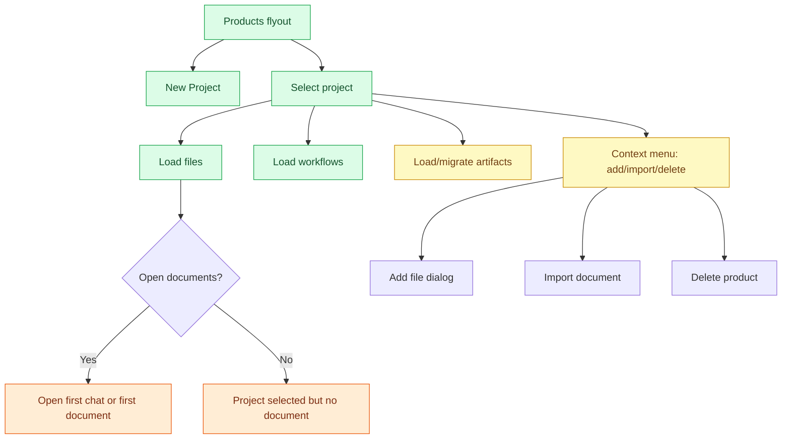

### Ambiguities

| Severity | Finding | Evidence / location | Suggested direction |
| --- | --- | --- | --- |
| 🟠 | Selecting a project can auto-open the first chat document or first file. This is surprising and hides where the user is. | `handleProjectSelect` opens `firstChat || first document`. | Show a product home/overview page first, with clear cards: Chat, Files, Artifacts, Workflows. |
| 🟠 | “New Project” is user-facing inside “Products”; the terms conflict. | `Sidebar.tsx` button `New Project`. | Rename to “New Product” if Product is chosen as the UI term. |
| 🔴 | Delete Product uses confirmation, but copy says action cannot be undone. Need clarity on whether files/artifacts/workflows are deleted too. | `ConfirmationDialog` in `Sidebar.tsx`. | Confirmation should enumerate deletion scope and require typing product name for destructive product deletion. |
| 🟡 | Add File and Import Document live in context menu only for project cards. | `Sidebar.tsx` project context menu. | Add visible “Add file / Import” buttons in a product overview or files section. |
| 🟡 | There is no explicit empty-state next step when a product has no files/artifacts. | `No files yet` text. | Replace with CTA cards: “Create file”, “Create artifact”, “Ask Copilot to generate docs”. |

## Document / Editor / Tabs Flow

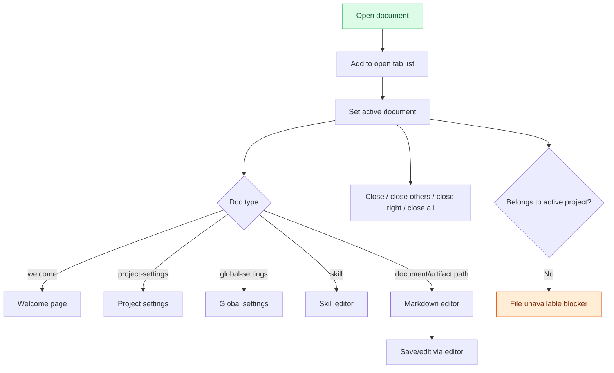

### Ambiguities

| Severity | Finding | Evidence / location | Suggested direction |
| --- | --- | --- | --- |
| 🟠 | Tabs can remain open across project switches but become unavailable. This protects data but creates context confusion. | `MainPanel.tsx` `File Unavailable`. | Make cross-product tabs visually grouped or close/suspend them with a clear “Switch back to open” action. |
| 🟡 | “Select a file…” appears when no documents are open even though chat may be the primary workspace. | `MainPanel.tsx`. | Empty state should explain: “Open a file from Products, create an artifact, or use Copilot.” |
| 🟡 | Special docs (`welcome`, settings, skill) share the same tab strip as project files. | `MainPanel.tsx` doc type branching. | Style system tabs differently or move settings/welcome out of document tabs. |
| 🟡 | Close tab actions are hidden in context menu and overflow menu. | `MainPanel.tsx`. | Keep close icon, but add “Close all” only in overflow; user does not need four close variants initially. |

## Chat / Copilot Flow

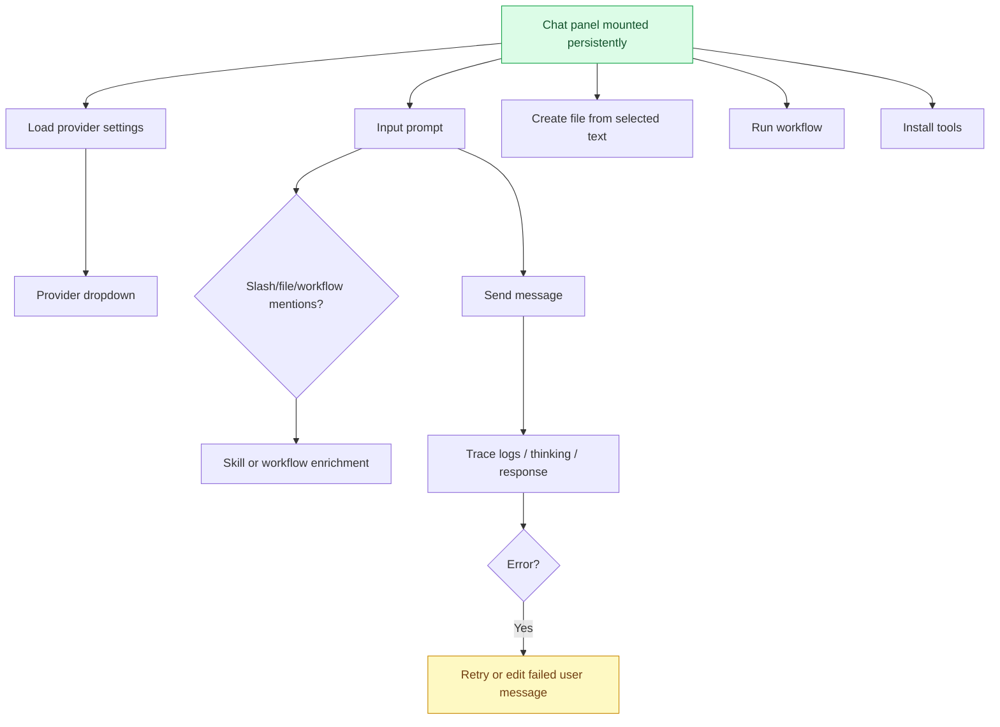

### Ambiguities

| Severity | Finding | Evidence / location | Suggested direction |
| --- | --- | --- | --- |
| 🟠 | Chat is both a conversation and a command surface, but the input does not advertise its powers clearly. | `ChatPanel.tsx` supports skills, workflows, file suggestions, approvals, token saver, trace logs. | Add input helper row: “Try: /workflow, @file, run workflow, create artifact”. |
| 🟠 | Provider labels are inconsistent with provider setup labels: “Claude API”, “Google”, “OpenAI”, “Hosted API”, “Auto-Router”. | `providerLabels` in `ChatPanel.tsx`, settings provider names. | Use shared provider display metadata everywhere. |
| 🟡 | Chat visibility rules are hard to infer: hidden for global settings, toggleable with docs/workflows, always mounted. | `MainPanel.tsx`. | Use a clear layout control: “Copilot: Open / Split / Hidden”. |
| 🟡 | Trace logs and thinking states are developer-oriented. | `ChatPanel.tsx`, `TraceLogs`, `ThinkingBlock`. | Hide behind “Details” with simple status copy by default. |
| 🔴 | Copilot can initiate config-changing actions via approval cards; trust boundary is not visually distinct enough from normal chat. | `ApprovalCard.tsx` used by `ChatPanel.tsx`. | Stronger confirmation design for config mutations: affected setting, before/after, rollback note. |

## Artifacts Flow

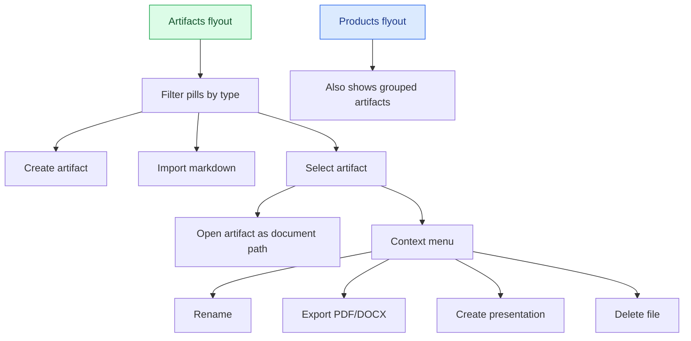

### Ambiguities

| Severity | Finding | Evidence / location | Suggested direction |
| --- | --- | --- | --- |
| 🔵 | Artifacts appear in both Products and Artifacts sections. This is powerful but unclear: are they files, generated docs, or separate objects? | `Sidebar.tsx` and `ArtifactList.tsx`. | Introduce definition: “Artifacts are structured product docs saved as files.” Use consistent icon/badge. |
| 🟠 | Artifact labels differ by location: `Product Visions` vs `Vision`; delete copy says “Delete File”. | `Sidebar.tsx`, `ArtifactList.tsx`. | Normalize artifact type labels and destructive action copy: “Delete artifact”. |
| 🟡 | “New Artifact” defaults to Roadmap when no filter is selected. | `ArtifactList.tsx`. | Open type picker first, or label button “New Roadmap” only when selected. |
| 🟡 | Import Markdown requires choosing type implicitly from current filter/default. | `handleArtifactMarkdownImport`, `ArtifactList.tsx`. | Import dialog should show selected artifact type and allow changing it. |

## Skills Flow

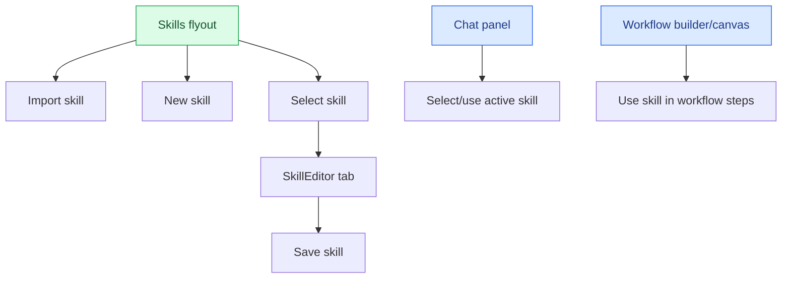

### Ambiguities

| Severity | Finding | Evidence / location | Suggested direction |
| --- | --- | --- | --- |
| 🔵 | Skills are described as “skills”, “playbooks”, and “templates” in different places. | `Sidebar.tsx`, `Welcome.tsx`, docs. | Pick one primary label. Recommendation: **Skills** with subtitle “Reusable AI playbooks”. |
| 🟡 | Skill creation opens an editor tab, but relationship to chat/workflows is not obvious. | `handleNewSkill`, `SkillEditor`. | Empty skill editor should explain where skills can be used. |
| 🟡 | Import skill expects an NPX command in some flows, which is technical and not introduced. | `handleImportSkill`. | Import dialog should support URL/file/registry first, advanced command second. |

## Workflows Flow

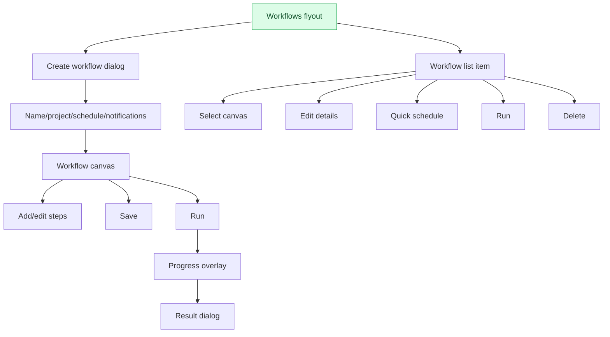

### Ambiguities

| Severity | Finding | Evidence / location | Suggested direction |
| --- | --- | --- | --- |
| 🟠 | “Create Workflow” creates metadata first; actual steps are edited later in canvas. This is not explicit enough. | `WorkflowBuilderDialog.tsx`, `WorkflowCanvas.tsx`. | Dialog CTA: “Create and open builder”. Add stepper: Details → Steps → Test → Schedule. |
| 🟡 | The helper text says “Create → select → edit → run”, which is accurate but too terse. | `WorkflowList.tsx`. | Replace with contextual empty state and a first workflow template CTA. |
| 🟠 | Schedule exists both in workflow details and quick schedule; notification setup jumps to global settings via hidden global function. | `WorkflowBuilderDialog.tsx`. | Centralize schedule/notifications in a clear workflow settings panel. |
| 🟡 | Running state is shown by a small pulsing icon and separate overlay. | `WorkflowList.tsx`, `WorkflowProgressOverlay`. | Add status row with current run name, cancel option, and recent run history. |
| 🔴 | Workflow delete uses native `confirm`, while other deletes use custom confirmation. | `WorkflowList.tsx`. | Standardize destructive confirmation UX. |

## Settings / Models / Integrations Flow

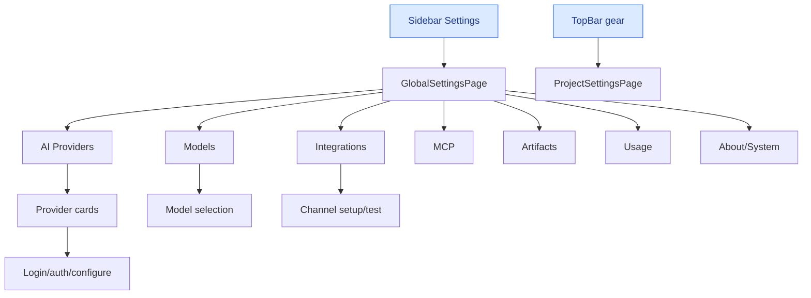

### Ambiguities

| Severity | Finding | Evidence / location | Suggested direction |
| --- | --- | --- | --- |
| 🔴 | Two settings entry points mean different things: app settings and product settings. | `TopBar.tsx`, `Sidebar.tsx`. | Rename entry points visibly: “Product settings” and “App settings”. |
| 🟠 | Settings search is shown globally but components must individually honor it; some settings may not filter. | `SettingsLayout.tsx`, `ProviderSettings.tsx`. | Either implement universal section search or scope placeholder: “Search this section”. |
| 🟠 | Provider cards show “Active” when configured/detected, but “active provider” also means selected provider. | `ProviderSettings.tsx`. | Separate statuses: Installed, Authenticated, Selected, Enabled. |
| 🟡 | Models sidebar tab duplicates Settings > AI / Usage. | `Sidebar.tsx`, `GlobalSettings.tsx`. | Move cost/provider summary into a dashboard or remove Models from primary nav. |
| 🟡 | Integration setup is required for workflow notifications, but discovery depends on workflow notification copy. | `WorkflowBuilderDialog.tsx`, `IntegrationSettings`. | Add “Notifications” setup state in workflow and settings with direct path. |

## Import / Export / File Operations Flow

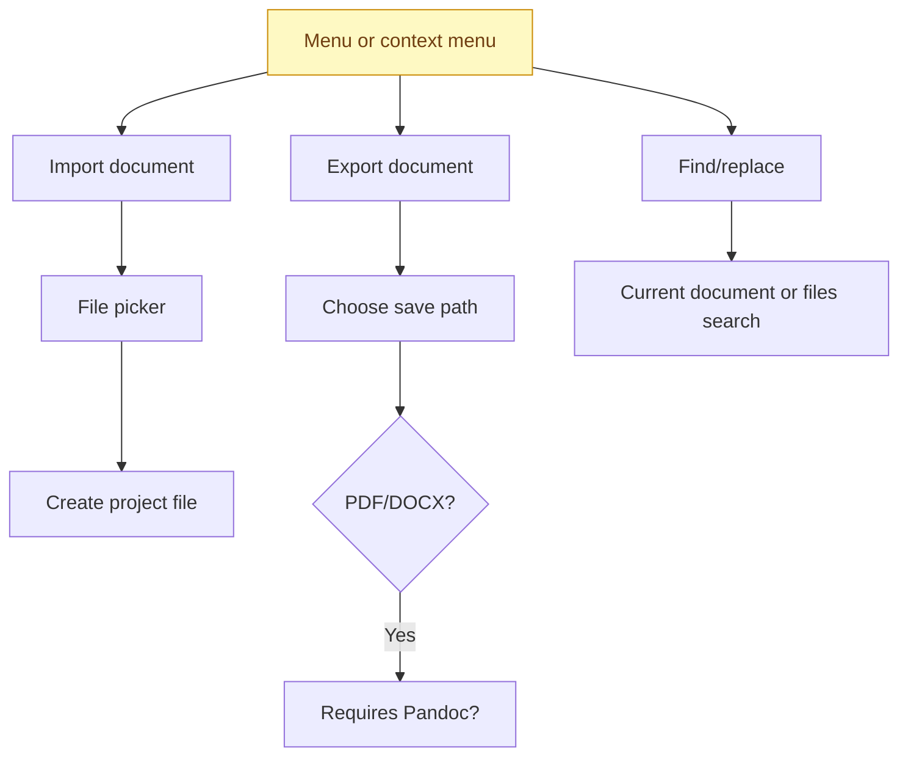

### Ambiguities

| Severity | Finding | Evidence / location | Suggested direction |
| --- | --- | --- | --- |
| 🟡 | Import/export actions are scattered across native menu events, project context menus, file context menus, and artifact menus. | `Workspace.tsx`, `Sidebar.tsx`, `ArtifactList.tsx`. | Provide a consistent “File” command center or command palette. |
| 🟠 | Export format is inferred by appending `.pdf` / `.docx` to names in menu handlers. | `Sidebar.tsx`, `ArtifactList.tsx`. | Use a real export dialog with explicit format, destination, and dependency status. |
| 🟡 | Pandoc install path exists but is not visible until export fails or action needs it. | `handleInstallPandoc`, export flow. | Preflight export dependencies in Settings/About or export dialog. |
| 🟡 | Find/replace has current document, find in files, replace in files modes; entry points are keyboard/menu driven. | `Workspace.tsx` handlers. | Add discoverable command palette or editor toolbar. |

## Cross-Cutting UX Ambiguity Register

| Severity | Area | Ambiguity / unclear flow | Why it matters | Recommended fix |
| --- | --- | --- | --- | --- |
| 🔴 | Settings | App settings vs product settings both use gear icons. | Users can edit the wrong scope. | Explicit labels, separate icons, breadcrumbs. |
| 🔴 | Destructive actions | Delete product/file/artifact/workflow use mixed confirmation patterns and vague deletion scope. | Trust and data safety risk. | Unified confirmation component, scope summary, stronger product/workflow delete confirmation. |
| 🔴 | Copilot approvals | Chat approvals can modify configuration, but normal chat and privileged actions share the same surface. | Trust boundary is blurred. | Distinct approval card styling with before/after and rollback note. |
| 🟠 | Concept model | Product/project/file/artifact/skill/workflow terms overlap. | New users cannot build a stable mental model. | Define a product glossary and expose it in onboarding/empty states. |
| 🟠 | First-run | InstallationWizard, Onboarding, Welcome, Settings provider setup overlap. | Users may skip setup without understanding consequences. | Consolidate first-run into one guided path. |
| 🟠 | Active context | Active project, active tab, active document, active workflow, and chat provider are all separate states. | Users can think they are editing/running in one context while another is active. | Add contextual breadcrumb/status bar: Product → Mode → Item → Provider. |
| 🟠 | Chat layout | Chat is sometimes central, sometimes side panel, sometimes hidden. | Users may lose Copilot or not know it persists. | Add a clear Copilot layout control. |
| 🟠 | Artifact duality | Artifacts are both structured objects and files. | Rename/delete/export behavior feels inconsistent. | Treat artifacts as “structured files” with badges and consistent verbs. |
| 🟡 | Empty states | Several panels show terse empty text. | New users need action guidance, not just absence. | Replace with CTA empty states. |
| 🟡 | Hidden context menus | Many key actions are right-click only. | Discoverability problem, especially web users. | Add visible overflow buttons or action bars. |
| 🟡 | Provider statuses | Installed/authenticated/configured/selected are conflated. | Users cannot diagnose model setup. | Four-state provider status model. |
| 🔵 | Navigation IA | Models in sidebar is partial settings/usage dashboard. | Primary nav feels arbitrary. | Either promote dashboard or move Models into Settings. |
| 🔵 | Skills naming | Skills/playbooks/templates mixed. | Product language feels unfinished. | Standardize language. |

## Recommended Redesign North Star

### Proposed information architecture

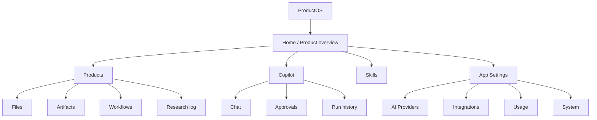

### Immediate UX fixes to do first

1. **Disambiguate settings scopes**: rename TopBar gear to “Product settings”; Sidebar gear to “App settings”.
2. **Add product overview page** when switching products instead of auto-opening first chat/file.
3. **Unify destructive confirmations** across product, file, artifact, workflow.
4. **Normalize terminology**: choose Product externally, project internally.
5. **Clarify Copilot state**: visible layout control and privileged approval styling.
6. **Normalize artifact treatment**: consistent labels, delete copy, create/import type selection.
7. **Consolidate first-run**: one setup journey, not InstallationWizard + Onboarding + Welcome with overlapping CTAs.
8. **Add context breadcrumb/status bar**: Product / mode / item / provider.

## Source Map

Primary files audited:

- `src/App.tsx` — app boot, server offline, installation wizard routing.
- `src/pages/Workspace.tsx` — central state machine for projects, documents, workflows, dialogs, file operations, settings entry points.
- `src/pages/Onboarding.tsx` — provider checks and first project creation.
- `src/pages/Welcome.tsx` — welcome CTAs.
- `src/components/workspace/Sidebar.tsx` — primary rail/flyout navigation, product/artifact/file actions, settings/quit/install.
- `src/components/workspace/TopBar.tsx` — active product switcher, research log, project settings.
- `src/components/workspace/MainPanel.tsx` — editor/workflow/chat layout and tab behavior.
- `src/components/workspace/ChatPanel.tsx` — Copilot messaging, provider selection, workflow/skill/file-assisted actions.
- `src/components/workspace/ArtifactList.tsx` — artifact filters, create/import/select/context actions.
- `src/components/workflow/WorkflowList.tsx` — workflow list, run/edit/schedule/delete actions.
- `src/components/workflow/WorkflowBuilderDialog.tsx` — workflow metadata/schedule/notification setup.
- `src/pages/GlobalSettings.tsx` and `src/components/settings/*` — settings IA, providers, integrations, usage, system/about.

## Notes for Implementation Planning

This map is an audit artifact, not a redesign spec. The next step should be turning the red/orange items into small UI issues or a staged redesign PR sequence:

1. **Language and scope cleanup** — low risk, high clarity.
2. **Empty states and visible actions** — low/medium risk.
3. **Product overview and breadcrumbs** — medium risk, high value.
4. **First-run consolidation** — higher risk, should be designed/tested carefully.
5. **Copilot trust boundary and command UX** — high value, should be reviewed with security/config mutation expectations.
