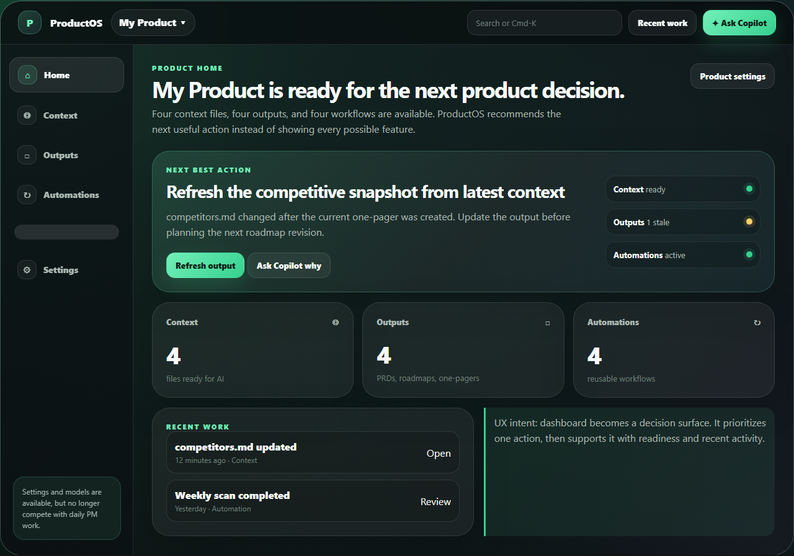
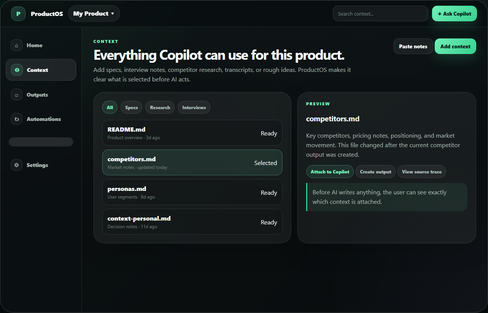
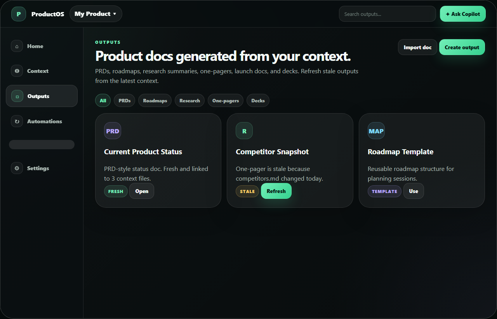
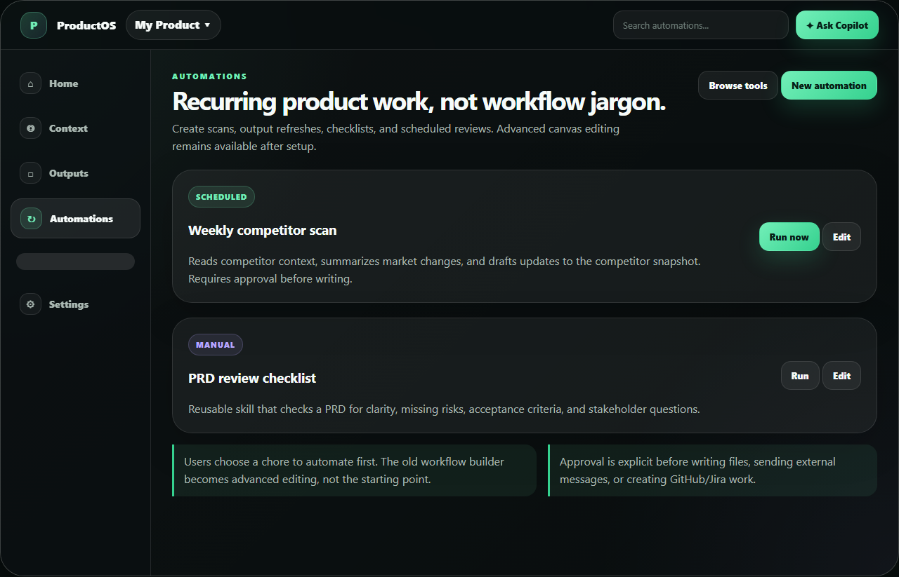
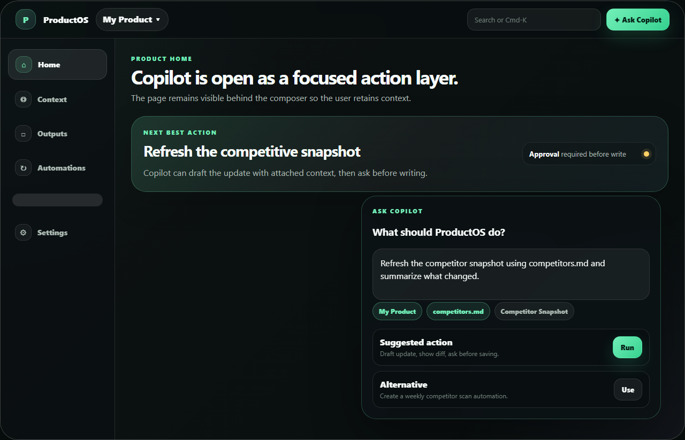
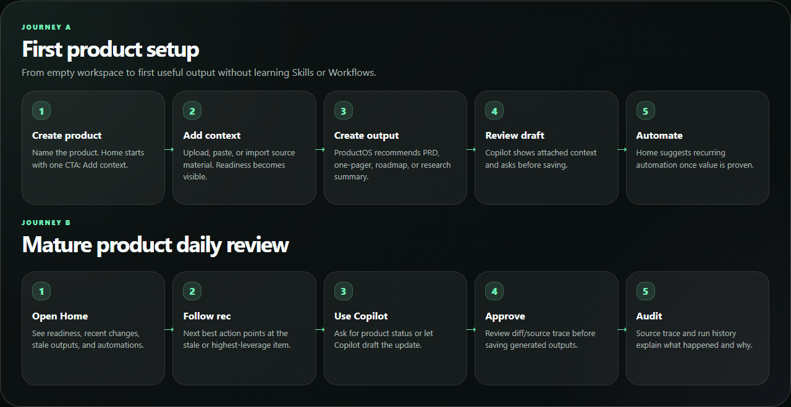

# ProductOS Visual UX Mockups

This pack adds visual direction on top of the first low-fidelity IA docs. It includes color, hierarchy, state styling, and concrete journey boards.

## Visual direction

- **Mood:** dark product command center, calmer than the current dense workspace.
- **Primary action color:** mint/green for Copilot and next-best actions.
- **Secondary accents:** cyan for context/data, violet for templates/reusable docs, amber for warnings/stale states.
- **Interaction model:** one product workspace, one active surface, one primary CTA per screen.
- **Copilot model:** on-demand action drawer/composer with explicit context chips and approval language.

## Screens

### 1. Product Home



UX intent:
- Prioritize one next-best action.
- Show readiness as supporting evidence, not as competing cards.
- Surface recent work only after the recommendation.

Primary CTA states:
- Empty product: `Add context`
- Context exists: `Create output`
- Output stale: `Refresh output`
- Mature product: `Ask Copilot for next actions`

### 2. Context



UX intent:
- Replaces mixed project/file navigation with a source-material library.
- Makes selected AI context visible before Copilot acts.
- Gives users clear actions: add context, attach to Copilot, create output, view trace.

### 3. Outputs



UX intent:
- Rename Artifacts to Outputs to emphasize user-facing PM deliverables.
- Show freshness and refresh actions.
- Group deliverables by familiar PM doc types.

### 4. Automations



UX intent:
- Merge workflows, skills, and schedules into repeated product work.
- Start from intent (`weekly competitor scan`) rather than implementation (`workflow builder`).
- Keep advanced workflow editing available after setup.

### 5. Copilot Composer



UX intent:
- Copilot is always available but not always occupying a permanent panel.
- The composer shows attached context, suggested action, and approval behavior.
- The underlying screen remains visible to preserve user orientation.

### 6. Visual Flow Boards



UX intent:
- Show the first-product and daily-review journeys as screen-to-screen behavior.
- Make the approval/review moments explicit before generated work is saved.

## Prototype source

Open the visual prototype locally:

```bash
docs/ux/visual-mockups/productos-visual-mockups.html
```

Render screenshots:

```bash
node docs/ux/visual-mockups/render-visual-mockups.mjs
```

## Implementation implications

Recommended order:

1. Implement simplified shell labels: Home, Context, Outputs, Automations, Settings.
2. Update Product Home to use the next-best-action hero card.
3. Split current product/file/artifact browsing into Context and Outputs surfaces.
4. Move Skills and Workflows under Automations IA.
5. Convert persistent chat panel into an optional Copilot drawer/composer with pin support.
6. Add source trace and approval cards around generated output writes.
